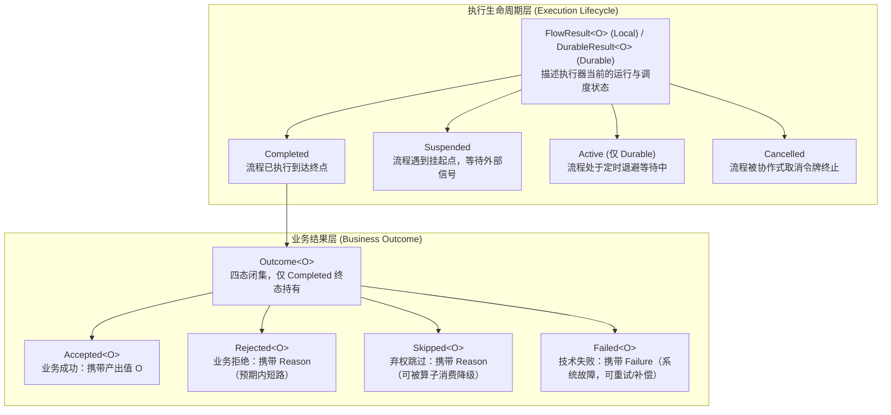
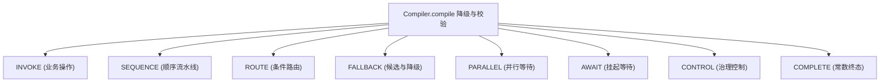

# 核心语义全景总览

本章提供 `team4u-flow` 流程编排组件核心语义与运行机制的全景总览与架构蓝图。各项专题已细化并独立成章，推荐结合各独立专章深入研读：

- 结果类型体系与代数映射：[四态业务结果与生命周期模型](flow-outcome.md)
- 状态传播与短路规则：[四态传播规则与消费机制](flow-propagation.md)
- 8 种运行时节点详解：[运行时节点与 DSL 编排原语](flow-nodes.md)
- Policy、Retry 与 Timeout：[流程治理：Policy 策略、Retry 重试与 Timeout 控制](flow-governance.md)
- 并行执行与汇合策略：[并行分支与汇合治理](flow-parallel.md)
- 挂起恢复与协作取消：[挂起续接与协作式取消合同](flow-suspend.md)
- 线程模型与死锁防御：[Local 线程模型与死锁防御机制](flow-threading.md)
- Spring 容器集成：[Bean 容器集成与 Spring 治理](flow-bean.md)
- Durable 持久化状态机：[Durable 状态机与 CAS 检查点机制](flow-durable-core.md)
- 两段式恢复协议：[Durable 两段式恢复协议与 PersistentPolicy](flow-durable-resume.md)
- 快照槽位与确定性编解码：[快照存储结构与 StateMapper 编解码](flow-durable-snapshot.md)
- 全链路诊断码与排查手册：[诊断码体系与故障排查手册](flow-diagnostics.md)

---

## 结果类型体系

### 三套结果类型对照

| 结果类型 | 所属层次 | 状态闭集 | 携带载荷 |
| :--- | :--- | :--- | :--- |
| **`Outcome<T>`** | 业务层 | `Accepted` / `Rejected` / `Skipped` / `Failed` | 仅 `Accepted` 携带输出值；其余三态携带不可变诊断值对象 `Reason` 或 `Failure` |
| **`FlowResult<O>`** | Local 执行层 | `Completed` / `Suspended` / `Cancelled` | `Completed` 携带最终 `Outcome`；`Suspended` 携带单次消费句柄 `Suspension`；`Cancelled` 携带 `executionId` |
| **`DurableResult<O>`** | Durable 持久化层 | `Completed` / `Suspended` / `Active` / `Cancelled` | `Completed` 携带 `Outcome`；`Suspended` 携带挂起点名称；`Active` 携带 `wakeAt` 计划唤醒时间戳；`Cancelled` 携带快照 |

---

## 四态 Outcome 与流转规则

### 四态定义与语义

`Outcome<T>` 是业务结果的封闭枚举式抽象（包级私有构造器，模块外不可继承）：

| 状态 | 载荷 | 语义说明与默认行为 |
| :--- | :--- | :--- |
| **`Accepted`** | `T value`（非 null） | 成功产出业务数据，**四态中唯一携带输出**。驱动后置节点推进。 |
| **`Rejected(Reason)`** | 不可变业务原因 `Reason` | 业务拒绝（如黑名单、余额不足）；属于正常业务分支，**不触发重试与技术补偿**。 |
| **`Skipped(Reason)`** | 不可变弃权原因 `Reason` | 弃权跳过（当前节点不适用）；**可被 `thenOptional` 或 `firstApplicable` 消费**。 |
| **`Failed(Failure)`** | 不可变失败原因 `Failure` | 技术失败（网络超时、系统异常）；**可触发 `retry` 重试或 `recoverWith` 补偿**。 |

### 算子传播规则总表

| 传播场景 | 行为规则 |
| :--- | :--- |
| **`then` (Sequence)** | **仅 Accepted 推进**：前置节点 Accepted 时其输出作为后置节点输入；Rejected / Skipped / Failed 直接短路终止当前序列 |
| **`thenOptional`** | 仅用于同类型 `O -> O` 节点：Accepted 以新值推进；Skipped 消费弃权并以进入步骤前的原值推进；Rejected / Failed 仍短路 |
| **`Rejected`** | 终止当前 Sequence 并逐层向外透传；不触发 `firstApplicable` 候选推进与 `recoverWith` 补偿 |
| **`Skipped`** | 默认终止当前 Sequence；在 `firstApplicable` 或 `thenOptional` 边界被消费，否则向外透传 |
| **`Failed`** | 终止当前 Sequence；触发同作用域内的 `retry` 重试或 `recoverWith` 恢复边界；否则向外透传 |
| **`firstApplicable`** | 依次尝试各个候选分支，**以首个非 Skipped 结果作为整体结果**；全部 Skipped 则整体 Skipped |
| **`recoverWith`** | 主流程 Failed 时，以 `Recovery<I>`（原始输入 + Failure）作为输入执行恢复流程；非 Failed 原样透传 |
| **`route`** | selector 产出路由键（精确 `equals` 匹配）选中分支；未命中且未配置 `otherwise` 时整体 Skipped（`NO_ROUTE`） |
| **`parallel`** | wait-all 等待全部分支完成后，由 `JoinStrategy` 合并为单个 Outcome |

---

## 运行时八大封闭节点

编译后的运行时计划封闭为八种 `NodeDescriptor.Kind`，不开放自定义节点类型：

1. **`INVOKE`**：业务原子调用。支持 `use(op, project, merge)` 上下文投影合并；业务异常统一收敛为 `OPERATION_EXCEPTION`；
2. **`SEQUENCE`**：顺序流水线。连续匿名 `then` 步骤在编译期自动扁平化合并；`Flow.scope(name, body)` 创建具名作用域；
3. **`ROUTE`**：条件路由分发。按精确 `equals` 匹配 case 键；未匹配且无 otherwise 时输出 `Skipped(NO_ROUTE)`；
4. **`FALLBACK`**：降级与补偿节点。支持 SKIPPED 触发器（`firstApplicable` / `thenOptional`）与 FAILED 触发器（`recoverWith`）；
5. **`PARALLEL`**：并行分支。True Wait-All 合同，取消绕过 Join 逻辑；内置 `allAccepted`、`firstAccepted`、`quorum`、`homogeneousCollect` 策略；
6. **`AWAIT`**：挂起点。Local 返回 `Suspension` 句柄，Durable 快照落库等待外部注入信号；
7. **`CONTROL`**：治理切面。提供 `POLICY`（无状态网关）、`PERSISTENT_POLICY`（有状态策略）与 `TIMEOUT`（时限控制）；
8. **`COMPLETE`**：静态常量终点。`Flow.identity()`（原样透传）、`Flow.accepted`、`rejected`、`skipped`、`failed`。

---

## 治理控制机制

- **洋葱圈拦截模型**：后声明的治理策略在外层包裹业务主体；
- **无状态切面（`Policy<K>`）**：在前置 `before` 进行 `Gate` 裁决（`proceed` / `reject` / `fail`），后置 `after` 接收完成摘要；
- **有状态策略（`PersistentPolicy<K, S>`）**：维护不可变状态 `S`，支持 `WaitUntil` 延时挂起与 `RetryAt` 退避唤醒；
- **超时控制（`Timeout`）**：执行器在栈帧边界监控绝对 Deadline，超时发送物理中断并截断栈帧产出 `TIMEOUT` 失败；
- **稳定幂等键（`invocationId`）**：$$\text{invocationId} = \text{flowId} : \text{flowVersion} : \text{executionId} : \text{path}$$
  在 Retry 重试或崩溃恢复重放时保持恒定，为外部副作用提供绝对幂等防重保障。

---

## Local 线程模型与死锁防御

- **双线程池分工**：
  - **Dispatcher 调度池**：负责 `runAsync` / `resumeAsync` 的顶层发起派发；
  - **Worker 工作池**：负责 `Flow.parallel` 分支并发执行与 `timeout` 超时监控（默认 `ForkJoinPool.commonPool()`）；
- **两级静态死锁防御**：
  - **规则 1（隔离校验）**：含 `parallel` 或 `timeout` 的流程，严禁将同一个非 ForkJoinPool 的有限线程池同时用作 Dispatcher 与 Worker；
  - **规则 2（补偿校验）**：`parallel` 分支内部嵌套 `parallel` 或 `timeout` 时，Worker 必须是支持工作窃取与 `ManagedBlocker` 线程补偿的 `ForkJoinPool`。

---

## Durable 持久化与两段式恢复

- **零代码修改**：同一份 `Flow<I, O>` 定义无缝适配 `Local` 与 `Durable` 执行器；
- **零 Lambda / 代码序列化**：快照仅持久化元数据与由 `StateMapper` 编码的业务槽位（`StoredValue`）；
- **单调递增 revision CAS 检查点**：节点边界以乐观锁提交，多实例并发竞争时安全拒绝（`REVISION_CONFLICT`）；
- **两段式 CAS 恢复协议**：阶段 1 恢复信号安全持久化落库 -> 阶段 2 状态机续接驱动；彻底消除信号丢失与并发冲突。

---

## 全链路诊断体系速查

- **编译期静态校验（`FlowBuildException`）**：`DUPLICATE_LABEL`, `DUPLICATE_SCOPE`, `DUPLICATE_BRANCH`, `DUPLICATE_RESUME_POINT`, `PARALLEL_AWAIT`, `PARALLEL_PERSISTENT_POLICY`, `INVALID_BINDING`, `MISSING_BINDING`, `BINDING_TYPE`, `DUPLICATE_ROUTE_CASE`；
- **运行时 Failed 失败码（`FlowDiagnosticCodes`）**：`OPERATION_EXCEPTION`, `OPERATION_INTERRUPTED`, `OPERATION_CANCELLED`, `TIMEOUT`, `EXECUTOR_REJECTED`, `WAIT_INTERRUPTED`, `POLICY_EXCEPTION`, `JOIN_EXCEPTION`, `PARALLEL_EXCEPTION`, `PARALLEL_INTERRUPTED`, `QUORUM_NOT_REACHED`；
- **运行时 Skipped 弃权码**：`NO_ROUTE`, `NO_APPLICABLE_BRANCH`；
- **Durable 状态机异常（`DurableException.Error`）**：`REVISION_CONFLICT`, `FLOW_MISMATCH`, `RESUME_SIGNAL_CONFLICT`, `EXECUTION_EXISTS`, `EXECUTION_NOT_FOUND`, `CODEC_FAILURE`, `STORE_FAILURE`, `LIFECYCLE_MISMATCH`, `ASYNC_EXECUTOR_MISSING`。

---

## 关联专章与深度研读

- [四态业务结果与生命周期模型](flow-outcome.md)
- [四态传播规则与消费机制](flow-propagation.md)
- [运行时节点与 DSL 编排原语](flow-nodes.md)
- [流程治理概览：Policy、Retry 与 Timeout](flow-governance.md)
- [并行分支与汇合治理](flow-parallel.md)
- [挂起续接与协作式取消合同](flow-suspend.md)
- [Local 线程模型与死锁防御机制](flow-threading.md)
- [Bean 容器集成与 Spring 治理](flow-bean.md)
- [Durable 状态机与 CAS 检查点机制](flow-durable-core.md)
- [Durable 两段式恢复协议与 PersistentPolicy](flow-durable-resume.md)
- [快照存储结构与 StateMapper 编解码](flow-durable-snapshot.md)
- [DurableStore 存储 SPI 与 KV 适配](flow-durable-kv.md)
- [可视化图表渲染与双投影架构](flow-graph.md)
- [测试支持与测试套件](flow-test.md)
- [诊断码体系与故障排查手册](flow-diagnostics.md)
- [扩展机制与 SPI 开发指南](flow-extension.md)
- [实战案例库与生产模式](flow-sample.md)
