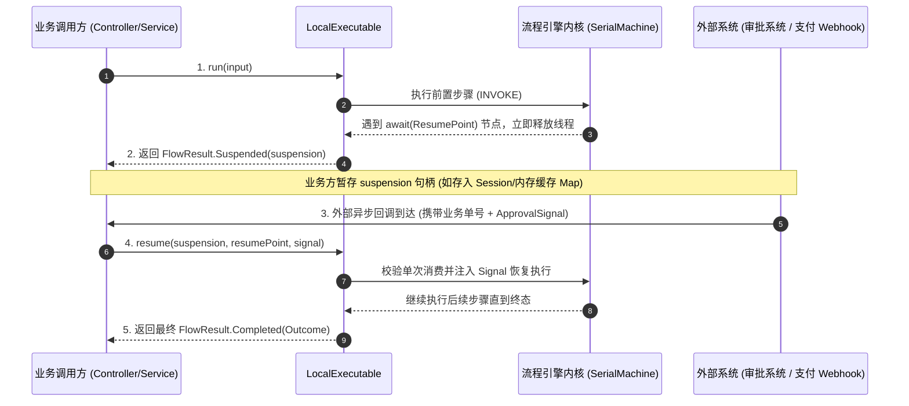
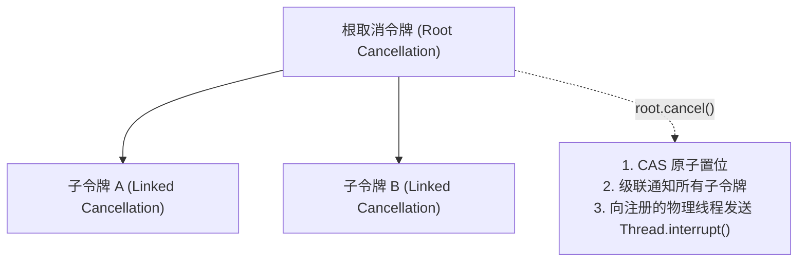
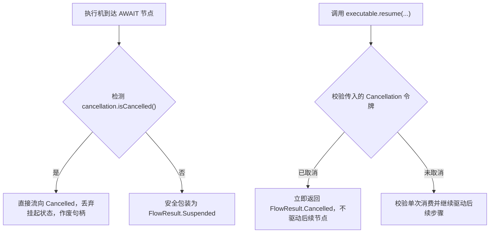

# 挂起续接与协作式取消合同

在现代分布式业务架构中，流程往往不是一口气执行完毕的纯同步短事务。诸如“用户下单后等待二次短信验证”、“大额支付等待人工审批流审批”、“等待异步 Webhook 回调”等场景，都需要流程引擎具备**非阻塞挂起（Suspend）**、**精准恢复（Resume）**以及**安全取消（Cancellation）**的能力。

本文将深入剖析 Local 模式下的挂起续接机制、单次消费句柄 `Suspension` 的防重放设计、在 Spring 控制层中实现 Webhook 异步回调的完整实战代码、协作式取消令牌底层原理以及挂起与取消之间的极端竞态防御。

---

## 挂起与恢复交互模型



---

## 1. 声明挂起点与续接数据模型

### 声明强类型挂起点：`ResumePoint<R>`

挂起点（`ResumePoint`）是一个强类型的静态标识，用于标记流程挂起的位置以及恢复时预期的信号（Signal）数据类型：

```java
import com.team4u.framework.flow.api.ResumePoint;

// 声明一个名为 "managerApproval" 且预期接收 ApprovalSignal 对象的挂起点
ResumePoint<ApprovalSignal> approvalPoint = ResumePoint.named("managerApproval");
```

### DSL 声明与 `Resumed<State, Signal>` 解包

在 `await` 节点之后的步骤中，入参类型会被自动包装为 `Resumed<State, Signal>`：

```java
Flow<OrderRequest, OrderReceipt> approvalFlow = Flow.<OrderRequest>identity()
        .then(createDraftOrderOp) // 返回草稿订单 OrderRequest
        .await(approvalPoint)     // 流程在此挂起并释放当前线程！
        .then((context, resumed) -> {
            // 1. resumed.state(): 获取挂起前的原始业务状态数据 (OrderRequest)
            OrderRequest draftOrder = resumed.state();
            
            // 2. resumed.signal(): 获取外部调用 resume(...) 时注入的信号对象 (ApprovalSignal)
            ApprovalSignal signal = resumed.signal();
            
            if (!signal.isApproved()) {
                return Outcome.rejected(Reason.of("REJECTED_BY_MANAGER", signal.getComment()));
            }
            return Outcome.accepted(new OrderReceipt(draftOrder.getOrderId(), "APPROVED"));
        });
```

---

## 2. Local 挂起句柄：`Suspension<O>`

当 Local 执行器遇到 `AWAIT` 节点时，执行器立即释放当前线程，并返回一个 `FlowResult.Suspended` 实例：

```java
LocalExecutable<OrderRequest, OrderReceipt> executable = Local.compile(approvalFlow);

// 首次同步执行
FlowResult<OrderReceipt> result = executable.run(request);

if (result instanceof FlowResult.Suspended) {
    Suspension<OrderReceipt> suspension = ((FlowResult.Suspended<OrderReceipt>) result).suspension();
    
    // 暂存 suspension 句柄（如存入内存 Map 或 Session）
    suspensionStore.put(request.getOrderId(), suspension);
}
```

### 单次消费（Single-Use）安全保证
- **防重放与双花防御**：`Suspension` 是一个不透明的**单次消费句柄**；
- 一旦通过 `executable.resume(suspension, ...)` 消费过一次，该句柄内部状态立即标记为失效（`consumed = true`）；
- 若尝试对同一个 `Suspension` 实例调用两次 `resume`，框架会严格抛出 `IllegalStateException("Suspension has already been consumed")`，从底层杜绝外部重复回调引发的重放攻击与并发双花。

---

## 3. Spring 控制层 Webhook 异步回调完整实战

以下是在生产 Spring Boot 应用中，如何优雅地将 Local 流程与外部 Webhook 回调打通的完整代码：

```java
@RestController
@RequestMapping("/api/orders")
public class OrderApprovalController {

    @Autowired
    private LocalExecutable<OrderRequest, OrderReceipt> orderExecutable;
    
    @Autowired
    private ResumePoint<ApprovalSignal> approvalPoint;

    // 内存挂起句柄缓存（Local 模式适合单机内存生命周期；集群持久化请使用 Durable 模式）
    private final Map<String, Suspension<OrderReceipt>> suspensionCache = new ConcurrentHashMap<>();

    /**
     * 1. 提交审批订单接口
     */
    @PostMapping("/submit")
    public ResponseEntity<?> submitOrder(@RequestBody OrderRequest request) {
        FlowResult<OrderReceipt> result = orderExecutable.run(request);

        if (result instanceof FlowResult.Suspended) {
            // 流程遇到 await，暂存 suspension 句柄
            Suspension<OrderReceipt> suspension = ((FlowResult.Suspended<OrderReceipt>) result).suspension();
            suspensionCache.put(request.getOrderId(), suspension);
            
            return ResponseEntity.ok(Map.of(
                    "orderId", request.getOrderId(),
                    "status", "SUSPENDED_WAITING_APPROVAL",
                    "message", "订单已提交，等待主管审批"
            ));
        }

        if (result instanceof FlowResult.Completed) {
            return ResponseEntity.ok(((FlowResult.Completed<OrderReceipt>) result).outcome());
        }

        return ResponseEntity.status(500).body("Unexpected execution result");
    }

    /**
     * 2. 接收外部审批系统 Webhook 回调接口
     */
    @PostMapping("/callback/approval")
    public ResponseEntity<?> onApprovalCallback(@RequestBody ApprovalCallbackRequest callback) {
        String orderId = callback.getOrderId();
        
        // 提取并移除暂存的 suspension 句柄
        Suspension<OrderReceipt> suspension = suspensionCache.remove(orderId);
        if (suspension == null) {
            return ResponseEntity.badRequest().body("未找到该订单的挂起句柄或订单已被处理: " + orderId);
        }

        // 构造强类型审批信号
        ApprovalSignal signal = new ApprovalSignal(callback.isApproved(), callback.getComment());

        // 核心：调用 resume 注入信号，恢复流程继续向前推进
        FlowResult<OrderReceipt> finalResult = orderExecutable.resume(suspension, approvalPoint, signal);

        if (finalResult instanceof FlowResult.Completed) {
            Outcome<OrderReceipt> outcome = ((FlowResult.Completed<OrderReceipt>) finalResult).outcome();
            if (outcome instanceof Outcome.Accepted) {
                return ResponseEntity.ok(((Outcome.Accepted<OrderReceipt>) outcome).value());
            } else if (outcome instanceof Outcome.Rejected) {
                return ResponseEntity.ok(Map.of("status", "REJECTED", "reason", ((Outcome.Rejected<?>) outcome).reason()));
            } else {
                return ResponseEntity.status(500).body(((Outcome.Failed<?>) outcome).failure());
            }
        }

        return ResponseEntity.ok("处理中");
    }
}
```

---

## 4. 恢复执行 API 契约

Local 执行器提供同步与异步两种恢复方式：

| API 方法 | 签名 | 说明 |
| :--- | :--- | :--- |
| **`resume`** | `resume(suspension, resumePoint, signal[, cancellation])` | 在当前调用线程同步恢复并驱动后续步骤 |
| **`resumeAsync`** | `resumeAsync(suspension, resumePoint, signal[, cancellation])` | 提交至 Dispatcher 线程池异步恢复，返回 `CompletionStage` |

---

## 5. 协作式取消令牌：`Cancellation`

`Cancellation` 是 `team4u-flow` 的轻量级协作式取消令牌，用于跨线程、跨层级安全取消正在运行的流程。



### 核心机制与原理
1. **CAS 原子置位**：令牌内部通过 CAS 状态机保证取消状态只被置位一次，并发安全；
2. **物理线程中断与干净清理**：
   - 执行器在进入执行循环时通过 `cancellation.attach(Thread.currentThread())` 注册物理线程；
   - 一旦触发 `cancel()`，自动向执行线程发送中断信号；
   - **退出保护**：在退出 `SerialMachine` 时，仅当取消在本流内部触发了中断且进入时并非已中断时，才清除取消残留的中断标记，**绝对不破坏或吞噬调用方外部既有的中断状态**；
3. **父子级联取消**：通过 `Cancellation.linked(parent)` 创建的子令牌会自动监听父令牌的状态，父令牌取消时所有子令牌同步生效；
4. **清理屏障**：流程取消后，所有下游节点均不会被调度，并行块严格等待正在运行的子线程完全退出。

### 取消使用示例

```java
import com.team4u.framework.flow.model.Cancellation;

Cancellation cancellation = Cancellation.create();

// 异步提交耗时任务
CompletableFuture<FlowResult<Receipt>> future = executable.runAsync(orderRequest, cancellation)
        .toCompletableFuture();

// 如果前端用户在处理期间点击了“取消”
if (userClickedCancel) {
    cancellation.cancel(); // 触发协作取消与线程中断
}

FlowResult<Receipt> result = future.join();
if (result instanceof FlowResult.Cancelled) {
    log.info("流程已安全取消: executionId={}", ((FlowResult.Cancelled<Receipt>) result).executionId());
}
```

---

## 6. 挂起与取消的时序竞态防御

在并发高压环境下，可能出现“调用方刚刚触发 `cancel()`，而执行器正好在进入 `await()` 挂起节点”的极端时序竞态。

框架内部建立了多重时序安全防御：



1. **挂起前检测取消**：在将状态包装为 `Suspended` 之前，框架执行 CAS 校验；若检测到取消信号，直接丢弃挂起状态并流向 `Cancelled`；
2. **恢复时检测取消**：在 `resume` 调用入口处校验传入的 `Cancellation` 令牌；若已被取消，直接返回 `Cancelled` 且不驱动后续节点；
3. **挂起句柄安全作废**：被取消流程对应的 `Suspension` 句柄会被立即标记为作废，防止后续错误的外部信号再次唤醒已取消的流程。

---

## Local 与 Durable 挂起恢复机制对比

| 维度 | Local 执行器 (`team4u-flow`) | Durable 执行器 (`team4u-flow-durable`) |
| :--- | :--- | :--- |
| **挂起状态载体** | 内存单次消费句柄 `Suspension<O>` | 数据库持久化快照（`awaitingPoint` 字段） |
| **恢复入口** | `executable.resume(suspension, point, signal)` | `durable.resume(executionId, pointName, signal)` |
| **防重放机制** | 内存原子标志 `consumed` 单次消费保护 | 两段式 CAS 乐观锁提交与信号内容哈希比对 |
| **跨进程恢复** | 仅支持单 JVM 进程内恢复 | 支持任意节点集群在崩溃重启后断点续跑 |

---

## 关联章节与进一步阅读

- 了解 Durable 模式下的跨进程两段式 CAS 挂起与恢复：[Durable 两段式恢复协议与 PersistentPolicy](flow-durable-resume.md)
- 了解 Local 执行器的线程模型与 Dispatcher 调度：[Local 线程模型与死锁防御机制](flow-threading.md)
- 查阅挂起与取消相关的测试夹具：[测试支持与测试套件](flow-test.md)
- 查看完整的审批流实战代码：[实战案例库与生产模式](flow-sample.md)
