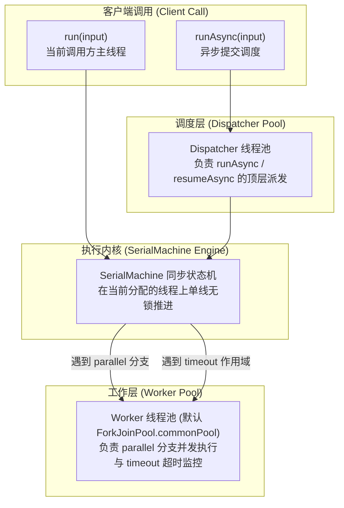
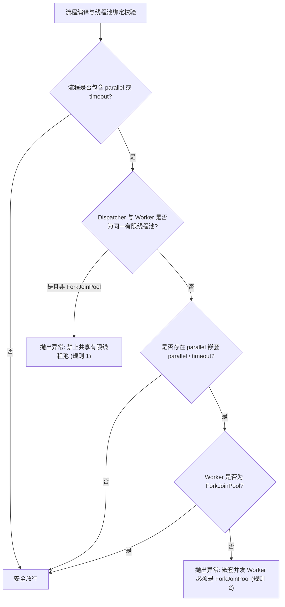

# Local 线程模型与死锁防御机制

高并发 Java 应用中最隐蔽、破坏力最大的生产事故之一是**线程饥饿死锁（Thread Starvation Deadlock）**——当父任务在有限线程池中占有线程并同步等待子任务完成，而子任务又被提交到同一个线程池且无可用空闲线程时，整个系统将陷入不可逆的全面卡死。

`team4u-flow` 从架构层面设计了清晰的双线程池分工体系，并在编译期与运行时构建了两级严格的**静态死锁防御**体系。

---

## 线程模型架构：Dispatcher 与 Worker



### 角色职责与分工

| 线程池角色 | 负责内容 | 默认配置 | 建议策略 |
| :--- | :--- | :--- | :--- |
| **调用方线程 / Dispatcher** | 执行 `SerialMachine` 主流水线状态机；串行调度 `INVOKE`、`ROUTE`、`FALLBACK` 等节点 | 同步调用使用当前调用者线程；`runAsync` 提交至传入的调度池 | 适合轻量 I/O 或纯计算密集型流水线调度 |
| **Worker 线程池** | 执行 `Flow.parallel` 中的子分支；执行 `timeout` 超时监控与任务打断 | `ForkJoinPool.commonPool()` | 必须支持工作窃取或具备动态线程补偿机制（强烈推荐 `ForkJoinPool`） |

---

## 执行 API 契约与线程绑定

### 同步执行：`run`

```java
LocalExecutable<OrderRequest, Receipt> executable = Local.compile(flow);

// 在当前线程同步执行，完全不发生跨线程上下文切换
FlowResult<Receipt> result = executable.run(orderRequest);
```

### 异步执行：`runAsync`

```java
// 异步提交执行，返回 Java 标准 CompletionStage
CompletableFuture<FlowResult<Receipt>> future = executable
        .runAsync(orderRequest)
        .toCompletableFuture();

future.thenAccept(res -> log.info("Async result: {}", res.requireAccepted()));
```

`runAsync` 提供四个重载，允许显式指定取消令牌与调度线程池：

| 重载 | 说明 |
| :--- | :--- |
| `runAsync(input)` | 默认取消令牌 + `commonPool` 调度 |
| `runAsync(input, cancellation)` | 指定取消令牌 + `commonPool` 调度 |
| `runAsync(input, dispatcher)` | 默认取消令牌 + 显式调度线程池 |
| `runAsync(input, cancellation, dispatcher)` | 全参重载：显式取消令牌与调度线程池（dispatcher 为 null 时回退 commonPool） |

> [!IMPORTANT]
> **Dispatcher 与 Worker 隔离**：显式传入的 `dispatcher` 仅负责顶层派发；并行分支与超时监控
> 始终使用编译时绑定的 Worker 线程池。切勿将同一个非 ForkJoinPool 有限线程池同时用作
> dispatcher 与 worker（运行时校验会直接抛出 `IllegalArgumentException`，详见下文死锁防御规则）。
> `resumeAsync` 同样提供对应的 `(suspension, point, signal[, cancellation][, dispatcher])` 重载。

### 自定义 Worker 线程池绑定：`withExecutor`

如果流程需要使用专用的业务 Worker 线程池，可通过 `withExecutor` 派生句柄：

```java
ExecutorService customWorkerPool = Executors.newFixedThreadPool(16);

// 派生绑定独立 Worker 线程池的执行器句柄
LocalExecutable<OrderRequest, Receipt> customExecutable = 
        executable.withExecutor(customWorkerPool);
```

---

## 静态死锁防御规则（Deadlock Defense）

为了在开发与测试阶段彻底根绝线程饥饿死锁，框架在编译期（`Local.compile`）与构建期内置了两级静态校验规则。一旦检测到高危配置，立即抛出明确的 `IllegalArgumentException` 阻断启动：



### 规则 1：Dispatcher 与 Worker 隔离校验

- **规则说明**：凡是包含 `parallel`（并行）或 `timeout`（超时）的流程，**严禁将同一个非 ForkJoinPool 的单线程或固定大小线程池（FixedThreadPool）同时用作 Dispatcher 与 Worker**；
- **死锁机理**：若 Dispatcher 占有了线程池中唯一的可用线程，并在 `parallel` 处阻塞等待子分支完成；而子分支又排队等待同一个线程池分配线程，导致互相永久死锁；
- **防御触发**：编译期检测到相同实例时立即抛出 `IllegalArgumentException`，杜绝死锁隐患上线。

### 规则 2：嵌套并行补偿校验

- **规则说明**：当 `parallel` 分支内部还嵌套包含 `parallel` 或 `timeout` 时，Worker 线程池**必须是支持工作窃取（Work-Stealing）与动态线程补偿的 `ForkJoinPool`** ；
- **技术原理**：
  - `ForkJoinPool` 在工作线程遇到阻塞时，会自动从其他任务双端队列窃取就绪任务执行；
  - 框架结合 `ManagedBlocker` 机制，在工作线程阻塞时能够通知池动态拉起临时补偿线程，从而打破有限线程池中的依赖死锁循环。

---

## 最佳实践与线程池调优建议

1. **优先复用默认 Worker 池**：
   框架默认使用 `ForkJoinPool.commonPool()`，对于大多数混合型并发场景已具备极高的吞吐与自适应补偿能力；
2. **I/O 密集型步骤采用异步转同步**：
   在业务 `Operation` 内部调用远程微服务时，推荐使用 `context.await(completionStage)`，执行器会高效协同挂起；
3. **避免在同一个线程池中执行嵌套闭包**：
   对于超高并发的核心交易流程，建议为顶层调度（Dispatcher）与底层计算分支（Worker）配置各自独立的线程池实例。

---

## 关联章节与进一步阅读

- 深入学习并行分支的 Wait-All 合同：[并行分支与汇合治理](flow-parallel.md)
- 学习协作式取消令牌与线程中断：[挂起续接与协作式取消合同](flow-suspend.md)
- 了解测试中的并发同步验证屏障：[测试支持与测试套件](flow-test.md)
- 查看完整的治理与超时机制：[流程治理：Policy 策略、Retry 重试与 Timeout 控制](flow-governance.md)
