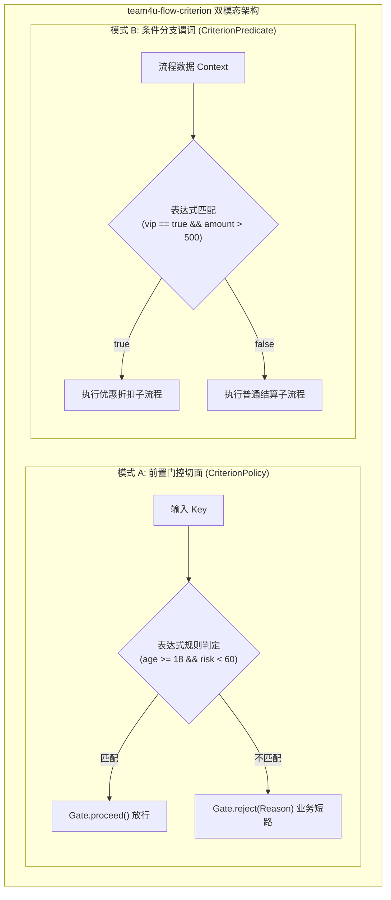

# 表达式规则门控策略：`team4u-flow-criterion`

在复杂多变的业务场景中（如营销圈选、动态风控、权限准入、A/B 实验分流等），业务规则往往面临高频变更。若每次规则调整都修改 Java 代码并重新发布服务，会导致开发效率低下且伴随发布风险。

`team4u-flow-criterion` 模块将流程引擎的无状态治理契约 [`Policy<K>`](flow-governance.md#核心治理契约) 与规则表达式引擎 [`team4u-criterion`](../criterion/README.md) 结合，支持直接使用**低开销、高性能的类 SQL 文本表达式**进行前置门控拦截与流程分支判定。

---

## 引入依赖

```xml
<dependency>
    <groupId>com.team4u</groupId>
    <artifactId>team4u-flow-criterion</artifactId>
</dependency>
```

> [!NOTE]
> `team4u-flow-criterion` 生产代码仅依赖 `team4u-flow` 与 `team4u-criterion`，保持纯净零额外框架污染。

---

## 核心架构与双模态集成

`team4u-flow-criterion` 为 Flow 提供了两套正交且互补的集成形式：



---

## 模式 A：门控策略 (`CriterionPolicy<K>`)

用于在节点或子流程执行前进行**准入校验、风控拦截与黑白名单过滤**。

### 门控模式矩阵

| 模式枚举 | 便捷工厂方法 | 行为语义 | 典型应用场景 |
| :--- | :--- | :--- | :--- |
| **`PERMIT_IF`** | `CriterionPolicies.permitIf(expr, code, msg)` | **满足表达式则放行**；不满足时以 `Rejected` 短路退出。 | **准入许可**：如“年龄满 18 岁且已完成实名认证”。 |
| **`REJECT_IF`** | `CriterionPolicies.rejectIf(expr, code, msg)` | **满足表达式则以 `Rejected` 短路退出**；不满足时放行。 | **风险拦截**：如“处于黑名单中或风险评分超标”。 |
| **`FAIL_IF`** | `CriterionPolicies.failIf(expr, code, msg)` | **满足表达式则以 `Failed` 系统故障退出**；不满足时放行。 | **严重故障熔断**：如“探测指标异常，需触发容灾或外层重试”。 |

### 编排使用示例

```java
import com.team4u.framework.flow.Flow;
import com.team4u.framework.flow.criterion.CriterionPolicies;
import com.team4u.framework.flow.criterion.CriterionPolicy;
import com.team4u.framework.flow.model.Reason;

// 1. 准入放行：未满 18 岁以 UNDERAGE 错误码拒绝
Flow<UserRequest, Receipt> flow1 = Flow.step(chargeOperation)
        .policy(CriterionPolicies.permitIf("age >= 18", "UNDERAGE", "用户未满 18 周岁"), req -> req);

// 2. 风险拦截：命中黑名单或风控分过高直接短路
Flow<UserRequest, Receipt> flow2 = Flow.step(chargeOperation)
        .policy(CriterionPolicies.rejectIf("blacklisted == true || riskScore > 80", "RISK_BLOCKED", "触发风控拦截"), req -> req);

// 3. 高级定制：自定义 Reason 工厂与嵌套对象属性提取
CriterionPolicy<OrderRequest> customPolicy = CriterionPolicy.<OrderRequest>builder()
        .expression("buyer.verified == true && order.totalAmount <= 50000")
        .mode(CriterionPolicy.Mode.PERMIT_IF)
        .reasonFactory((ctx, req) -> Reason.of("HIGH_VALUE_UNVERIFIED", "大额未认证交易")
                .withDetail("buyerId", req.getBuyerId())
                .withDetail("amount", String.valueOf(req.getTotalAmount())))
        .build();

Flow<OrderRequest, Receipt> flow3 = Flow.step(chargeOperation)
        .policy(customPolicy, req -> req);
```

---

## 模式 B：条件分支谓词 (`CriterionPredicate<T>`)

`CriterionPredicate<T>` 实现了标准 Java `Predicate<T>` 接口，可在 Flow 的条件判断、路由分发、步骤跳过中无缝复用：

```java
import com.team4u.framework.flow.Flow;
import com.team4u.framework.flow.criterion.CriterionPredicates;
import com.team4u.framework.flow.criterion.CriterionPredicate;
import com.team4u.framework.flow.model.Outcome;
import com.team4u.framework.flow.model.Reason;

// 1. 定义动态匹配规则谓词
CriterionPredicate<Order> vipEligible = CriterionPredicates.of("vip == true && amount >= 200");

// 2. 在业务步骤中实现动态跳过或分支分发
Flow<Order, Receipt> flow = Flow.step((ctx, order) -> 
        vipEligible.test(order) 
                ? Outcome.accepted(applyVipPromotion(order)) 
                : Outcome.skipped(Reason.of("NOT_ELIGIBLE", "不满足 VIP 促销条件"))
);
```

---

## 常用表达式语法速查

`team4u-criterion` 针对 Flow 上下文中的 JavaBean、Map 与集合对象提供开箱即用的高阶语法支持：

### 1. 数值与关系比较
```text
amount >= 100 && score < 60 && status != 'CANCELLED'
```

### 2. 集合与容器包含
```text
tags contains 'VIP' && roles contains all ['AUDITOR', 'MANAGER']
grade in ['A', 'B', 'A+']
```

### 3. 区间范围判断
```text
age between [18, 60] && score between (60, 100]
```

### 4. 空值与存在性检查
```text
address is not null && items is not empty
```

### 5. 正则与通配符
```text
email =~ '.*@team4u\\.com$' && username like 'admin_*'
```

### 6. 概率与哈希灰度分流
```text
userId hash 0.2 // 按用户 ID 稳定 Hash 圈选 20% 流量
```

完整语法手册与自定义算子扩展，请参考 [Criterion 核心文档](../criterion/README.md)。

---

## 性能与表达式预编译缓存

- **预编译机制**：`CriterionPolicy` 与 `CriterionPredicate` 在初始化构建时完成 AST 语法树解析与预编译；
- **运行期零解析开销**：执行期直接针对预编译 AST 进行快速求值，吞吐量达每秒数百万次评估，性能开销极低。

---

## 关联章节与进一步阅读

- [流程治理概览与洋葱模型](flow-governance.md)
- [限流治理策略 (team4u-flow-ratelimiter)](policy-ratelimiter.md)
- [重试与退避治理策略 (team4u-flow-retry)](policy-retry.md)
- [自定义 Policy 扩展开发](policy-custom.md)
- [四态传播与消费机制 (Skipped / Rejected 消费)](flow-propagation.md)
