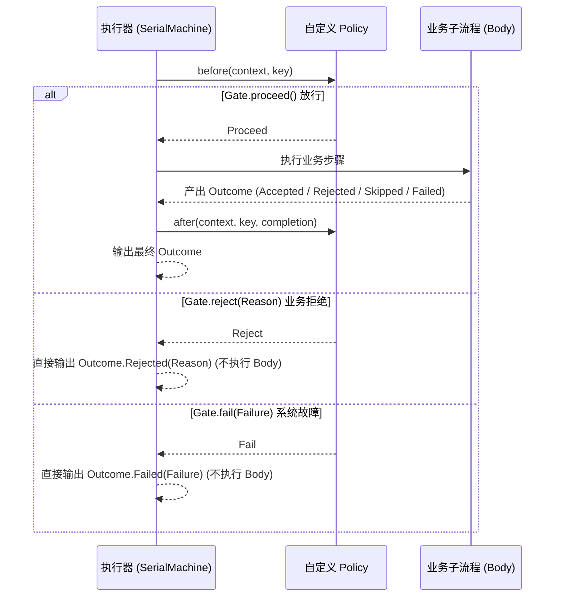
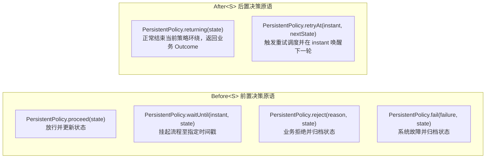

# 自定义治理策略开发指南：`Policy` 与 `PersistentPolicy`

除了框架提供的开箱即用策略模块（限流 `team4u-flow-ratelimiter`、重试 `team4u-flow-retry`、规则门控 `team4u-flow-criterion`），开发者可以非常轻松地为特定业务定制专有的拦截与调度策略。

`team4u-flow` 提供了两种不同生命周期维度的策略契约：
- **`Policy<K>`（无状态切面拦截契约）**：适用于权限鉴权、动态开关、白名单校验、指标埋点、审计日志等纯切面场景；
- **`PersistentPolicy<K, S>`（有状态持久化策略契约）**：适用于需要维护多轮状态、定时退避唤醒、Durable 状态机检查点存储与断点续跑等复杂场景。

---

## 无状态策略契约：`Policy<K>`

### 接口契约与调用时序

```java
package com.team4u.framework.flow.api;

public interface Policy<K> {
    /**
     * 前置评估网关：在目标流程执行前调用。
     *
     * @param context 策略上下文（包含 flowId、invocationId、attempt 等）
     * @param key     从输入中提取的策略路由键
     * @return Gate 判定结果：放行（proceed）、业务拒绝（reject）或系统故障（fail）
     */
    Gate before(PolicyContext context, K key);

    /**
     * 后置通知回调：在目标流程执行完成后调用（无论成功、拒绝、跳过或失败）。
     *
     * @param context    策略上下文
     * @param key        策略路由键
     * @param completion 完成摘要（包含四态 kind、耗时 durationMs 等）
     */
    default void after(PolicyContext context, K key, Completion completion) { }
}
```



### `Gate` 三态门控裁决

| 门控决策 | 构造方式 | 引擎执行动作 |
| :--- | :--- | :--- |
| **放行 (Proceed)** | `Gate.proceed()` | 继续向下推进执行目标业务步骤。 |
| **业务拒绝 (Reject)** | `Gate.reject(Reason.of("CODE", "msg"))` | 立即以 `Outcome.Rejected` 短路退出，不执行业务步骤，**绝不触发重试**。 |
| **系统故障 (Fail)** | `Gate.fail(Failure.of("CODE", "msg"))` | 立即以 `Outcome.Failed` 退出，可被外层重试策略捕获并触发退避重试。 |

### 开发示例：用户权限鉴权与审计策略

```java
import com.team4u.framework.flow.api.Gate;
import com.team4u.framework.flow.api.Policy;
import com.team4u.framework.flow.api.PolicyContext;
import com.team4u.framework.flow.model.Completion;
import com.team4u.framework.flow.model.Reason;
import lombok.extern.slf4j.Slf4j;

@Slf4j
public class UserAuthPolicy implements Policy<String> {

    private final AuthService authService;

    public UserAuthPolicy(AuthService authService) {
        this.authService = authService;
    }

    @Override
    public Gate before(PolicyContext context, String userId) {
        if (!authService.hasPermission(userId, "ORDER_CREATE")) {
            return Gate.reject(Reason.of("UNAUTHORIZED", "用户无创建订单权限"));
        }
        return Gate.proceed();
    }

    @Override
    public void after(PolicyContext context, String userId, Completion completion) {
        log.info("AuthPolicy Audit: user={}, outcome={}, duration={}ms",
                userId, completion.kind(), completion.durationMs());
    }
}
```

---

## 有状态持久化策略契约：`PersistentPolicy<K, S>`

当策略需要在多轮尝试之间**维护不可变状态（State）、计算唤醒时刻（`wakeAt`）、支持 Durable 检查点存储**时，实现 `PersistentPolicy<K, S>`。

### 接口契约定义

```java
package com.team4u.framework.flow.api;

public interface PersistentPolicy<K, S> {
    /** 初始化状态对象（首次进入策略作用域时调用） */
    S initialState(K key);

    /** 前置决策处理：返回决策与更新后的状态 */
    Before<S> before(PolicyContext context, K key, S state);

    /** 后置完成处理：返回后置决策与更新后的状态 */
    After<S> after(PolicyContext context, K key, S state, Completion completion);
}
```

### 前置与后置决策原语



### 状态不可变性（State Immutability）要求
> [!IMPORTANT]
> 状态对象 `S` 必须设计为**不可变对象（Immutable Object）**，且满足 `StateMapper` 确定性编解码契约。在每次状态变迁时（如递增重试计数），必须创建新的状态实例返回，以便框架安全落库至快照的 `policy:<path>` 槽位。

### 开发示例：自定义指数退避重试策略

```java
import com.team4u.framework.flow.api.PersistentPolicy;
import com.team4u.framework.flow.api.PolicyContext;
import com.team4u.framework.flow.model.Completion;
import com.team4u.framework.flow.model.Outcome;
import lombok.Value;

import java.time.Duration;
import java.time.Instant;

public class CustomBackoffPolicy implements PersistentPolicy<String, CustomBackoffPolicy.RetryState> {

    @Value
    public static class RetryState {
        int attempt;
        public static RetryState initial() { return new RetryState(1); }
        public RetryState next() { return new RetryState(attempt + 1); }
    }

    private final int maxAttempts;
    private final Duration baseDelay;

    public CustomBackoffPolicy(int maxAttempts, Duration baseDelay) {
        this.maxAttempts = maxAttempts;
        this.baseDelay = baseDelay;
    }

    @Override
    public RetryState initialState(String key) {
        return RetryState.initial();
    }

    @Override
    public Before<RetryState> before(PolicyContext context, String key, RetryState state) {
        // 前置放行并保持当前状态
        return PersistentPolicy.proceed(state);
    }

    @Override
    public After<RetryState> after(PolicyContext context, String key, RetryState state, Completion completion) {
        // 仅在技术失败且重试次数未达上限时触发退避重试
        if (completion.kind() == Outcome.Kind.FAILED && state.getAttempt() < maxAttempts) {
            long delayMillis = baseDelay.toMillis() * (1L << (state.getAttempt() - 1));
            Instant wakeTime = Instant.now().plusMillis(delayMillis);
            return PersistentPolicy.retryAt(wakeTime, state.next());
        }
        // 正常结束
        return PersistentPolicy.returning(state);
    }
}
```

---

## Spring 容器集成与依赖注入

若自定义策略需要注入 Spring Bean（如 DAO、RedisTemplate、RPC 客户端等），可配合 [`team4u-flow-bean`](flow-bean.md) 在编译期自动完成依赖注入与 AOP 代理保留：

```java
@Component
public class SpringUserAuthPolicy implements Policy<String> {

    @Autowired
    private PermissionRepository permissionRepository;

    @Override
    public Gate before(PolicyContext context, String userId) {
        if (!permissionRepository.checkAccess(userId)) {
            return Gate.reject(Reason.of("ACCESS_DENIED", "无权访问"));
        }
        return Gate.proceed();
    }
}

// 在 Flow 中声明式通过 Class 绑定
Flow<OrderRequest, Receipt> flow = Flow.step(chargeOperation)
        .policy(SpringUserAuthPolicy.class, OrderRequest::getUserId);
```

---

## 关联章节与进一步阅读

- [流程治理概览与洋葱模型](flow-governance.md)
- [限流治理策略 (team4u-flow-ratelimiter)](policy-ratelimiter.md)
- [重试与退避治理策略 (team4u-flow-retry)](policy-retry.md)
- [表达式规则门控策略 (team4u-flow-criterion)](policy-criterion.md)
- [Durable 状态机与 CAS 检查点](flow-durable-core.md)
- [Bean 容器集成与 Spring 治理](flow-bean.md)
