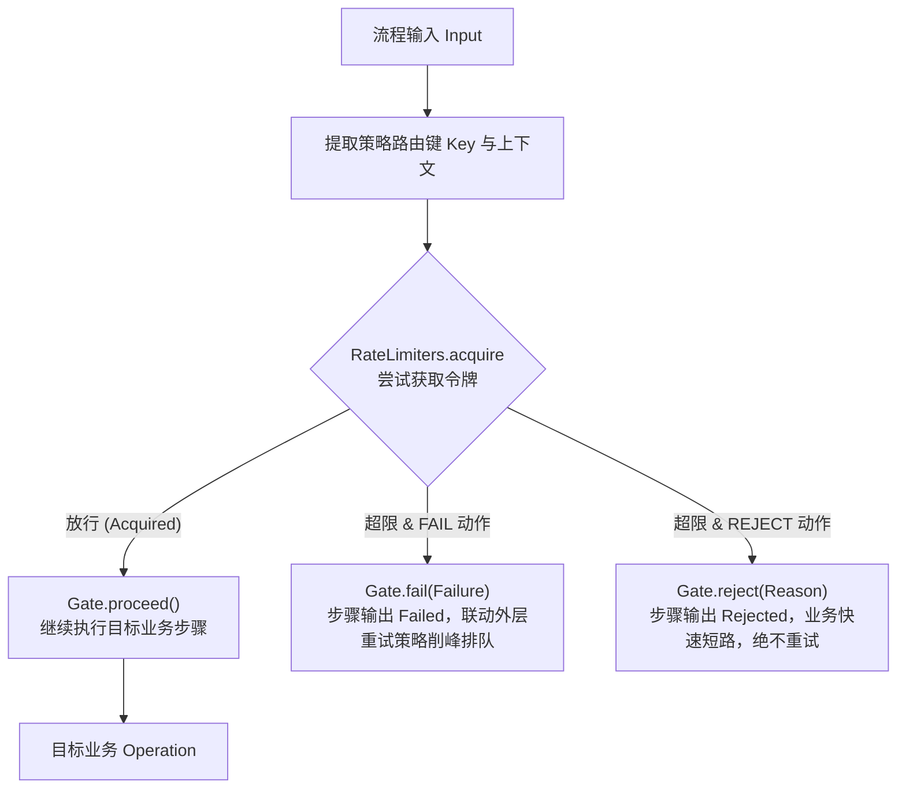
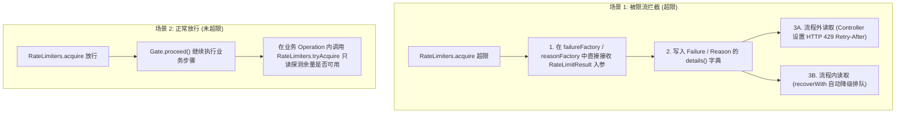

# 限流治理策略：`team4u-flow-ratelimiter`

在微服务与高并发分布式系统中，高成本业务步骤（如第三方支付扣款、外部 RPC 调用、高开销 AI 推理、优惠券核销等）需要实施严格的流量控制与过载保护。

`team4u-flow-ratelimiter` 模块将流程引擎的无状态治理契约 [`Policy<K>`](flow-governance.md#核心治理契约) 与框架的分布式限流引擎 [`team4u-ratelimiter`](../ratelimiter/README.md) 无缝融合，提供开箱即用的流程级分布式限流能力。

---

## 引入依赖

```xml
<dependency>
    <groupId>com.team4u</groupId>
    <artifactId>team4u-flow-ratelimiter</artifactId>
</dependency>
```

> [!NOTE]
> `team4u-flow-ratelimiter` 遵循纯净与最小依赖原则，生产代码仅依赖 `team4u-flow` 与 `team4u-ratelimiter`，无任何 Spring 或 Jackson 的强制运行时绑定。

---

## 核心架构与决策模型

限流策略作为无状态拦截器，在前置门控阶段（`before`）调用 `team4u-ratelimiter` 引擎尝试获取令牌，并将限流裁决结果转换为 Flow 标准门控决策：



### 限流决策动作：`RateLimitAction`

| 动作枚举 | 门控返回值 | 行为语义 | 典型应用场景 |
| :--- | :--- | :--- | :--- |
| **`RateLimitAction.FAIL`** *(默认)* | `Gate.fail(Failure)` | **系统级限流/排队**：步骤以 `Outcome.Failed` 退出。 | **削峰填谷与排队重试**：配合外层挂载的 `FlowRetryPolicy`，在退避等待后自动重新获取令牌。 |
| **`RateLimitAction.REJECT`** | `Gate.reject(Reason)` | **业务级快速失败/降级短路**：步骤以 `Outcome.Rejected` 退出。 | **防刷拦截与高频降级**：业务直接拒绝请求，**绝不触发多余重试与线程占用**。 |

---

## 编排使用指南与代码示例

### 基础用法（默认 FAIL 模式）

通过 `RateLimitPolicy.of` 绑定限流检查点，默认使用 `FAIL` 模式（每次扣减 1 个令牌）：

```java
import com.team4u.framework.flow.Flow;
import com.team4u.framework.flow.ratelimiter.RateLimitPolicy;

// 绑定用户维度的扣款限流检查点：限流时返回 Gate.fail
Flow<OrderRequest, Receipt> flow = Flow.step(chargeOperation)
        .policy(RateLimitPolicy.of("order.charge", OrderRequest::getUserId));
```

### 拒绝模式（快速短路，绝不重试）

当需要对高频恶意流量或超出容量的非关键请求实施即时拒绝时，使用 `RateLimitPolicy.reject`：

```java
// 超过限流阈值时直接返回 Rejected(Reason)，不执行后续业务，亦不触发重试
Flow<OrderRequest, Receipt> flow = Flow.step(chargeOperation)
        .policy(RateLimitPolicy.reject("order.charge", OrderRequest::getUserId));
```

---

## 高级定制：`RateLimitPolicy.builder()` 详解

在实际复杂的企业级业务中，简单的“每次扣减 1 个令牌并返回固定错误码”往往无法满足需求。例如：
- **批量操作**：批量订单处理需要根据订单条数动态扣减 $N$ 个令牌；
- **多租户隔离**：需要根据租户 ID、渠道标识动态提取限流上下文；
- **智能诊断与重试提示**：需要提取底层限流算法计算出的建议等待时间（`retryAfterMillis`），并注入 HTTP 响应头或失败详情中。

通过 `RateLimitPolicy.builder()` 可以对限流策略的每个维度进行细粒度定制：

```java
import com.team4u.framework.flow.Flow;
import com.team4u.framework.flow.ratelimiter.RateLimitPolicy;
import com.team4u.framework.flow.ratelimiter.RateLimitAction;
import com.team4u.framework.flow.model.Failure;

import java.util.LinkedHashMap;
import java.util.Map;

RateLimitPolicy<BatchOrderRequest> customPolicy = RateLimitPolicy.<BatchOrderRequest>builder()
        // 1. 指定限流检查点名称（对应配置中心中的规则 Key）
        .point("order.batch")
        
        // 2. 提取限流路由上下文（用于匹配规则里的 ${tenantId} 等占位符）
        .contextExtractor(BatchOrderRequest::getTenantId)
        
        // 3. 动态计算本次请求消耗的令牌数（按批量包含的条目数扣减）
        .permitsExtractor(BatchOrderRequest::getItemCount)
        
        // 4. 设定决策动作：FAIL（可触发重试）或 REJECT（业务短路）
        .action(RateLimitAction.FAIL)
        
        // 5. 自定义失败诊断工厂：提取建议重试时间与业务上下文（一次构造携带全部 details）
        .failureFactory((result, req) -> {
            Map<String, String> details = new LinkedHashMap<String, String>();
            details.put("tenantId", req.getTenantId());
            details.put("ruleId", result.getRuleId());
            details.put("requestedPermits", String.valueOf(req.getItemCount()));
            details.put("retryAfterMillis", String.valueOf(result.getRetryAfterMillis()));
            return new Failure("RATE_LIMIT_EXCEEDED",
                    "下单过于频繁，建议在 " + result.getRetryAfterMillis() + "ms 后重试",
                    details);
        })
        .build();

// 将策略挂载到 Flow 步骤上（req -> req 表示策略路由键直接使用 BatchOrderRequest 对象）
Flow<BatchOrderRequest, BatchReceipt> flow = Flow.step(batchChargeOperation)
        .policy(customPolicy, req -> req);
```

### Builder 各配置方法核心作用与原理解析

| Builder 配置方法 | 参数类型 | 默认行为 | 核心作用与业务场景 |
| :--- | :--- | :--- | :--- |
| **`point(String)`** | `String` | **必填**（无默认值） | **限流检查点唯一标识**。<br/>限流引擎会根据此 `point` 在配置中心（`team4u-config`）或本地规则注册表中检索对应的限流规则（如令牌桶容量、填充速率等）。 |
| **`contextExtractor(...)`** | `Function<K, ?>` | `k -> k`（原样透传 `key`） | **限流路由上下文提取器**。<br/>限流规则通常按维度（如 `${userId}`、`${tenantId}`、`${clientIp}`）隔离计数。通过此函数从请求对象中提取对应的隔离维度对象，供限流引擎解析表达式。 |
| **`permits(int)`** | `Integer` | `1` | **静态许可数**。<br/>适用于固定消耗场景。每次请求固定扣减指定数量的令牌。 |
| **`permitsExtractor(...)`** | `Function<K, Integer>` | `k -> 1`（或由 `permits` 决定） | **动态许可数提取器（核心高级特性）**。<br/>在批量导入、批量转账或大模型 Token 预估扣减等场景下，单次请求消耗的系统资源不同。此函数根据入参动态计算需扣减的令牌数。若当前桶内余量不足，请求将被精准限流拦截。 |
| **`action(RateLimitAction)`** | `RateLimitAction` | `RateLimitAction.FAIL` | **限流裁决动作**：<br/>• `FAIL`：步骤返回 `Outcome.Failed`，可联动外层 `FlowRetryPolicy` 进行自动退避排队；<br/>• `REJECT`：步骤返回 `Outcome.Rejected`，直接业务短路，绝不触发重试。 |
| **`failureFactory(...)`** | `BiFunction<RateLimitResult, K, Failure>` | 默认生成标准失败诊断 | **自定义 Failure 诊断工厂（仅在 FAIL 模式生效）**。<br/>允许开发者访问限流引擎的底层裁决结果 `RateLimitResult` 与业务请求 `K`，将算法计算出的 `retryAfterMillis`、命中的 `ruleId` 等封装进 `Failure`，供排障或重试策略使用。 |
| **`reasonFactory(...)`** | `BiFunction<RateLimitResult, K, Reason>` | 默认生成标准拒绝原因 | **自定义 Reason 业务原因工厂（仅在 REJECT 模式生效）**。<br/>在业务拒绝模式下，根据 `RateLimitResult` 定制具体的业务错误码与多语言提示信息。 |
| **`engine(RateLimitEngine)`** | `RateLimitEngine` | `RateLimiters.acquire`（全局默认单例） | **自定义限流引擎实例**。<br/>如果系统内针对不同业务划分了独立的限流引擎（如极速本地缓存引擎 vs 全局 Redis 分布式引擎），可通过此方法注入专属实例。 |

---

## 如何在流程内外获取与使用 RateLimitResult

许多开发者在接入限流时关心一个核心问题：**“限流结果 `RateLimitResult` 中的数据（如算法算出来的等待时间 `retryAfterMillis`、命中的规则 `ruleId`、剩余可用配额 `remaining`）在流程中到底该如何获取和使用？”**

在 `team4u-flow` 中，获取限流结果主要分为**超限拦截**与**正常放行**两类场景：



---

### 超限拦截场景：写入诊断并在流程外/流程内提取

#### 第一步：在策略工厂中捕获并封装进 `Failure`

```java
RateLimitPolicy<OrderRequest> customPolicy = RateLimitPolicy.<OrderRequest>builder()
        .point("order.charge")
        .contextExtractor(OrderRequest::getUserId)
        .action(RateLimitAction.FAIL)
        // 关键：第一个入参 result 即为限流引擎产生的 RateLimitResult！
        .failureFactory((result, req) -> {
            Long retryAfter = result.getRetryAfterMillis(); // 底层算法建议等待时间
            String ruleId = result.getRuleId();             // 命中的规则 ID
            Long remaining = result.getRemaining();         // 剩余配额

            Map<String, String> details = new LinkedHashMap<String, String>();
            details.put("retryAfterMillis", String.valueOf(retryAfter));
            details.put("ruleId", ruleId);
            details.put("remaining", String.valueOf(remaining));
            return new Failure("RATE_LIMIT_EXCEEDED", "请求过于频繁", details);
        })
        .build();
```

#### 第二步 A：在流程外部（如 Spring Controller）提取并设置响应头

```java
@PostMapping("/charge")
public ResponseEntity<?> handleCharge(@RequestBody OrderRequest request) {
    FlowResult<Receipt> result = orderExecutable.run(request);

    Outcome<Receipt> outcome = result.outcome();
    if (outcome != null) {
        if (outcome instanceof Outcome.Accepted) {
            return ResponseEntity.ok(((Outcome.Accepted<Receipt>) outcome).value());
        }
        
        if (outcome instanceof Outcome.Failed) {
            Failure failure = ((Outcome.Failed<Receipt>) outcome).failure();
            if ("RATE_LIMIT_EXCEEDED".equals(failure.code())) {
                // 提取之前放入 details 的 retryAfterMillis
                String retryAfterMs = failure.details().get("retryAfterMillis");
                long seconds = retryAfterMs != null ? Long.parseLong(retryAfterMs) / 1000 : 1;

                // 设置标准 HTTP 429 与 Retry-After 响应头
                return ResponseEntity.status(HttpStatus.TOO_MANY_REQUESTS)
                        .header(HttpHeaders.RETRY_AFTER, String.valueOf(Math.max(1, seconds)))
                        .body("操作过于频繁，请在 " + seconds + " 秒后重试");
            }
            return ResponseEntity.status(500).body(failure.message());
        }
    }
    throw new IllegalStateException("Unexpected result: " + result);
}
```

#### 第二步 B：在流程内部通过 `recoverWith` 自动降级排队

```java
Flow<OrderRequest, Receipt> resilientFlow = Flow.step(chargeOperation)
        .policy(customPolicy, req -> req)
        // 捕获限流 Failed 并进行业务降级
        .recoverWith(Flow.step((context, recovery) -> {
            Failure failure = recovery.failure();
            
            if ("RATE_LIMIT_EXCEEDED".equals(failure.code())) {
                String retryAfter = failure.details().get("retryAfterMillis");
                log.warn("触发限流，转入异步延迟排队, 预计等待: {}ms", retryAfter);
                
                // 返回排队中的凭证（转为 Accepted 正常继续）
                return Outcome.accepted(new Receipt("PENDING_QUEUE", "正在排队中，预计 " + retryAfter + "ms 后处理"));
            }
            // 非限流错误原样向外透传
            return Outcome.failed(failure);
        }));
```

---

### 正常放行场景：在业务步骤中只读查询当前配额

当请求成功通过限流放行后，如果后续的业务 `Operation` 需要感知当前剩余多少配额（如将剩余可用次数展示给用户）：

`team4u-ratelimiter` 的 `RateLimiters` 门面提供了 `tryAcquire(point, context)` 轻量探测方法，**不消耗令牌、仅探测当前是否可获取**，适合做只读的状态感知：

```java
@Component
public class ChargeOperation implements Operation<OrderRequest, Receipt> {

    @Override
    public Outcome<Receipt> execute(OperationContext context, OrderRequest req) {
        // 只读探测当前检查点是否仍可获取令牌（零副作用，不消耗令牌）
        boolean stillAllowed = RateLimiters.tryAcquire("order.charge", req.getUserId());
        
        log.info("用户 [{}] 当前扣款检查点可获取令牌: {}", req.getUserId(), stillAllowed);

        // 执行核心业务扣款并返回带有配额信息的收据...
        Receipt receipt = new Receipt(req.getOrderId(), "PAID");
        receipt.setQuotaAvailable(stillAllowed);
        return Outcome.accepted(receipt);
    }
}
```

> [!NOTE]
> `RateLimiters` 门面的完整方法集为 `init(ConfigManager, KvStore)`、`acquire(point, context)`、
> `acquire(point, context, permits)`、`tryAcquire(point, context)` 与 `destroy()`；
> 并不存在名为 `check(point, context)` 的只读查询方法。若需要携带 `remaining`、`retryAfterMillis`
> 等详细裁决信息，应在策略的 `failureFactory` / `reasonFactory` 中捕获超限时的 `RateLimitResult`，
> 或直接集成 `team4u-ratelimiter` 的 `RateLimitEngine` 自行探测。

---

### `RateLimitResult` 核心字段速查表

| 字段方法 | 返回类型 | 字段说明 | 业务用途 |
| :--- | :--- | :--- | :--- |
| **`result.isAllowed()`** | `boolean` | 本次请求是否被放行 | 核心判定标志。 |
| **`result.getRuleId()`** | `String` | 命中的限流规则 ID | 多规则配置场景下定位具体是哪条规则（如全局规则还是租户规则）拦截了请求。 |
| **`result.getRetryAfterMillis()`** | `Long` | 建议重试等待毫秒数 | 算法（令牌桶、漏桶）计算出的桶恢复到可用所需的时间，用于前端倒计时或 `Retry-After` 头。 |
| **`result.getRemaining()`** | `Long` | 当前窗口剩余可用额度 | 展示给客户端或记录日志进行配额消耗监控。 |
| **`result.getDecisionTimeMillis()`** | `long` | 裁决发生的时间戳（epoch 毫秒） | 用于分布式审计与链路追踪回溯。 |
| **`result.getReason()`** | `RateLimitReason` | 裁决底层枚举原因 | 如 `ALLOWED`（放行）、`EXCEEDED`（超限）、`NO_RULE`（无规则放行）等。 |

---

## 限流与重试联动（削峰填谷排队模式）

将限流策略（`Policy`）作为内层拦截，重试策略（`FlowRetryPolicy`）作为外层控制器。当限流返回 `FAIL` 时，外层重试策略会自动在退避延迟后重新尝试获取令牌：

```java
import com.team4u.framework.flow.Flow;
import com.team4u.framework.flow.retry.FlowRetryPolicy;
import com.team4u.framework.flow.ratelimiter.RateLimitPolicy;

// 链式组合：内层限流（每次重试均重新获取令牌），外层挂载 3 次指数退避重试
Flow<OrderRequest, Receipt> protectedFlow = Flow.step(chargeOperation)
        .policy(RateLimitPolicy.of("order.charge", OrderRequest::getUserId))
        .persistentPolicy(FlowRetryPolicy.exponential(3, 100, 2.0, 1000), OrderRequest::getUserId);
```

```text
[请求到来]
  -> [Retry 尝试 1]
    -> [RateLimit.before 尝试获取令牌] -> [超限! 返回 Gate.fail]
  -> [Retry 捕获 Failed -> 计算指数退避 100ms 并等待]
  -> [Retry 尝试 2]
    -> [RateLimit.before 重新获取令牌] -> [成功获取! 返回 Gate.proceed]
    -> [执行 chargeOperation] -> [返回 Accepted(Receipt)]
  -> [流程成功完成]
```

---

## 限流算法与配置驱动热生效实战

限流引擎支持通过配置中心（[`team4u-config`](../config/README.md)）动态下发限流算法与阈值配置。当配置中心的规则发生变更时，引擎在后台自动监听并热重载规则，**无需重启服务即可秒级生效**。

### 配置键（Key）命名约定

一个限流检查点（`point`）对应配置中心的一个配置键：
$$\text{Key} = \text{team4u.ratelimiter.} + \text{point}$$

例如限流点为 `"order.charge"` 时，配置键为：**`team4u.ratelimiter.order.charge`** 。

---

### 配置值（Value）JSON 规则数组定义

配置中心的值为该检查点对应的 **JSON 规则数组**（支持配置多条规则分层拦截）：

```json
[
  {
    "id": "per-user-limit",
    "algorithm": "token-bucket",
    "capacity": 10,
    "refillRate": 2.0,
    "key": "${userId}",
    "priority": 0
  },
  {
    "id": "global-cluster-limit",
    "algorithm": "sliding-window",
    "windowMillis": 1000,
    "threshold": 500,
    "priority": 1
  }
]
```

#### JSON 核心字段说明

| 字段 | 类型 | 必填 | 说明 |
| :--- | :--- | :--- | :--- |
| **`id`** | `String` | 是 | 规则唯一标识（同检查点内不能重复，作为缓存 Key 与诊断 ruleId）。 |
| **`algorithm`** | `String` | 是 | 限流算法名：`token-bucket`（令牌桶）、`sliding-window`（滑动窗口）、`leaky-bucket`（漏桶）、`fixed-window`（固定窗口）。 |
| **`key`** | `String` | 否 | 路由键模板，支持 `${variable}` 占位符（从请求上下文中提取）；为空表示全局共享配额。 |
| **`capacity`** | `int` | 按算法 | 令牌桶/漏桶容量上限。 |
| **`refillRate`** | `double` | 按算法 | 令牌桶每秒补充令牌速率。 |
| **`windowMillis`** | `long` | 按算法 | 窗口时长（毫秒），如滑动窗口长度。 |
| **`threshold`** | `int` | 按算法 | 窗口内允许通过的最大请求数阈值。 |
| **`priority`** | `int` | 否 | 规则优先级（**数字越小越先执行**，默认 0）。 |

> [!TIP]
> 详细的限流算法模型、参数配置与分布式存储后端（Redis / JDBC）选型，请参考 [RateLimiter 快速开始与配置规范 (docs/ratelimiter/quick-start.md)](../ratelimiter/quick-start.md) 及 [RateLimiter 算法详解 (docs/ratelimiter/ratelimiter-algorithms.md)](../ratelimiter/ratelimiter-algorithms.md)。

---

### 支持的限流算法速查

| 算法类型 | 算法标识 | 核心特点 | 适用场景 |
| :--- | :--- | :--- | :--- |
| **令牌桶 (Token Bucket)** | `token-bucket` | 允许应对突发流量，平滑补充令牌 | 核心交易下单、高并发 API 网关 |
| **漏桶 (Leaky Bucket)** | `leaky-bucket` | 恒定速率流出，严格整形流量 | 保护脆弱下游、对外部第三方接口限速 |
| **滑动窗口 (Sliding Window)** | `sliding-window` | 精确统计窗口内请求数，无临界跳变 | 严格周期配额、防高频刷单 |
| **固定窗口 (Fixed Window)** | `fixed-window` | 实现极简、内存开销极低 | 粗粒度防刷、基础防护 |

---

## 在文本 DSL 与动态流程定义中使用 (Flow DSL 集成)

`team4u-flow-ratelimiter` 提供了开箱即用的 [`RateLimitFlowDefinitionExtension`](file:///root/code/team4u-framework/modules/flow/ratelimiter/src/main/java/com/team4u/framework/flow/ratelimiter/RateLimitFlowDefinitionExtension.java) SPI 扩展。引入依赖后即可在 `.flow` 文本 DSL 中声明限流切面：

```dsl
step payment.charge {
    # 声明限流切面：绑定 key 提取器与动态参数
    policy payment.rateLimit key order.userId {
        permits: 1,
        action: "REJECT"
    }
}
```

底层通过 [`RateLimitPolicyProvider`](file:///root/code/team4u-framework/modules/flow/ratelimiter/src/main/java/com/team4u/framework/flow/ratelimiter/RateLimitPolicyProvider.java) 与 [`MapReader`](file:///root/code/team4u-framework/modules/base/core/src/main/java/com/team4u/framework/base/util/MapReader.java) 自动解析参数，支持 `permits`（每次消耗令牌数）、`action`（`REJECT`、`FAIL` 或 `PROCEED`）与 `point`（自定义限流检查点标识），无缝构建强类型 `RateLimitPolicy`。

---

## 关联章节与进一步阅读

- [流程治理概览与洋葱模型](flow-governance.md)
- [重试与退避治理策略 (team4u-flow-retry)](policy-retry.md)
- [表达式规则门控策略 (team4u-flow-criterion)](policy-criterion.md)
- [RateLimiter 快速开始与配置规范 (docs/ratelimiter/quick-start.md)](../ratelimiter/quick-start.md)
- [配置中心组件核心文档 (docs/config/README.md)](../config/README.md)
- [自定义 Policy 扩展开发](policy-custom.md)

