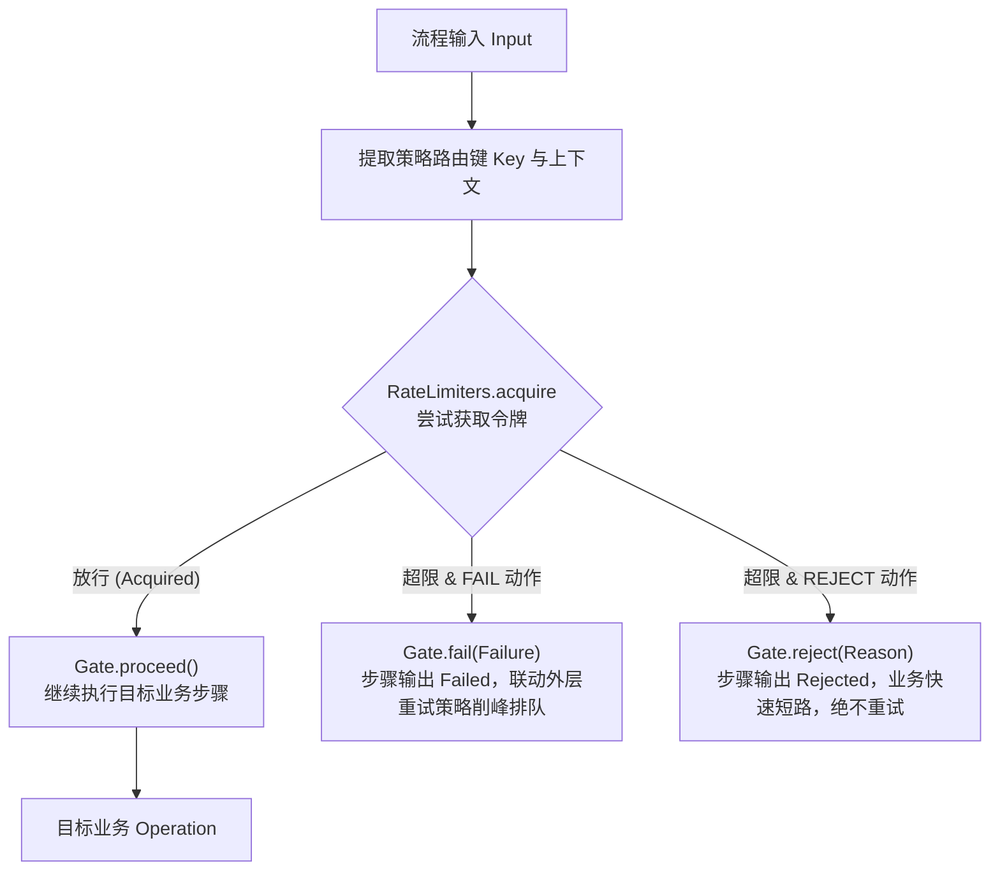

# 限流治理策略：`team4u-flow-ratelimiter`

在微服务与高并发分布式系统中，高成本业务步骤（如第三方支付扣款、外部 RPC 调用、高开销 AI 推理、优惠券核销等）需要实施严格的流量控制与过载保护。

`team4u-flow-ratelimiter` 模块将流程引擎的无状态治理契约 [`Policy<K>`](flow-governance.md#核心治理契约) 与框架的分布式限流引擎 [`team4u-ratelimiter`](../ratelimiter/README.md) 无缝融合，提供开箱即用的流程级分布式限流能力。

---

## 引入依赖

```xml
<dependency>
    <groupId>com.team4u</groupId>
    <artifactId>team4u-flow-ratelimiter</artifactId>
</dependency>
```

> [!NOTE]
> `team4u-flow-ratelimiter` 遵循纯净与最小依赖原则，生产代码仅依赖 `team4u-flow` 与 `team4u-ratelimiter`，无任何 Spring 或 Jackson 的强制运行时绑定。

---

## 核心架构与决策模型

限流策略作为无状态拦截器，在前置门控阶段（`before`）调用 `team4u-ratelimiter` 引擎尝试获取令牌，并将限流裁决结果转换为 Flow 标准门控决策：



### 限流决策动作：`RateLimitAction`

| 动作枚举 | 门控返回值 | 行为语义 | 典型应用场景 |
| :--- | :--- | :--- | :--- |
| **`RateLimitAction.FAIL`** *(默认)* | `Gate.fail(Failure)` | **系统级限流/排队**：步骤以 `Outcome.Failed` 退出。 | **削峰填谷与排队重试**：配合外层挂载的 `FlowRetryPolicy`，在退避等待后自动重新获取令牌。 |
| **`RateLimitAction.REJECT`** | `Gate.reject(Reason)` | **业务级快速失败/降级短路**：步骤以 `Outcome.Rejected` 退出。 | **防刷拦截与高频降级**：业务直接拒绝请求，**绝不触发多余重试与线程占用**。 |

---

## 编排使用指南与代码示例

### 1. 基础用法（默认 FAIL 模式）

通过 `RateLimitPolicies.of` 绑定限流检查点，默认使用 `FAIL` 模式（每次扣减 1 个令牌）：

```java
import com.team4u.framework.flow.Flow;
import com.team4u.framework.flow.ratelimiter.RateLimitPolicies;

// 绑定用户维度的扣款限流检查点：限流时返回 Gate.fail
Flow<OrderRequest, Receipt> flow = Flow.step(chargeOperation)
        .policy(RateLimitPolicies.of("order.charge", OrderRequest::getUserId));
```

### 2. 拒绝模式（快速短路，绝不重试）

当需要对高频恶意流量或超出容量的非关键请求实施即时拒绝时，使用 `RateLimitPolicies.reject`：

```java
// 超过限流阈值时直接返回 Rejected(Reason)，不执行后续业务，亦不触发重试
Flow<OrderRequest, Receipt> flow = Flow.step(chargeOperation)
        .policy(RateLimitPolicies.reject("order.charge", OrderRequest::getUserId));
```

---

## 高级定制：`RateLimitPolicy.builder()` 详解

在实际复杂的企业级业务中，简单的“每次扣减 1 个令牌并返回固定错误码”往往无法满足需求。例如：
- **批量操作**：批量订单处理需要根据订单条数动态扣减 $N$ 个令牌；
- **多租户隔离**：需要根据租户 ID、渠道标识动态提取限流上下文；
- **智能诊断与重试提示**：需要提取底层限流算法计算出的建议等待时间（`retryAfterMillis`），并注入 HTTP 响应头或失败详情中。

通过 `RateLimitPolicy.builder()` 可以对限流策略的每个维度进行细粒度定制：

```java
import com.team4u.framework.flow.Flow;
import com.team4u.framework.flow.ratelimiter.RateLimitPolicy;
import com.team4u.framework.flow.ratelimiter.RateLimitAction;
import com.team4u.framework.flow.model.Failure;

RateLimitPolicy<BatchOrderRequest> customPolicy = RateLimitPolicy.<BatchOrderRequest>builder()
        // 1. 指定限流检查点名称（对应配置中心中的规则 Key）
        .point("order.batch")
        
        // 2. 提取限流路由上下文（用于匹配规则里的 ${tenantId} 等占位符）
        .contextExtractor(BatchOrderRequest::getTenantId)
        
        // 3. 动态计算本次请求消耗的令牌数（按批量包含的条目数扣减）
        .permitsExtractor(BatchOrderRequest::getItemCount)
        
        // 4. 设定决策动作：FAIL（可触发重试）或 REJECT（业务短路）
        .action(RateLimitAction.FAIL)
        
        // 5. 自定义失败诊断工厂：提取建议重试时间与业务上下文
        .failureFactory((result, req) -> Failure.of("RATE_LIMIT_EXCEEDED", 
                "下单过于频繁，建议在 " + result.getRetryAfterMillis() + "ms 后重试")
                .withDetail("tenantId", req.getTenantId())
                .withDetail("ruleId", result.getRuleId())
                .withDetail("requestedPermits", String.valueOf(req.getItemCount()))
                .withDetail("retryAfterMillis", String.valueOf(result.getRetryAfterMillis())))
        .build();

// 将策略挂载到 Flow 步骤上（req -> req 表示策略路由键直接使用 BatchOrderRequest 对象）
Flow<BatchOrderRequest, BatchReceipt> flow = Flow.step(batchChargeOperation)
        .policy(customPolicy, req -> req);
```

### Builder 各配置方法核心作用与原理解析

| Builder 配置方法 | 参数类型 | 默认行为 | 核心作用与业务场景 |
| :--- | :--- | :--- | :--- |
| **`point(String)`** | `String` | **必填**（无默认值） | **限流检查点唯一标识**。<br/>限流引擎会根据此 `point` 在配置中心（`team4u-config`）或本地规则注册表中检索对应的限流规则（如令牌桶容量、填充速率等）。 |
| **`contextExtractor(...)`** | `Function<K, ?>` | `k -> k`（原样透传 `key`） | **限流路由上下文提取器**。<br/>限流规则通常按维度（如 `${userId}`、`${tenantId}`、`${clientIp}`）隔离计数。通过此函数从请求对象中提取对应的隔离维度对象，供限流引擎解析表达式。 |
| **`permits(int)`** | `Integer` | `1` | **静态许可数**。<br/>适用于固定消耗场景。每次请求固定扣减指定数量的令牌。 |
| **`permitsExtractor(...)`** | `Function<K, Integer>` | `k -> 1`（或由 `permits` 决定） | **动态许可数提取器（核心高级特性）**。<br/>在批量导入、批量转账或大模型 Token 预估扣减等场景下，单次请求消耗的系统资源不同。此函数根据入参动态计算需扣减的令牌数。若当前桶内余量不足，请求将被精准限流拦截。 |
| **`action(RateLimitAction)`** | `RateLimitAction` | `RateLimitAction.FAIL` | **限流裁决动作**：<br/>• `FAIL`：步骤返回 `Outcome.Failed`，可联动外层 `FlowRetryPolicy` 进行自动退避排队；<br/>• `REJECT`：步骤返回 `Outcome.Rejected`，直接业务短路，绝不触发重试。 |
| **`failureFactory(...)`** | `BiFunction<RateLimitResult, K, Failure>` | 默认生成标准失败诊断 | **自定义 Failure 诊断工厂（仅在 FAIL 模式生效）**。<br/>允许开发者访问限流引擎的底层裁决结果 `RateLimitResult` 与业务请求 `K`，将算法计算出的 `retryAfterMillis`、命中的 `ruleId` 等封装进 `Failure`，供排障或重试策略使用。 |
| **`reasonFactory(...)`** | `BiFunction<RateLimitResult, K, Reason>` | 默认生成标准拒绝原因 | **自定义 Reason 业务原因工厂（仅在 REJECT 模式生效）**。<br/>在业务拒绝模式下，根据 `RateLimitResult` 定制具体的业务错误码与多语言提示信息。 |
| **`engine(RateLimitEngine)`** | `RateLimitEngine` | `RateLimiters.acquire`（全局默认单例） | **自定义限流引擎实例**。<br/>如果系统内针对不同业务划分了独立的限流引擎（如极速本地缓存引擎 vs 全局 Redis 分布式引擎），可通过此方法注入专属实例。 |

---

### `RateLimitResult` 裁决对象字段说明

在 `failureFactory` 与 `reasonFactory` 中，限流引擎会传入只读的裁决对象 `RateLimitResult`，其主要属性如下：

- **`result.isAllowed()`**：`boolean`，本次请求是否成功获取到令牌；
- **`result.getRuleId()`**：`String`，触发限流的具体规则 ID（多规则配置时方便定位是哪条规则拦截了请求）；
- **`result.getRetryAfterMillis()`**：`Long`，算法（如令牌桶、漏桶）计算出的**建议重试等待毫秒数**（若算法无法精确估算则为 `null`）；
- **`result.getRemaining()`**：`Long`，当前窗口内剩余的可用配额；
- **`result.getDecisionTimeMillis()`**：`long`，限流裁决发生的时间戳（epoch 毫秒）。

---

## 限流与重试联动（削峰填谷排队模式）

将限流策略（`Policy`）作为内层拦截，重试策略（`FlowRetryPolicy`）作为外层控制器。当限流返回 `FAIL` 时，外层重试策略会自动在退避延迟后重新尝试获取令牌：

```java
import com.team4u.framework.flow.Flow;
import com.team4u.framework.flow.retry.FlowRetries;
import com.team4u.framework.flow.ratelimiter.RateLimitPolicies;

// 链式组合：内层限流（每次重试均重新获取令牌），外层挂载 3 次指数退避重试
Flow<OrderRequest, Receipt> protectedFlow = Flow.step(chargeOperation)
        .policy(RateLimitPolicies.of("order.charge", OrderRequest::getUserId))
        .persistentPolicy(FlowRetries.exponential(3, 100, 2.0, 1000), OrderRequest::getUserId);
```

```text
[请求到来]
  -> [Retry 尝试 1]
    -> [RateLimit.before 尝试获取令牌] -> [超限! 返回 Gate.fail]
  -> [Retry 捕获 Failed -> 计算指数退避 100ms 并等待]
  -> [Retry 尝试 2]
    -> [RateLimit.before 重新获取令牌] -> [成功获取! 返回 Gate.proceed]
    -> [执行 chargeOperation] -> [返回 Accepted(Receipt)]
  -> [流程成功完成]
```

---

## 限流算法与配置驱动热生效

限流引擎支持通过配置中心（`team4u-config`）动态下发限流算法（令牌桶、漏桶、滑动窗口、固定窗口）与阈值配置，无需重启服务即可即时热生效：

```json
// 配置键：team4u.ratelimiter.order.charge
[
  {
    "id": "tb-user-limit",
    "algorithm": "token-bucket",
    "capacity": 10,
    "refillRate": 2.0,
    "key": "${userId}"
  }
]
```

### 支持的限流算法速查

| 算法类型 | 算法标识 | 核心特点 | 适用场景 |
| :--- | :--- | :--- | :--- |
| **令牌桶 (Token Bucket)** | `token-bucket` | 允许应对突发流量，平滑补充令牌 | 核心交易下单、高并发 API 网关 |
| **漏桶 (Leaky Bucket)** | `leaky-bucket` | 恒定速率流出，严格整形流量 | 保护脆弱下游、对外部第三方接口限速 |
| **滑动窗口 (Sliding Window)** | `sliding-window` | 精确统计窗口内请求数，无临界跳变 | 严格周期配额、防高频刷单 |
| **固定窗口 (Fixed Window)** | `fixed-window` | 实现极简、内存开销极低 | 粗粒度防刷、基础防护 |

详细限流算法模型与多维度路由键配置，请参考 [RateLimiter 核心文档](../ratelimiter/README.md)。

---

## 关联章节与进一步阅读

- [流程治理概览与洋葱模型](flow-governance.md)
- [重试与退避治理策略 (team4u-flow-retry)](policy-retry.md)
- [表达式规则门控策略 (team4u-flow-criterion)](policy-criterion.md)
- [自定义 Policy 扩展开发](policy-custom.md)
