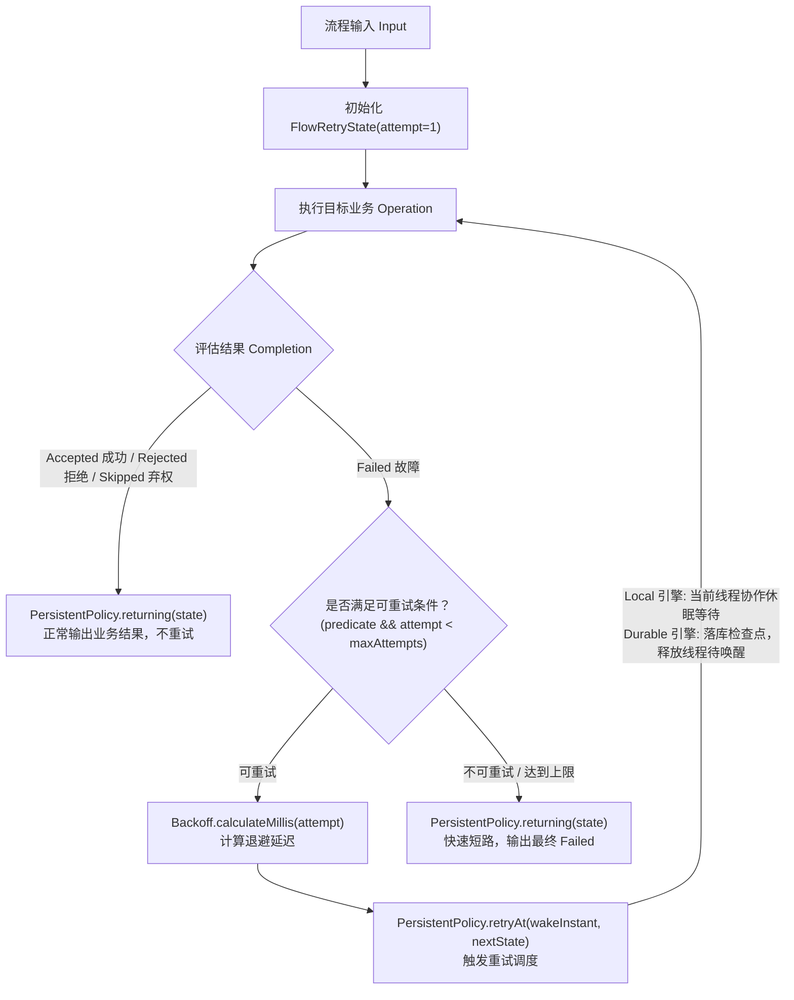

# 重试与退避治理策略：`team4u-flow-retry`

在分布式流水线中，网络抖动、偶发超时、下游负载突增与服务短暂不可用等临时性故障（Transient Failures）是常态。

`team4u-flow-retry` 模块将成熟的重试退避算法引擎 [`team4u-retry`](../retry/README.md) 与流程引擎的持久化策略契约 [`PersistentPolicy<K, FlowRetryState>`](flow-governance.md#核心治理契约) 深度整合，为业务提供抗重试风暴、条件快速短路、稳定幂等键注入与跨进程断点恢复的企业级重试治理能力。

---

## 引入依赖

```xml
<dependency>
    <groupId>com.team4u</groupId>
    <artifactId>team4u-flow-retry</artifactId>
</dependency>
```

> [!NOTE]
> `team4u-flow-retry` 遵循纯净架构原则，仅依赖 `team4u-flow` 与 `team4u-retry`，通过 Maven Enforcer 严格禁止 Spring 与 Jackson 等生产级外部框架硬编码依赖。

---

## 核心架构与状态调度模型

重试治理在 Flow 中被统一建模为**有状态持久化策略**（`PersistentPolicy`）。每次尝试的轮次、退避延迟与历史状态由不可变值对象 [`FlowRetryState`](file:///root/code/team4u-framework/modules/flow/retry/src/main/java/com/team4u/framework/flow/retry/FlowRetryState.java) 精确记录：



---

## 多算法退避数学模型

为了有效防止高并发下的**重试雪崩（Thundering Herd Problem）**与对下游服务的二次打垮，模块完整继承了 `team4u-retry` 强大的退避算法：

| 退避算法 | 便捷工厂方法 | 数学计算模型 | 适用场景 |
| :--- | :--- | :--- | :--- |
| **固定延迟 (Fixed)** | `FlowRetries.fixed(maxAttempts, delayMillis)` | $$D(a) = \text{delay}$$ | 重试成本低、故障恢复快的内部基础调用 |
| **指数退避 (Exponential)** | `FlowRetries.exponential(maxAttempts, initialDelay, multiplier, maxDelay)` | $$D(a) = \min(\text{maxDelay}, \text{initial} \times \text{multiplier}^{a - 1})$$ | 下游过载时的流量削峰平滑恢复 |
| **随机抖动退避 (Jitter)** | `FlowRetries.jitter(maxAttempts, initialDelay, multiplier, maxDelay)` | $$D(a) = \text{random}(0, \min(\text{maxDelay}, \text{initial} \times \text{multiplier}^{a - 1}))$$ | **生产核心推荐：彻底打散集群并发重试请求** |
| **等差递增 (Increment)** | `FlowRetries.increment(maxAttempts, initialDelay, stepMillis)` | $$D(a) = \text{initial} + (a - 1) \times \text{step}$$ | 排队等待耗时线性增加的异步任务 |

> [!TIP]
> **生产最佳实践**：在微服务集群环境下，强烈推荐优先使用 **`FlowRetries.jitter`（随机抖动退避）**。纯指数退避在集群遭遇瞬时故障时，由于各节点计算出的退避时间完全相同，会导致所有节点在同一毫秒重试，形成脉冲式的重试风暴；引入 Jitter 后重试请求在时间轴上均匀分布，大幅提升下游自愈概率。

---

## 编排使用指南与代码示例

### 1. 基础用法：指数与随机抖动退避

```java
import com.team4u.framework.flow.Flow;
import com.team4u.framework.flow.retry.FlowRetries;

// 1. 指数退避：最多 5 次（首次 + 4 次重试），初始 100ms，2.0 倍递增，最大上限 2000ms
Flow<OrderRequest, Receipt> flow1 = Flow.step(chargeOperation)
        .persistentPolicy(FlowRetries.exponential(5, 100, 2.0, 2000), OrderRequest::getUserId);

// 2. 随机抖动退避：生产级抗重试风暴
Flow<OrderRequest, Receipt> flow2 = Flow.step(chargeOperation)
        .persistentPolicy(FlowRetries.jitter(4, 50, 2.0, 1000), OrderRequest::getUserId);
```

### 2. 条件重试判定与快速短路（Fast-Fail）

在实际业务中，只有部分瞬态故障（如 `TIMEOUT`、`NETWORK_ERROR`）才应重试；而业务参数错误（如 `INVALID_ACCOUNT`、`BALANCE_NOT_ENOUGH`）若盲目重试不仅无意义，还会白白消耗线程与资源：

```java
import com.team4u.framework.flow.Flow;
import com.team4u.framework.flow.retry.FlowRetryPolicy;
import com.team4u.framework.retry.common.backoff.Backoffs;

FlowRetryPolicy<OrderRequest> conditionalPolicy = FlowRetryPolicy.<OrderRequest>builder()
        .maxAttempts(3)
        .backoff(Backoffs.exponentialJitter(100, 2.0, 1000))
        // 方式 A：精准白名单（仅当错误码为 TIMEOUT 或 RPC_ERROR 时重试）
        .retryOnCodes("TIMEOUT", "RPC_ERROR")
        // 方式 B：精准黑名单（命中 AUTH_FAILED 或 PARAM_ERROR 时绝不重试）
        // .abortOnCodes("AUTH_FAILED", "PARAM_ERROR")
        // 方式 C：自定义谓词函数
        // .retryPredicate(failure -> failure.message().contains("Connection reset"))
        .build();

Flow<OrderRequest, Receipt> flow = Flow.step(chargeOperation)
        .persistentPolicy(conditionalPolicy, OrderRequest::getUserId);
```

### 3. 动态配置规则与热重载

支持从内存注册表（`NamedRetryPolicyRegistry`）或配置中心（`DynamicRetryPolicyRegistry`）按名称动态加载重试参数，修改配置即刻热生效：

```java
// 动态拉取配置中心键为 "order-charge-retry" 的重试规则
Flow<OrderRequest, Receipt> flow = Flow.step(chargeOperation)
        .persistentPolicy(FlowRetries.named("order-charge-retry"), OrderRequest::getUserId);
```

---

## Local 与 Durable 双引擎行为差异

`team4u-flow-retry` 基于 `PersistentPolicy` 契约，在两种执行引擎下表现出针对各自运行时优化的执行语义：

| 引擎类型 | 重试退避实现机制 | 线程占用情况 | 崩溃自愈与恢复能力 |
| :--- | :--- | :--- | :--- |
| **Local 内存引擎** | 在当前工作线程内基于 `SerialMachine.awaitWake()` 进行高精度休眠等待。 | 占用当前线程（支持工作窃取与补偿）。 | 仅支持进程内生命周期，支持响应 `Cancellation` 中断安全唤醒退出。 |
| **Durable 持久化引擎** | 执行到达退避点时，**将当前 `FlowRetryState` 写入存储并标记 `ACTIVE`（附带 `wakeAt` 绝对时间戳）**，随后立即释放工作线程退出（Parked）。 | **零线程占用**。在长退避（如 10 分钟后重试）期间完全不消耗 CPU 与线程资源。 | 即使机器崩溃或重启，后台调度器扫描到 `wakeAt` 到期后调用 `recover(executionId)`，自动从失败节点原位断点续跑。 |

---

## 关键语义与幂等保证

### 1. 仅对 `Failed` 状态重试
- 若步骤返回 `Accepted`（成功）、`Rejected`（业务拒绝）或 `Skipped`（弃权跳过），框架均视为确定性的业务结论，**绝对不触发重试**；
- 避免了将业务层面的正常拦截误判为系统异常。

### 2. 稳定的幂等键 (`invocationId`)
节点在初次执行以及后续的所有重试轮次中，`context.invocationId()` 格式严格保持恒定：
$$\text{invocationId} = \text{flowId} : \text{flowVersion} : \text{executionId} : \text{nodePath}$$

- 下游外部 RPC 服务（如支付网关、库存中心）可以直接将该 ID 作为全局幂等防重 Token；
- 彻底解决了分布式环境下因网络抖动导致的**重试重复扣款**问题。

---

## 关联章节与进一步阅读

- [流程治理概览与洋葱模型](flow-governance.md)
- [限流治理策略 (team4u-flow-ratelimiter)](policy-ratelimiter.md)
- [表达式规则门控策略 (team4u-flow-criterion)](policy-criterion.md)
- [Durable 两段式恢复协议与 PersistentPolicy](flow-durable-resume.md)
- [自定义 Policy 扩展开发](policy-custom.md)
