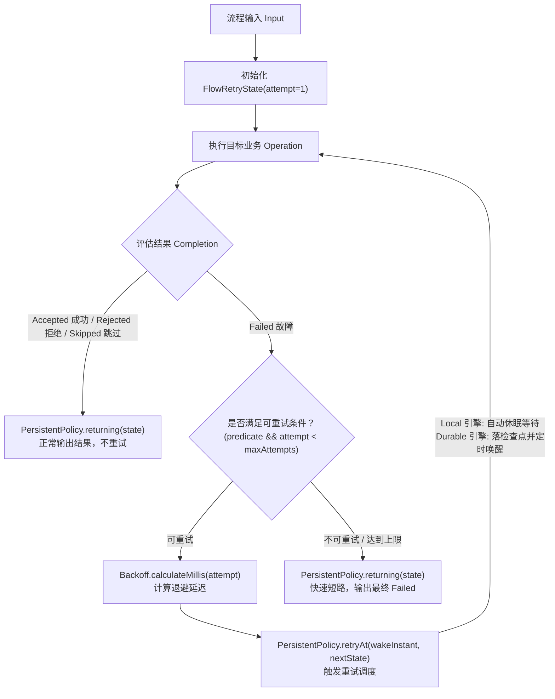

# 重试与退避治理策略：`team4u-flow-retry`

在分布式流水线中，网络抖动、偶发超时、下游负载突增等临时性故障（Transient Failures）是常态。`team4u-flow-retry` 模块将成熟的重试退避算法引擎 [`team4u-retry`](../retry/README.md) 与流程引擎的持久化策略契约 [`PersistentPolicy<K, FlowRetryState>`](flow-governance.md#2-有状态持久化策略persistentpolicyk-s) 深度整合，为业务提供抗重试风暴、条件快速失败、状态断点恢复的企业级重试治理能力。

---

## 1. 引入依赖

```xml
<dependency>
    <groupId>com.team4u</groupId>
    <artifactId>team4u-flow-retry</artifactId>
</dependency>
```

> [!NOTE]
> `team4u-flow-retry` 遵循纯净架构原则，仅依赖 `team4u-flow` 与 `team4u-retry`，通过 Maven Enforcer 严格禁止 Spring 与 Jackson 等生产级外部绑定。

---

## 2. 核心架构与调度模型

重试治理在 Flow 中被统一建模为**有状态持久化策略**（`PersistentPolicy`）。每次尝试的轮次与延迟状态由不可变值对象 [`FlowRetryState`](file:///root/code/team4u-framework/modules/flow/retry/src/main/java/com/team4u/framework/flow/retry/FlowRetryState.java) 精确记录：



---

## 3. 多算法退避体系

模块完整继承了 `team4u-retry` 强大的退避算法，有效防止高并发下的重试雪崩与下游二次打垮：

| 退避算法 | 便捷工厂方法 | 算法原理与应用场景 |
| :--- | :--- | :--- |
| **固定延迟 (Fixed)** | `FlowRetries.fixed(maxAttempts, delayMillis)` | 每次重试等待恒定时长。适用于重试成本低、故障恢复快的基础场景。 |
| **指数退避 (Exponential)** | `FlowRetries.exponential(maxAttempts, initialDelay, multiplier, maxDelay)` | 延迟随重试次数呈几何倍数递增（如 $100\text{ms} \rightarrow 200\text{ms} \rightarrow 400\text{ms}$）。适用于下游负载过高时的削峰恢复。 |
| **随机抖动退避 (Jitter)** | `FlowRetries.jitter(maxAttempts, initialDelay, multiplier, maxDelay)` | 在指数退避基础上引入随机抖动因子（Full / Equal Jitter）。**生产推荐：彻底打破集群客户端同步重试引起的重试风暴**。 |
| **等差递增 (Increment)** | `FlowRetries.increment(maxAttempts, initialDelay, stepMillis)` | 延迟按固定步长线性递增（如 $1\text{s} \rightarrow 1.5\text{s} \rightarrow 2\text{s}$）。适用于排队耗时逐步增加的场景。 |

---

## 4. 编排使用示例

### 4.1 基础用法：指数与随机抖动退避

```java
import com.team4u.framework.flow.Flow;
import com.team4u.framework.flow.retry.FlowRetries;
import com.team4u.framework.flow.retry.FlowRetryPolicy;

// 1. 指数退避：最多 5 次（首次 + 4 次重试），初始 100ms，2.0 倍递增，最大上限 2000ms
FlowRetryPolicy<OrderRequest> expPolicy = FlowRetries.exponential(5, 100, 2.0, 2000);
Flow<OrderRequest, Receipt> flow1 = expPolicy.wrap(Flow.step(chargeOperation), Function.identity());

// 2. 随机抖动退避：生产级防重试风暴
FlowRetryPolicy<OrderRequest> jitterPolicy = FlowRetries.jitter(4, 50, 2.0, 1000);
Flow<OrderRequest, Receipt> flow2 = jitterPolicy.wrap(Flow.step(chargeOperation), Function.identity());
```

### 4.2 条件重试判定与快速短路（Fast-Fail）

在实际业务中，只有部分瞬时故障（如 `TIMEOUT`、`CONNECTION_RESET`）才应重试；而业务参数错误（如 `INVALID_ACCOUNT`、`BALANCE_NOT_ENOUGH`）若盲目重试不仅无意义，还会白白消耗线程与资源：

```java
import com.team4u.framework.flow.retry.FlowRetryPolicy;
import com.team4u.framework.retry.common.backoff.Backoffs;

FlowRetryPolicy<OrderRequest> conditionalPolicy = FlowRetryPolicy.<OrderRequest>builder()
        .maxAttempts(3)
        .backoff(Backoffs.exponentialJitter(100, 2.0, 1000))
        // 方式 A：精准白名单（仅当错误码为 TIMEOUT 或 NETWORK_ERROR 时重试）
        .retryOnCodes("TIMEOUT", "NETWORK_ERROR")
        // 方式 B：精准黑名单（命中 AUTH_FAILED 时绝不重试）
        // .abortOnCodes("AUTH_FAILED", "INVALID_PARAM")
        // 方式 C：自定义谓词函数
        // .retryPredicate(failure -> failure.message().contains("Connection refused"))
        .build();

Flow<OrderRequest, Receipt> flow = conditionalPolicy.wrap(Flow.step(chargeOperation), Function.identity());
```

### 4.3 动态配置规则与热重载

支持从内存注册表（[`NamedRetryPolicyRegistry`](file:///root/code/team4u-framework/modules/retry/core/src/main/java/com/team4u/framework/retry/api/NamedRetryPolicyRegistry.java)）或配置中心（[`DynamicRetryPolicyRegistry`](file:///root/code/team4u-framework/modules/retry/config/src/main/java/com/team4u/framework/retry/dynamic/DynamicRetryPolicyRegistry.java)）按名称动态加载重试参数，修改配置即刻热生效：

```java
// 动态拉取配置键为 "order-charge-retry" 的重试规则
FlowRetryPolicy<OrderRequest> dynamicPolicy = FlowRetries.named("order-charge-retry");
Flow<OrderRequest, Receipt> flow = dynamicPolicy.wrap(Flow.step(chargeOperation), Function.identity());
```

---

## 5. Local 与 Durable 双引擎行为

| 引擎类型 | 重试退避行为 | 中断与恢复保证 |
| :--- | :--- | :--- |
| **Local 内存引擎** | 在当前工作线程内基于 `Thread.sleep` 或精准定时器进行退避等待。 | 支持协作式取消信号 [`Cancellation`](flow-suspend.md)。超时或取消时立即安全唤醒并退出。 |
| **Durable 持久化引擎** | 执行到达退避点时，**将当前 `FlowRetryState` 写入存储并标记 `ACTIVE`（附带 `wakeAt` 唤醒时刻）**，随后立即释放工作线程。 | 即使系统崩溃或服务重启，调度器扫描到 `wakeAt` 到期后会自动拉起快照并从失败节点精确续跑。 |

---

## 6. 关键语义与幂等保证

1. **仅对 `Failed` 状态重试**：
   - 若步骤返回 `Accepted`（成功）、`Rejected`（业务拒绝）或 `Skipped`（弃权跳过），框架均视为正常业务结论，**绝不触发重试**。
2. **稳定的幂等键 (`invocationId`)**：
   - 节点在初次执行以及后续的所有重试轮次中，`context.invocationId()`（格式：`flowId:flowVersion:executionId:nodePath`）**保持绝对恒定**。下游外部 RPC 服务可安全使用该 ID 作为全局幂等防重键。

---

## 7. 关联章节

- [流程治理概览与洋葱模型](flow-governance.md)
- [限流治理策略 (team4u-flow-ratelimiter)](policy-ratelimiter.md)
- [表达式规则门控策略 (team4u-flow-criterion)](policy-criterion.md)
- [Durable 两段式恢复协议与 PersistentPolicy](flow-durable-resume.md)
- [自定义 Policy 扩展开发](policy-custom.md)
