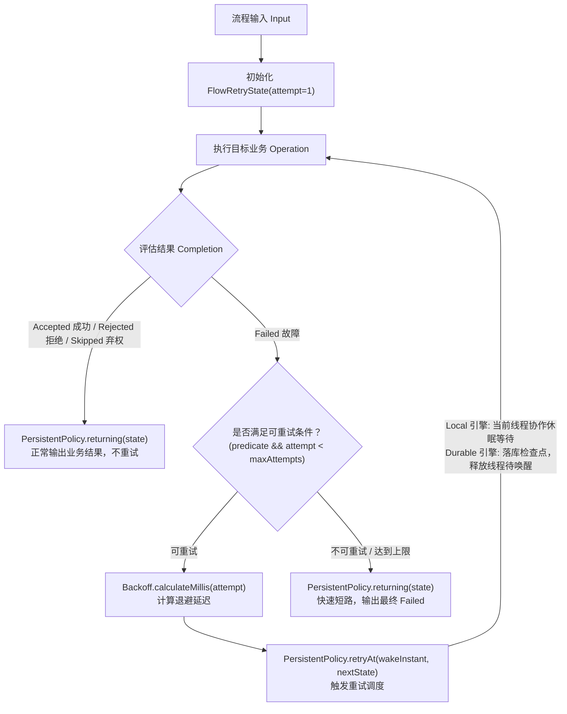
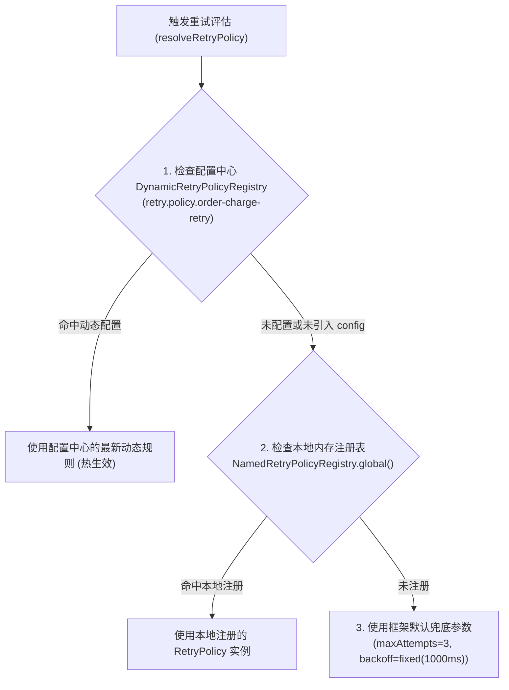

# 重试与退避治理策略：`team4u-flow-retry`

在分布式流水线中，网络抖动、偶发超时、下游负载突增与服务短暂不可用等临时性故障（Transient Failures）是常态。

`team4u-flow-retry` 模块将成熟的重试退避算法引擎 [`team4u-retry`](../retry/README.md) 与流程引擎的持久化策略契约 [`PersistentPolicy<K, FlowRetryState>`](flow-governance.md#核心治理契约) 深度整合，为业务提供抗重试风暴、条件快速短路、稳定幂等键注入与跨进程断点恢复的企业级重试治理能力。

---

## 引入依赖

```xml
<dependency>
    <groupId>com.team4u</groupId>
    <artifactId>team4u-flow-retry</artifactId>
</dependency>

<!-- 若需对接配置中心动态规则热重载，按需引入动态配置支持包 -->
<dependency>
    <groupId>com.team4u</groupId>
    <artifactId>team4u-retry-config</artifactId>
</dependency>
```

> [!NOTE]
> `team4u-flow-retry` 核心包遵循纯净架构原则，仅依赖 `team4u-flow` 与 `team4u-retry`；动态配置支持通过 `team4u-retry-config` 无缝桥接 [`team4u-config`](../config/README.md)。

---

## 核心架构与状态调度模型

重试治理在 Flow 中被统一建模为**有状态持久化策略**（`PersistentPolicy`）。每次尝试的轮次、退避延迟与历史状态由不可变值对象 [`FlowRetryState`](file:///root/code/team4u-framework/modules/flow/retry/src/main/java/com/team4u/framework/flow/retry/FlowRetryState.java) 精确记录：



---

## 多算法退避数学模型

为了有效防止高并发下的**重试雪崩（Thundering Herd Problem）**与对下游服务的二次打垮，模块完整继承了 `team4u-retry` 强大的退避算法：

| 退避算法 | 便捷工厂方法 | 数学计算模型 | 适用场景 |
| :--- | :--- | :--- | :--- |
| **固定延迟 (Fixed)** | `FlowRetries.fixed(maxAttempts, delayMillis)` | $$D(a) = \text{delay}$$ | 重试成本低、故障恢复快的内部基础调用 |
| **指数退避 (Exponential)** | `FlowRetries.exponential(maxAttempts, initialDelay, multiplier, maxDelay)` | $$D(a) = \min(\text{maxDelay}, \text{initial} \times \text{multiplier}^{a - 1})$$ | 下游过载时的流量削峰平滑恢复 |
| **随机抖动退避 (Jitter)** | `FlowRetries.jitter(maxAttempts, initialDelay, multiplier, maxDelay)` | $$D(a) = \text{random}(0, \min(\text{maxDelay}, \text{initial} \times \text{multiplier}^{a - 1}))$$ | **生产核心推荐：彻底打散集群并发重试请求** |
| **等差递增 (Increment)** | `FlowRetries.increment(maxAttempts, initialDelay, stepMillis)` | $$D(a) = \text{initial} + (a - 1) \times \text{step}$$ | 排队等待耗时线性增加的异步任务 |

> [!TIP]
> **生产最佳实践**：在微服务集群环境下，强烈推荐优先使用 **`FlowRetries.jitter`（随机抖动退避）**。纯指数退避在集群遭遇瞬时故障时，由于各节点计算出的退避时间完全相同，会导致所有节点在同一毫秒重试，形成脉冲式的重试风暴；引入 Jitter 后重试请求在时间轴上均匀分布，大幅提升下游自愈概率。

---

## 编排使用指南与代码示例

### 1. 基础用法：指数与随机抖动退避

```java
import com.team4u.framework.flow.Flow;
import com.team4u.framework.flow.retry.FlowRetries;

// 1. 指数退避：最多 5 次（首次 + 4 次重试），初始 100ms，2.0 倍递增，最大上限 2000ms
Flow<OrderRequest, Receipt> flow1 = Flow.step(chargeOperation)
        .persistentPolicy(FlowRetries.exponential(5, 100, 2.0, 2000), OrderRequest::getUserId);

// 2. 随机抖动退避：生产级抗重试风暴
Flow<OrderRequest, Receipt> flow2 = Flow.step(chargeOperation)
        .persistentPolicy(FlowRetries.jitter(4, 50, 2.0, 1000), OrderRequest::getUserId);
```

---

## 高级定制：`FlowRetryPolicy.builder()` 详解

在实际生产场景中，并非所有失败都适合重试。盲目重试非瞬态错误（如“参数错误”、“账户不存在”）只会白白浪费系统线程与连接池。

通过 `FlowRetryPolicy.builder()` 可以对重试最大次数、退避算法、条件白名单/黑名单以及动态命名策略进行细粒度控制：

```java
import com.team4u.framework.flow.Flow;
import com.team4u.framework.flow.retry.FlowRetryPolicy;
import com.team4u.framework.retry.common.backoff.Backoffs;

FlowRetryPolicy<OrderRequest> customPolicy = FlowRetryPolicy.<OrderRequest>builder()
        // 1. 设置最大尝试总次数（包含初次执行，必须 >= 1）
        .maxAttempts(3)
        
        // 2. 绑定退避算法（如带抖动的指数退避：初始 100ms，2.0 倍增长，上限 1000ms）
        .backoff(Backoffs.exponentialJitter(100, 2.0, 1000))
        
        // 3. 错误码精准白名单：仅在遇到 TIMEOUT 或 RPC_ERROR 时才触发重试
        .retryOnCodes("TIMEOUT", "RPC_ERROR")
        
        // 4. 或：错误码精准黑名单（遇到以下错误码绝不重试，直接快速失败）
        // .abortOnCodes("INVALID_PARAM", "AUTH_FAILED", "BALANCE_NOT_ENOUGH")
        
        // 5. 或：自定义高级谓词判定（可检查异常信息、根因类型等）
        // .retryOn(failure -> failure.cause() instanceof java.net.SocketTimeoutException)
        .build();

Flow<OrderRequest, Receipt> flow = Flow.step(chargeOperation)
        .persistentPolicy(customPolicy, OrderRequest::getUserId);
```

### Builder 各配置方法核心作用与原理解析

| Builder 配置方法 | 参数类型 | 默认行为 | 核心作用与业务场景 |
| :--- | :--- | :--- | :--- |
| **`maxAttempts(int)`** | `Integer` | `3`（或由动态策略决定） | **最大尝试总次数（含首次执行）**。<br/>若设为 3，代表“1 次初试 + 最多 2 次重试”。超过此轮次后步骤以最终的 `Outcome.Failed` 退出。 |
| **`backoff(Backoff)`** | `Backoff` | `Backoffs.fixed(1000)` | **退避算法实例**。<br/>指定每次重试之间的等待延迟计算器。支持 `fixed`（固定）、`exponential`（指数）、`exponentialJitter`（抖动）及 `increment`（等差）。 |
| **`retryOnCodes(String...)`** | `String...` | 无限制（所有 Failed 均重试） | **错误码白名单匹配（推荐）**。<br/>仅当 `Failure.code()` 在指定清单中时才触发重试；遇到其他未列出的错误码直接快速失败短路（Fast-Fail）。 |
| **`abortOnCodes(String...)`** | `String...` | 无限制 | **错误码黑名单匹配**。<br/>当命中业务参数错误、鉴权失败等确定性错误码时立即终止重试，向外透传失败。 |
| **`retryOn(...)` / `retryPredicate(...)`** | `Predicate<Failure>` | `failure -> true` | **自定义条件谓词**。<br/>支持根据 `Failure` 中的根因异常 `cause()`、详细键值对 `details()` 或错误描述信息进行深度定制判定。 |
| **`policyName(String)`** | `String` | `null` | **动态策略规则标识**。<br/>指定策略名称后，框架会尝试从配置中心（`DynamicRetryPolicyRegistry`）或命名注册表动态拉取规则，实现线上免重启热更新。 |
| **`namedRegistry(...)`** | `NamedRetryPolicyRegistry` | 全局单例注册表 | **自定义命名注册表**。<br/>用于多租户或隔离场景下查找指定名称的重试规则模板。 |

---

## 动态配置规则与热重载实战

在生产环境中，硬编码重试参数会导致遇到下游故障变更时必须重新打包发布代码。`team4u-flow-retry` 支持通过**策略名称（`policyName`）**从配置中心或内存注册表动态拉取重试规则，并在后台自动监听配置变更，实现**免重启秒级热生效**。

### 1. 流程中声明绑定策略名称

```java
import com.team4u.framework.flow.Flow;
import com.team4u.framework.flow.retry.FlowRetries;

// 使用 FlowRetries.named 绑定策略名 "order-charge-retry"
Flow<OrderRequest, Receipt> flow = Flow.step(chargeOperation)
        .persistentPolicy(FlowRetries.named("order-charge-retry"), OrderRequest::getUserId);
```

---

### 2. 配置中心下发规则配置

框架基于 [`team4u-config`](../config/README.md) 配置中心组件动态解析规则。

#### 配置键（Key）命名约定
配置中心中的配置键遵循统一前缀规则：
$$\text{Key} = \text{retry.policy.} + \text{policyName}$$

例如针对 `order-charge-retry`，配置键为：**`retry.policy.order-charge-retry`**。

#### 配置值（Value）JSON 格式定义

```json
{
  "maxRetries": 4,
  "backoff": {
    "type": "exponentialJitter",
    "params": {
      "initialDelay": 100,
      "multiplier": 2.0,
      "maxDelay": 2000
    }
  },
  "retryOnExceptions": [
    "java.net.SocketTimeoutException",
    "java.io.IOException"
  ],
  "abortOnExceptions": [
    "java.lang.IllegalArgumentException"
  ]
}
```

#### JSON 核心配置字段说明

| JSON 字段 | 类型 | 必填 | 说明 |
| :--- | :--- | :--- | :--- |
| **`maxRetries`** | `int` | 是 | **最大重试次数（不含首次执行）**。若设为 4，表示最多尝试 5 次。 |
| **`backoff.type`** | `String` | 是 | 退避算法类型标识：<br/>• `fixed`：固定延迟<br/>• `exponential`：纯指数退避<br/>• `exponentialJitter`：带随机抖动的指数退避（推荐）<br/>• `increment`：等差递增 |
| **`backoff.params`** | `Object` | 是 | 对应退避算法的数学参数（如 `initialDelay` 初始延迟、`multiplier` 倍数、`maxDelay` 上限毫秒数）。 |
| **`retryOnExceptions`**| `Array<String>` | 否 | 仅对指定异常类及其子类触发重试（类名需在类路径中存在）。 |
| **`abortOnExceptions`**| `Array<String>` | 否 | 遇到指定异常立即终止重试并快速失败。 |

> [!TIP]
> 详细的动态重试规则 JSON 格式定义与扩展说明，请参考 [重试策略配置规范 (docs/retry/retry-strategy.md#动态配置高级)](../retry/retry-strategy.md#动态配置高级)。

---

### 3. 本地代码内存注册静态兜底（可选）

如果应用在某些环境（如本地测试）未连接配置中心，可以通过 `NamedRetryPolicyRegistry` 注册静态默认策略：

```java
import com.team4u.framework.retry.api.NamedRetryPolicyRegistry;
import com.team4u.framework.retry.api.RetryPolicy;
import com.team4u.framework.retry.common.backoff.Backoffs;

// 注册名为 "order-charge-retry" 的本地静态兜底策略
NamedRetryPolicyRegistry.global().register("order-charge-retry", () -> 
        RetryPolicy.builder()
                .maxRetries(3)
                .backoff(Backoffs.exponentialJitter(100, 2.0, 1000))
                .build()
);
```

---

### 4. 运行期多级查找与降级优先级

当流程节点执行失败准备重试时，`FlowRetryPolicy` 按以下优先级解析生效参数：



---

## Local 与 Durable 双引擎行为差异

`team4u-flow-retry` 基于 `PersistentPolicy` 契约，在两种执行引擎下表现出针对各自运行时优化的执行语义：

| 引擎类型 | 重试退避实现机制 | 线程占用情况 | 崩溃自愈与恢复能力 |
| :--- | :--- | :--- | :--- |
| **Local 内存引擎** | 在当前工作线程内基于 `SerialMachine.awaitWake()` 进行高精度休眠等待。 | 占用当前线程（支持工作窃取与补偿）。 | 仅支持进程内生命周期，支持响应 `Cancellation` 中断安全唤醒退出。 |
| **Durable 持久化引擎** | 执行到达退避点时，**将当前 `FlowRetryState` 写入存储并标记 `ACTIVE`（附带 `wakeAt` 绝对时间戳）**，随后立即释放工作线程退出（Parked）。 | **零线程占用**。在长退避（如 10 分钟后重试）期间完全不消耗 CPU 与线程资源。 | 即使机器崩溃或重启，后台调度器扫描到 `wakeAt` 到期后调用 `recover(executionId)`，自动从失败节点原位断点续跑。 |

---

## 关键语义与幂等保证

### 1. 仅对 `Failed` 状态重试
- 若步骤返回 `Accepted`（成功）、`Rejected`（业务拒绝）或 `Skipped`（弃权跳过），框架均视为确定性的业务结论，**绝对不触发重试**；
- 避免了将业务层面的正常拦截误判为系统异常。

### 2. 稳定的幂等键 (`invocationId`)
节点在初次执行以及后续的所有重试轮次中，`context.invocationId()` 格式严格保持恒定：
$$\text{invocationId} = \text{flowId} : \text{flowVersion} : \text{executionId} : \text{nodePath}$$

- 下游外部 RPC 服务（如支付网关、库存中心）可以直接将该 ID 作为全局幂等防重 Token；
- 彻底解决了分布式环境下因网络抖动导致的**重试重复扣款**问题。

---

## 关联章节与进一步阅读

- [流程治理概览与洋葱模型](flow-governance.md)
- [限流治理策略 (team4u-flow-ratelimiter)](policy-ratelimiter.md)
- [表达式规则门控策略 (team4u-flow-criterion)](policy-criterion.md)
- [重试策略核心规范与配置详解 (docs/retry/retry-strategy.md)](../retry/retry-strategy.md)
- [配置中心组件核心文档 (docs/config/README.md)](../config/README.md)
- [Durable 两段式恢复协议与 PersistentPolicy](flow-durable-resume.md)
- [自定义 Policy 扩展开发](policy-custom.md)
