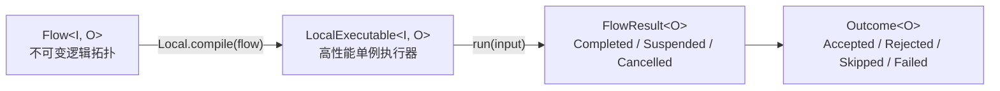

# 快速开始

本文介绍如何在项目中引入并使用 `team4u-flow` 流程编排组件。

---

## 引入依赖

通过统一 BOM 引入核心模块与可选扩展模块：

```xml
<dependencyManagement>
    <dependencies>
        <dependency>
            <groupId>com.team4u</groupId>
            <artifactId>team4u-framework</artifactId>
            <version>1.0.0-SNAPSHOT</version>
            <type>pom</type>
            <scope>import</scope>
        </dependency>
    </dependencies>
</dependencyManagement>

<dependencies>
    <!-- 核心模块：类型化 Flow DSL + Local 执行器，零第三方运行时依赖 -->
    <dependency>
        <groupId>com.team4u</groupId>
        <artifactId>team4u-flow</artifactId>
    </dependency>
</dependencies>
```

可选生态模块按需引入：

| 模块 | 用途 |
| :--- | :--- |
| `team4u-flow-bean`（配合 `team4u-bean-spring`） | Spring / Bean 容器声明式绑定编排 |
| `team4u-flow-durable` | 节点边界 CAS 检查点与跨进程崩溃恢复 |
| `team4u-flow-graph` | 流程结构 Mermaid 图与文本树渲染 |
| `team4u-flow-test`（`scope=test`） | 业务桩、Trace 收集器与单元测试断言 |

---

## 基础流水线与同步执行



业务步骤实现 `Operation<I, O>` 并返回四态 `Outcome`，通过 `Flow.step(...).then(...)` 组装为强类型流水线：

```java
import com.team4u.framework.flow.Flow;
import com.team4u.framework.flow.Local;
import com.team4u.framework.flow.LocalExecutable;
import com.team4u.framework.flow.api.Operation;
import com.team4u.framework.flow.model.FlowResult;
import com.team4u.framework.flow.model.Outcome;

public class QuickStart {

    static Operation<String, Integer> lengthOp = (context, value) ->
            Outcome.accepted(value.length());

    static Operation<Integer, String> formatOp = (context, value) ->
            Outcome.accepted("len=" + value);

    public static void main(String[] args) {
        // 构建不可变流程定义（Flow<I, O> 纯结构，无副作用）
        Flow<String, String> flow = Flow.step(lengthOp).then(formatOp);

        // 编译为可执行单例（完成结构校验、类型推导与绑定解析）
        LocalExecutable<String, String> executable = Local.compile(flow);

        // 同步执行并获取结果
        FlowResult<String> result = executable.run("team4u");
        System.out.println(result.requireAccepted()); // len=6
    }
}
```

> [!NOTE]
> - **严格类型推导**：`Flow<String, Integer>.then(Operation<Integer, String>)` 产出 `Flow<String, String>`，类型不匹配在编译期直接报错。
> - **定义与执行分离**：`Flow` 是纯逻辑拓扑，天然不可变且线程安全；`LocalExecutable` 是编译后的高性能单例，建议全局复用。

---

## 四态业务结果 (Outcome)

`Outcome<T>` 是业务结果的四态闭集，仅 `Accepted` 携带输出：

```java
Operation<OrderRequest, Receipt> checkout = (context, order) -> {
    // 1. 业务拒绝（如参数不合法、黑名单、额度不足）
    if (order.getAmount() <= 0) {
        return Outcome.rejected(Reason.of("INVALID_AMOUNT", "金额必须为正"));
    }
    // 2. 弃权跳过（当前节点不适用）
    if (!inventoryClient.tryReserve(order.getInvocationKey())) {
        return Outcome.skipped(Reason.of("OUT_OF_STOCK", "库存不足，暂不处理"));
    }
    // 3. 技术失败（外部系统故障、异常）
    Receipt receipt = paymentClient.charge(order);
    if (receipt == null) {
        return Outcome.failed(Failure.of("PAYMENT_ERROR", "支付渠道异常"));
    }
    // 4. 成功完成并携带输出
    return Outcome.accepted(receipt);
};
```

按状态消费执行结果：

```java
FlowResult<Receipt> result = Local.compile(Flow.step(checkout)).run(order);

if (result instanceof FlowResult.Completed) {
    Outcome<Receipt> outcome = ((FlowResult.Completed<Receipt>) result).outcome();
    if (outcome instanceof Outcome.Accepted) {
        handleSuccess(((Outcome.Accepted<Receipt>) outcome).value());
    } else if (outcome instanceof Outcome.Rejected) {
        handleReject(((Outcome.Rejected<Receipt>) outcome).reason());
    } else if (outcome instanceof Outcome.Skipped) {
        handleSkip(((Outcome.Skipped<Receipt>) outcome).reason());
    } else if (outcome instanceof Outcome.Failed) {
        handleFailure(((Outcome.Failed<Receipt>) outcome).failure());
    }
}
```

---

## 条件路由与候选降级

### 条件路由 (Route)

```java
Flow<OrderRequest, Receipt> routedFlow = Flow
        .route((Operation<OrderRequest, String>) (context, order) ->
                Outcome.accepted(order.getChannel()))
        .caseOf("ALIPAY", alipayFlow)
        .caseOf("WECHAT", wechatFlow)
        .otherwise(manualFlow); // 或 .withoutOtherwise()：未匹配时整体 Skipped
```

### 降级链 (firstApplicable)

依次尝试多个候选分支，以首个非 `Skipped` 结果结束；若全部分支均 `Skipped` 则整体 `Skipped`：

```java
Flow<OrderRequest, Receipt> fallbackFlow = Flow.firstApplicable(
        primeChannelFlow,   // 不适用时返回 Skipped
        backupChannelFlow,  // 不适用时返回 Skipped
        manualChannelFlow   // 兜底分支
);
```

### 可选步骤 (thenOptional)

用于同类型（`O -> O`）可选步骤。节点弃权返回 `Skipped` 时不中断流水线，而是将**进入该步骤前的原值**透传给后续节点：

```java
Operation<Order, Order> applyCoupon = (context, order) -> {
    if (order.getCouponCode() == null) {
        return Outcome.skipped(Reason.of("NO_COUPON", "未提供优惠券"));
    }
    return Outcome.accepted(order.applyCoupon());
};

Flow<Order, Receipt> flow = Flow.<Order>identity()
        .thenOptional(applyCoupon) // Skipped 时保留原 order 继续
        .then(createReceipt);
```

---

## Bean 容器集成

引入 `team4u-flow-bean` 与 `team4u-bean-spring` 后，可在 Flow 中直接引用 Class 与限定符。编译期一次性解析绑定容器单例，运行期直接调用无反射，Spring 事务与 AOP 代理完整生效：

```java
@Component("onlinePaymentOperation")
public class PaymentOperation implements Operation<OrderRequest, Receipt> {

    @Autowired
    private PaymentGatewayClient paymentGatewayClient;

    @Override
    @Transactional(rollbackFor = Exception.class) // 事务切面原样保留
    public Outcome<Receipt> execute(OperationContext context, OrderRequest order) {
        PaymentResponse resp = paymentGatewayClient.charge(
                context.invocationId(), order.getOrderId(), order.getAmount());
        return Outcome.accepted(new Receipt(order.getOrderId(), resp.getTxId()));
    }
}

@Configuration
@Import(Team4uBeanConfiguration.class) // 桥接 Spring 容器至 BeanManager
public class OrderFlowConfig {

    @Bean
    public LocalExecutable<OrderRequest, Receipt> orderExecutable() {
        return BeanFlows.compile(
                Flow.step(ValidateOrderOperation.class)
                        .then(PaymentOperation.class, "onlinePaymentOperation")
        );
    }
}
```

---

## 进阶编排与治理控制

### 异步执行 (runAsync)

```java
LocalExecutable<String, String> executable = Local.compile(flow);

// 返回 Java 标准 CompletionStage
executable.runAsync("framework")
        .thenAccept(res -> System.out.println("Result: " + res.requireAccepted()));
```

### 并行分支 (parallel 与 join)

```java
Branch<OrderRequest, RiskReport> riskBranch = Branch.of("risk", riskFlow);
Branch<OrderRequest, StockReport> stockBranch = Branch.of("stock", stockFlow);

Flow<OrderRequest, String> parallelFlow = Flow.<OrderRequest>parallel(riskBranch, stockBranch)
        .join(results -> results.allAccepted()
                .map(values -> values.get(riskBranch).summary() + "/" + values.get(stockBranch).summary()));
```

### 挂起与恢复 (await 与 resume)

```java
ResumePoint<Approval> approvalPoint = ResumePoint.named("manager-approval");

Flow<PaymentRequest, String> approvalFlow = Flow.<PaymentRequest>identity()
        .then(freezeOperation)
        .await(approvalPoint) // 挂起
        .then((context, resumed) -> settle(resumed.state(), resumed.signal()));

LocalExecutable<PaymentRequest, String> executable = Local.compile(approvalFlow);
FlowResult<String> firstResult = executable.run(payment);

if (firstResult instanceof FlowResult.Suspended) {
    Suspension<String> suspension = ((FlowResult.Suspended<String>) firstResult).suspension();
    // 审批系统回调后注入恢复信号
    FlowResult<String> finalResult = executable.resume(
            suspension, approvalPoint, new Approval(true));
    System.out.println(finalResult.requireAccepted());
}
```

### 容错治理 (retry / timeout / recoverWith)

```java
// 重试治理：Failed 时按退避重试（maxAttempts 包含首次）
Flow<OrderRequest, Receipt> retryFlow = Flow.step(chargeOperation)
        .retry(Retry.maxAttempts(3).withBackoff(Duration.ofMillis(200)));

// 超时控制：超出时限产生 TIMEOUT 失败并终止作用域
Flow<OrderRequest, Receipt> timeoutFlow = Flow.step(chargeOperation)
        .timeout(Duration.ofSeconds(2));

// 失败恢复：Failed 时携带原始输入与 Failure 进入补偿分支
Flow<OrderRequest, Receipt> recoverFlow = Flow.step(chargeOperation)
        .recoverWith(Flow.step((context, recovery) -> Outcome.accepted(
                manualCompensate(recovery.input(), recovery.failure().code()))));
```

### 上下文调用 (use)

调用外部服务而不丢失上游主上下文：

```java
Flow<State, State> enriched = Flow.<State>identity().use(
        riskOperation,             // Operation<RiskReq, RiskScore> 或 Class 绑定
        State::toRiskRequest,      // project: 派生入参
        (state, score) -> state.withScore(score) // merge: 合并结果
);
```

---

## 持久化执行器 (Durable)

`team4u-flow-durable` 允许在**不修改任何 Flow 业务定义**的前提下，将内存执行器替换为持久化执行器，获得节点级检查点与跨进程崩溃恢复能力：

```java
import com.team4u.framework.flow.durable.DurableExecutable;
import com.team4u.framework.flow.durable.DurableResult;
import com.team4u.framework.flow.durable.DurableRuntime;
import com.team4u.framework.flow.durable.store.InMemoryDurableStore;

// 1. 构建 Durable 运行时
DurableRuntime runtime = DurableRuntime.builder(new InMemoryDurableStore())
        .build();

// 2. 编译为持久化可执行对象（绑定 flowId 与 flowVersion）
DurableExecutable<OrderRequest, Receipt> durable =
        runtime.compile(orderFlow, "order-fulfillment", 1);

// 3. 启动执行并落初始检查点
DurableResult<Receipt> result = durable.start("order-0001", request);

// 4. 进程重启后可随时从最后提交的检查点断点续跑
DurableResult<Receipt> recovered = durable.recover("order-0001");
```

### Local 与 Durable 差异对比

| 维度 | Local (`Local.compile`) | Durable (`DurableRuntime.compile`) |
| :--- | :--- | :--- |
| **结果类型** | `FlowResult` (Completed / Suspended / Cancelled) | `DurableResult` (Completed / Suspended / Active / Cancelled) |
| **挂起机制** | 内存 `Suspension`（单次消费） | 快照 `awaitingPoint` + `resume(executionId, point, signal)` |
| **断点恢复** | 进程内恢复 | `recover(executionId)` 从最后提交快照续跑 |
| **检查点** | 无 | 节点边界 CAS（revision 乐观锁） |
| **并行驱动** | worker 线程池真并发 | 按声明顺序串行驱动（保证检查点一致性） |
| **适用场景** | 同步编排、单机流水线、测试 | 长事务、人工审批、跨进程长时任务 |

---

## 结构可视化与测试支持

### 流程图与文本树渲染 (team4u-flow-graph)

```java
import com.team4u.framework.flow.graph.FlowGraphs;

// 导出只读描述并渲染为 Mermaid 流程图
String mermaid = FlowGraphs.mermaid().render(flow.describe("order-flow"));

// 渲染为紧凑文本树
String tree = FlowGraphs.text().render(flow.describe("order-flow"));
```

### 单元测试与断言 (team4u-flow-test)

```java
import com.team4u.framework.flow.test.FlowAssertions;
import com.team4u.framework.flow.test.LocalFixture;
import com.team4u.framework.flow.test.OperationStub;

public class FlowTest {

    @org.junit.Test
    public void testReject() {
        OperationStub<OrderRequest, Receipt> stub =
                OperationStub.rejecting(Reason.of("INVALID_AMOUNT", "金额非法"));

        FlowResult<Receipt> result =
                LocalFixture.compile(Flow.step(stub)).run(new OrderRequest(-1));

        FlowAssertions.assertRejected(result, "INVALID_AMOUNT");
    }
}
```

---

## 下一步

- 深入了解四态流转、八节点语义与死锁防御：[核心语义与机制](flow-semantics.md)
- 掌握 Spring 容器绑定、动态代理与切面保留：[Bean 容器集成](flow-bean.md)
- 探索 CAS 检查点、状态编解码与断点恢复：[Durable 持久化执行](flow-durable.md)
- 查看 Mermaid 结构渲染与配置摘要：[可视化与图表渲染](flow-graph.md)
- 查阅测试桩、Trace 收集器与并行屏障：[测试支持与断言](flow-test.md)
- 了解自定义扩展点与双投影 SPI：[扩展机制与 SPI](flow-extension.md)
- 学习综合实战项目：[实战案例](flow-sample.md)
