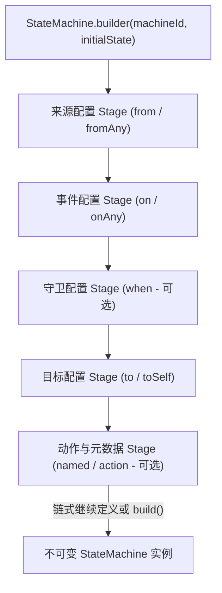
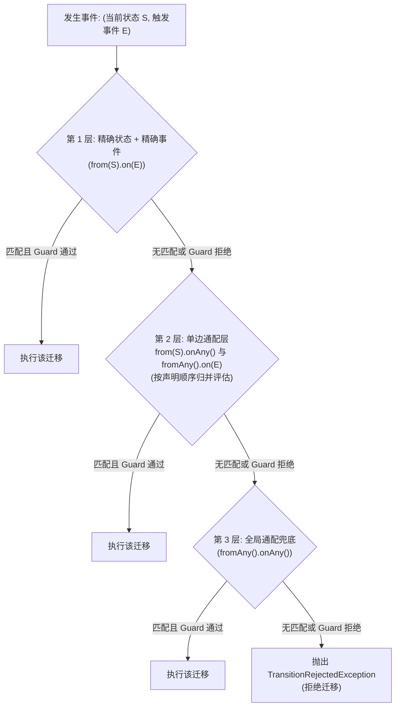

# 状态机定义与构建器 API

`team4u-fsm` 是一个专为 Java 业务系统设计的强类型、轻量级有限状态机组件。它通过流畅的链式 DSL（`StateMachineBuilder`）将状态流转、条件守卫（Guard）与执行动作（Action）解耦，同时在编译期提供完备的拓扑校验与不可达规则防御。

本文将深入解析状态机构建器的 API 体系、分层匹配因果律与构建期静态校验规则。

---

## 核心构建架构



---

## 1. 基础构建 API

### 声明构建器

```java
import com.team4u.framework.fsm.StateMachine;

// 指定状态机全局标识与初始状态
StateMachine<OrderState, OrderEvent, OrderContext> machine = StateMachine
        .<OrderState, OrderEvent, OrderContext>builder("order-fsm", OrderState.CREATED)
        .from(OrderState.CREATED).on(OrderEvent.SUBMIT).to(OrderState.SUBMITTED)
            .named("submit-order")
            .action(ctx -> log.info("订单已提交: {}", ctx.context().getOrderId()))
        .build();
```

---

## 2. 状态与事件配置方法

### 来源状态配置

| API 方法 | 语义说明 | 匹配优先级 |
| :--- | :--- | :--- |
| **`from(state)`** | 指定精确的来源状态（如 `OrderState.CREATED`） | **高**：进入精确来源规则桶 |
| **`fromAny()`** | 通配任意来源状态（适用于取消、强制关闭等全局事件） | **次高 / 兜底**：进入通配来源规则桶 |

### 触发事件配置

| API 方法 | 语义说明 | 匹配优先级 |
| :--- | :--- | :--- |
| **`on(event)`** | 指定精确的触发事件（如 `OrderEvent.PAY`） | **高**：精确事件规则 |
| **`onAny()`** | 通配任意触发事件 | **单边通配 / 全局兜底** |

### 目标状态配置

| API 方法 | 语义说明 | 典型场景 |
| :--- | :--- | :--- |
| **`to(targetState)`** | 发生状态迁移，流转至新的目标状态 | 正常业务流转（如 `CREATED -> PAID`） |
| **`toSelf()` / `stay()`** | 内部自迁移动作，保持当前状态不变 | 刷新心跳、记录备注、重新发送短信通知 |

---

## 3. 四层匹配优先级机制（Layered Matching Priority）

当一个事件发生时，状态机按照严格的**四层优先级从高到低**进行规则查找：



1. **第 1 层（精确匹配）**：`from(S).on(E)` 具有最高优先级，优先匹配具体的业务路径；
2. **第 2 层（单边通配）**：`from(S).onAny()` 与 `fromAny().on(E)` 属于单边通配层，两桶之间按代码**声明顺序**归并评估；
3. **第 3 层（双通配兜底）**：`fromAny().onAny()` 作为全局兜底策略；
4. **拒绝终态**：若所有层级均无匹配或所有匹配规则的 Guard 均返回 `false`，状态机拒绝本次流转。

---

## 4. 构建期静态校验与防呆规则

调用 `.build()` 时，构建器执行严格的拓扑完整性校验：

- **未完成迁移拦截**：若声明了 `from(...).on(...)` 但未指定 `to(...)`，立即抛出 `StateMachineDefinitionException("incomplete transition definition")`；
- **空规则拦截**：状态机必须至少包含一条完整的迁移规则；
- **同桶不可达规则拦截（Dead-rule Defense）**：在同一个匹配桶内，如果一条**无条件规则（无 Guard）**之后还声明了其他规则，由于该无条件规则必定吞噬所有流量，后续规则永远无法到达，构建器将聚合报错并拒绝启动。

---

## 关联章节与进一步阅读

- 深入掌握条件守卫与执行动作：[流转契约：Guard 守卫、Action 动作与 Context 上下文](fsm-transition.md)
- 了解状态机运行语义与结果模型：[流转语义与生命周期模型](fsm-semantics.md)
- 自动导出 Mermaid 状态机图：[Mermaid 状态机图表导出与可视化](fsm-mermaid.md)
- 查看完整的请假与交易审批流案例：[企业工单与审批流实战案例](fsm-sample.md)
