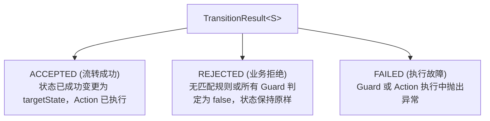
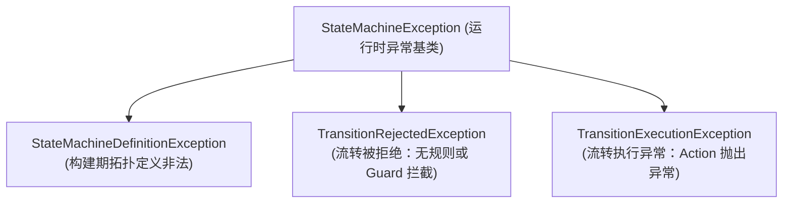

# 状态机结果模型与异常诊断体系

在业务状态流转过程中，准确区分“流转成功”、“业务规则拒绝”与“底层系统执行异常”对于上层调用方的错误处理与日志告警至关重要。`team4u-fsm` 提供了分层的**流转结果模型（`TransitionResult` / `TransitionOutcome`）**与**结构化异常诊断体系**。

本文将详细解析结果状态分类、异常继承树与生产排查指引。

---

## 结果模型与三态闭集 (`TransitionOutcome`)

每次调用 `machine.fire(...)` 执行迁移时，产生对应的 `TransitionResult`：



| 状态类型 | 枚举值 | 业务含义 | 携带数据 | 是否发生状态变更 |
| :--- | :--- | :--- | :--- | :--- |
| **成功态** | `ACCEPTED` | 成功匹配到迁移规则且 Guard 放行，Action 执行成功 | `targetState`（新状态） | **是** |
| **拒绝态** | `REJECTED` | 当前状态下该事件不合法，或所有候选 Guard 均返回 `false` | `reason`（拒绝原因） | **否** |
| **失败态** | `FAILED` | Guard 或 Action 执行过程中抛出未捕获异常 | `cause`（根因异常） | **否** |

---

## 异常类层次结构

框架将所有错误收敛于以 `StateMachineException` 为基类的不可变异常体系中：



### 1. 构建期定义异常：`StateMachineDefinitionException`

在调用 `.build()` 阶段抛出，用于拦截非法的状态机拓扑：
- **未完成迁移**：声明了 `from(...).on(...)` 但未指定目标状态 `to(...)`；
- **空规则集合**：状态机未包含任何迁移规则；
- **同桶不可达规则**：在无条件规则后声明了后续死规则。

### 2. 运行时拒绝异常：`TransitionRejectedException`

当使用严格模式调用 `machine.fireOrThrow(...)` 且迁移被拒绝时抛出：
- 包含来源状态 `sourceState`、触发事件 `event` 与机器标识 `machineId`；
- 表示业务非法操作（例如尝试对已取消的订单发起发货）。

### 3. 运行时执行异常：`TransitionExecutionException`

当 Guard 评估或 Action 执行过程中发生代码抛错时抛出：
- 封装了底层真实的 `cause` 根因异常；
- 状态机不会推进状态，调用方可发起重试或事务回滚。

---

## 异常捕获与业务处理模式

### 模式 A：优雅结果模式（无异常分发）

```java
TransitionResult<OrderState> result = machine.fire(currentState, event, payload, order);

switch (result.outcome()) {
    case ACCEPTED:
        order.setState(result.targetState());
        orderDao.update(order);
        return ApiResult.success();
        
    case REJECTED:
        log.warn("非法流转: state={}, event={}, reason={}", currentState, event, result.reason());
        return ApiResult.fail("INVALID_STATE_TRANSITION", "当前状态不支持此操作");
        
    case FAILED:
        log.error("流转执行异常", result.cause());
        return ApiResult.error("SYSTEM_ERROR", "系统处理异常");
}
```

### 模式 B：严格事务抛错模式（`fireOrThrow`）

```java
@Transactional(rollbackFor = Exception.class)
public void handleEvent(Order order, OrderEvent event) {
    // 若被拒绝抛 TransitionRejectedException；若异常抛 TransitionExecutionException
    OrderState nextState = machine.fireOrThrow(order.getState(), event, null, order);
    order.setState(nextState);
    orderRepository.save(order);
}
```

---

## 关联章节与进一步阅读

- 了解构建器定义与规则优先级：[状态机定义与构建器 API](fsm-builder.md)
- 了解条件守卫与上下文：[流转契约：Guard 守卫、Action 动作与 Context 上下文](fsm-transition.md)
- 查看完整的请假与交易审批流案例：[企业工单与审批流实战案例](fsm-sample.md)
