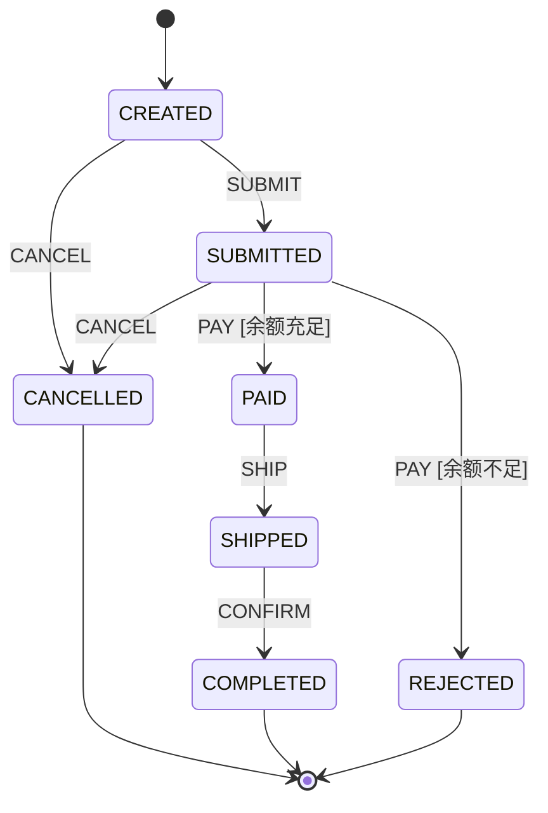

# Mermaid 状态机图表导出与可视化

在系统设计、代码审查以及业务沟通中，状态机逻辑常常需要以直观的架构图进行展示。`team4u-fsm` 内置了原生 **`StateMachineMermaid`** 图表导出器，能够将不可变状态机实例一键渲染为符合 Mermaid 标准规范的 `stateDiagram-v2` 状态图源码。

---

## 导出与使用示例

```java
import com.team4u.framework.fsm.StateMachine;
import com.team4u.framework.fsm.StateMachineMermaid;

// 1. 构建状态机
StateMachine<OrderState, OrderEvent, Order> machine = ...;

// 2. 导出为 Mermaid 状态图文本
String mermaidSource = StateMachineMermaid.toMermaid(machine);
System.out.println(mermaidSource);
```

### 导出的 Mermaid 渲染效果



---

## 渲染特性与语法映射规范

`StateMachineMermaid` 在生成图表时遵循以下映射规则：

1. **初始状态生成**：根据 `initialState` 自动生成 `[*] --> INITIAL_STATE` 起点连线；
2. **迁移连线标注**：
   - 包含事件名称：`SOURCE --> TARGET: EVENT`；
   - 若迁移配置了具名 Guard（`when("条件说明", ...)`），条件说明自动渲染在方括号内：`SOURCE --> TARGET: EVENT [条件说明]`；
3. **通配来源与目标渲染**：
   - `fromAny()` 规则会展开并为各个具体已注册的来源状态生成清晰的迁移连线；
   - `toSelf()` 内部迁移渲染为指向自身的环形连线；
4. **Markdown 与文档无缝集成**：生成的文本可以直接粘贴至 GitHub Markdown、Notion 或 Docsify 文档中以 ```mermaid 代码块直接呈现。

---

## 单元测试中的图表断言

通过图表生成器，可以在自动化测试中对状态机的拓扑结构进行快照比对断言：

```java
@Test
public void shouldRenderValidMermaidDiagram() {
    StateMachine<OrderState, OrderEvent, Order> machine = buildOrderStateMachine();
    String mermaid = StateMachineMermaid.toMermaid(machine);

    Assert.assertTrue(mermaid.contains("stateDiagram-v2"));
    Assert.assertTrue(mermaid.contains("[*] --> CREATED"));
    Assert.assertTrue(mermaid.contains("CREATED --> SUBMITTED: SUBMIT"));
}
```

---

## 关联章节与进一步阅读

- 了解构建器定义与规则优先级：[状态机定义与构建器 API](fsm-builder.md)
- 了解条件守卫与上下文：[流转契约：Guard 守卫、Action 动作与 Context 上下文](fsm-transition.md)
- 查看完整的请假与交易审批流案例：[企业工单与审批流实战案例](fsm-sample.md)
