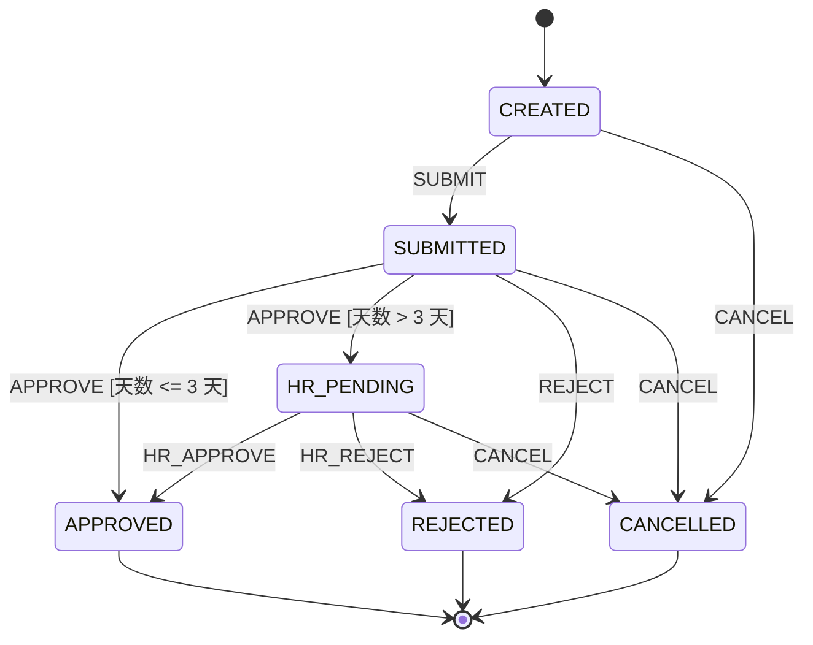

# 企业工单与审批流实战案例

在企业协同与交易系统中，请假审批、报销单流转与订单履约是最常见的有限状态机应用场景。本文通过一个完整的**多级员工请假审批系统**，演示如何使用 `team4u-fsm` 构建包含条件守卫、跨级审批、全局取消与副作用通知的企业级状态机。

---

## 业务需求与状态图

### 业务规则
1. **员工提交申请（CREATED -> SUBMITTED）**；
2. **请假天数 $\le 3$ 天**：直属主管审批通过即可进入 `APPROVED`；
3. **请假天数 $> 3$ 天**：直属主管审批通过后进入 `HR_PENDING`，需 HR 最终审批通过方可 `APPROVED`；
4. **任何审批人均可驳回（-> REJECTED）**；
5. **在进入终态（APPROVED / REJECTED）前，员工可随时取消（-> CANCELLED）**。

### Mermaid 状态图



---

## 领域模型定义

```java
public enum LeaveState {
    CREATED,
    SUBMITTED,
    HR_PENDING,
    APPROVED,
    REJECTED,
    CANCELLED
}

public enum LeaveEvent {
    SUBMIT,
    APPROVE,
    REJECT,
    HR_APPROVE,
    HR_REJECT,
    CANCEL
}

@Data
public class LeaveRequest {
    private String requestId;
    private String applicantId;
    private int leaveDays;
    private LeaveState state;
    private String rejectReason;
}
```

---

## 状态机装配与构建

```java
import com.team4u.framework.fsm.StateMachine;
import org.springframework.context.annotation.Bean;
import org.springframework.context.annotation.Configuration;

@Configuration
public class LeaveFsmConfiguration {

    @Bean
    public StateMachine<LeaveState, LeaveEvent, LeaveRequest> leaveStateMachine() {
        return StateMachine.<LeaveState, LeaveEvent, LeaveRequest>builder("leave-fsm", LeaveState.CREATED)
                // 1. 提交请假申请
                .from(LeaveState.CREATED).on(LeaveEvent.SUBMIT).to(LeaveState.SUBMITTED)
                    .named("submit-application")
                    .action(ctx -> log.info("请假单提交成功: id={}", ctx.context().getRequestId()))

                // 2. 主管审批 (天数 <= 3 天直通 APPROVED)
                .from(LeaveState.SUBMITTED).on(LeaveEvent.APPROVE)
                    .when("天数 <= 3 天", ctx -> ctx.context().getLeaveDays() <= 3)
                    .to(LeaveState.APPROVED)
                    .named("direct-approve")
                    .action(ctx -> notifyApplicant(ctx.context(), "主管已直接批准"))

                // 3. 主管审批 (天数 > 3 天流转至 HR_PENDING)
                .from(LeaveState.SUBMITTED).on(LeaveEvent.APPROVE)
                    .when("天数 > 3 天", ctx -> ctx.context().getLeaveDays() > 3)
                    .to(LeaveState.HR_PENDING)
                    .named("forward-hr")
                    .action(ctx -> notifyHrGroup(ctx.context(), "请假超过3天，请HR介入审批"))

                // 4. 主管驳回
                .from(LeaveState.SUBMITTED).on(LeaveEvent.REJECT).to(LeaveState.REJECTED)
                    .named("manager-reject")
                    .action(ctx -> handleReject(ctx))

                // 5. HR 终审通过与驳回
                .from(LeaveState.HR_PENDING).on(LeaveEvent.HR_APPROVE).to(LeaveState.APPROVED)
                    .named("hr-approve")
                    .action(ctx -> notifyApplicant(ctx.context(), "HR 终审已批准"))

                .from(LeaveState.HR_PENDING).on(LeaveEvent.HR_REJECT).to(LeaveState.REJECTED)
                    .named("hr-reject")
                    .action(ctx -> handleReject(ctx))

                // 6. 全局取消事件 (使用 fromAny，在终态前均可取消)
                .from(LeaveState.CREATED).on(LeaveEvent.CANCEL).to(LeaveState.CANCELLED)
                .from(LeaveState.SUBMITTED).on(LeaveEvent.CANCEL).to(LeaveState.CANCELLED)
                .from(LeaveState.HR_PENDING).on(LeaveEvent.CANCEL).to(LeaveState.CANCELLED)

                .build();
    }

    private void notifyApplicant(LeaveRequest req, String message) {
        log.info("向申请人 [{}] 发送通知: {}", req.getApplicantId(), message);
    }

    private void notifyHrGroup(LeaveRequest req, String message) {
        log.info("向 HR 群组发送待办: reqId={}, msg={}", req.getRequestId(), message);
    }

    private void handleReject(com.team4u.framework.fsm.TransitionContext<LeaveState, LeaveEvent, LeaveRequest> ctx) {
        String reason = ctx.payload(String.class);
        ctx.context().setRejectReason(reason);
        log.info("工单已被驳回: reqId={}, reason={}", ctx.context().getRequestId(), reason);
    }
}
```

---

## 业务 Service 调用实践

```java
@Service
public class LeaveServiceImpl implements LeaveService {

    @Autowired
    private StateMachine<LeaveState, LeaveEvent, LeaveRequest> leaveStateMachine;

    @Autowired
    private LeaveRequestRepository repository;

    @Transactional(rollbackFor = Exception.class)
    public void approve(String requestId, String operatorId, int days) {
        LeaveRequest request = repository.findById(requestId);
        
        // 触发 APPROVE 事件
        TransitionResult<LeaveState> result = leaveStateMachine.fire(
                request.getState(), LeaveEvent.APPROVE, null, request);

        if (result.outcome() == TransitionOutcome.ACCEPTED) {
            request.setState(result.targetState());
            repository.update(request);
        } else {
            throw new IllegalStateException("审批失败: " + result.reason());
        }
    }
}
```

---

## 关联章节与进一步阅读

- 了解构建器定义与规则优先级：[状态机定义与构建器 API](fsm-builder.md)
- 了解条件守卫与上下文：[流转契约：Guard 守卫、Action 动作与 Context 上下文](fsm-transition.md)
- 了解结果模型与异常处理：[状态机结果模型与异常诊断体系](fsm-diagnostics.md)
- 自动导出 Mermaid 状态机图：[Mermaid 状态机图表导出与可视化](fsm-mermaid.md)
