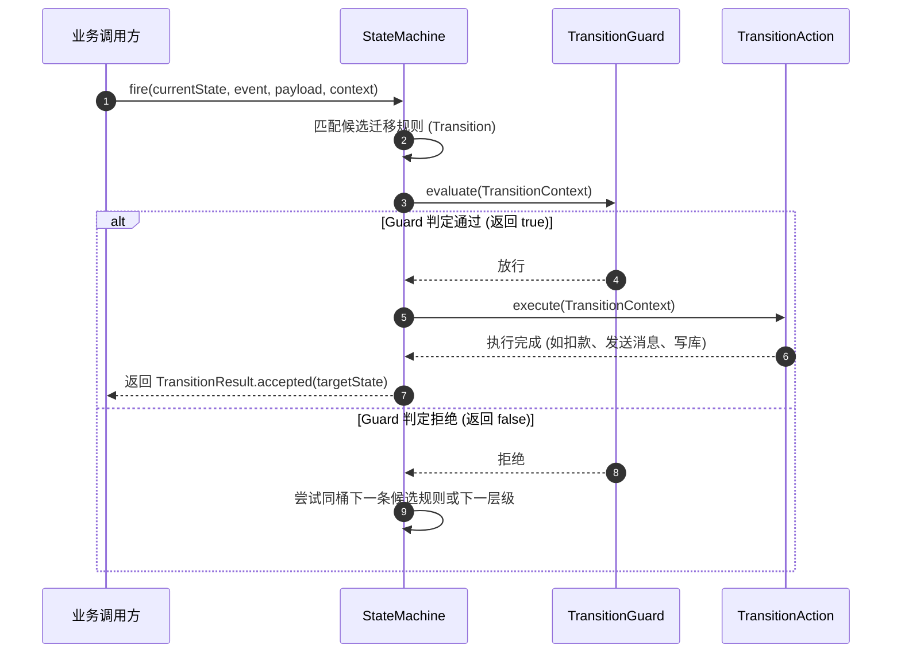

# 流转契约：Guard 守卫、Action 动作与 Context 上下文

在有限状态机的流转过程中，核心业务逻辑通常分为两部分：**判断能否流转（Guard 守卫条件）**与**流转发生时的副作用处理（Action 执行动作）**。`team4u-fsm` 通过强类型的 `TransitionContext` 将业务上下文、事件载荷与流转元数据统一桥接。

本文将详细解析 Guard 守卫契约、Action 动作契约以及 `TransitionContext` 的使用规范。

---

## 契约执行时序



---

## 条件守卫：`TransitionGuard`

`TransitionGuard` 是纯函数式的断言接口，用于评估当前上下文是否满足迁移条件：

```java
@FunctionalInterface
public interface TransitionGuard<S, E, C> {
    /**
     * 评估是否允许执行本次流转。
     *
     * @param context 流转上下文
     * @return true 允许流转；false 拒绝并尝试后续规则
     * @throws Exception 抛出异常将被视为执行故障 (FAILED)
     */
    boolean evaluate(TransitionContext<S, E, C> context) throws Exception;
}
```

### 声明形式与具名守卫

支持匿名 Lambda 声明，或携带描述性名称（用于日志追踪与 Mermaid 流程图渲染）：

```java
// 1. 带描述名称的 Guard (推荐，Mermaid 渲染时会作为条件展示在边线上)
builder.from(OrderState.CREATED).on(OrderEvent.PAY)
        .when("余额充足且未超限", ctx -> ctx.context().getBalance() >= ctx.context().getAmount())
        .to(OrderState.PAID);

// 2. 匿名 Guard
builder.from(OrderState.PAID).on(OrderEvent.DELIVER)
        .when(ctx -> ctx.context().hasTrackingNumber())
        .to(OrderState.DELIVERED);
```

---

## 状态动作：`TransitionAction`

`TransitionAction` 用于在状态流转确认发生时执行副作用（如数据库更新、通知发送、审计日志记录）：

```java
@FunctionalInterface
public interface TransitionAction<S, E, C> {
    /**
     * 执行状态流转副作用动作。
     *
     * @param context 流转上下文
     * @throws Exception 业务执行异常将包装为 TransitionExecutionException 抛出
     */
    void execute(TransitionContext<S, E, C> context) throws Exception;
}
```

### 声明形式与命名

```java
builder.from(OrderState.CREATED).on(OrderEvent.PAY).to(OrderState.PAID)
        .named("pay-success-action")
        .action(ctx -> {
            Order order = ctx.context();
            PaymentInfo payment = ctx.payload(PaymentInfo.class);
            order.markPaid(payment.getTransactionId());
            notificationService.sendPaymentSuccessSms(order.getPhone());
        });
```

---

## 流转上下文：`TransitionContext`

`TransitionContext` 是传递给 Guard 与 Action 的只读上下文聚合载体：

| 方法 | 返回类型 | 语义说明 |
| :--- | :--- | :--- |
| **`source()`** | `S` | 本次流转的来源状态 |
| **`event()`** | `E` | 触发本次流转的事件 |
| **`target()`** | `S` | 目标状态（若为自迁移 `toSelf()` 则等于 source） |
| **`context()`** | `C` | 业务实体或上下文对象（如 `Order`、`LeaveRequest`） |
| **`payload()`** | `Object` | 本次事件携带的临时载荷对象（如 `ApprovalComment`） |
| **`payload(Class<T>)`** | `T` | 强类型获取临时载荷，类型不匹配抛 `ClassCastException` |
| **`hasPayload()`** | `boolean` | 是否携带了非 null 的事件载荷 |

### 上下文与载荷的区别

- **`context()`（业务实体）**：代表状态机作用的主体领域对象（通常带有生命周期和持久化 ID，如 `Order`）；
- **`payload()`（事件载荷）**：代表本次事件临时传入的入参（如 `ApprovalForm`、`CancelReason`），通常无需持久化，仅在流转 Action 中消费一次。

---

## 关联章节与进一步阅读

- 了解构建器定义与优先级机制：[状态机定义与构建器 API](fsm-builder.md)
- 了解流转语义与四态结果：[流转语义与生命周期模型](fsm-semantics.md)
- 自动导出 Mermaid 状态机图：[Mermaid 状态机图表导出与可视化](fsm-mermaid.md)
- 查看完整的请假与交易审批流案例：[企业工单与审批流实战案例](fsm-sample.md)
