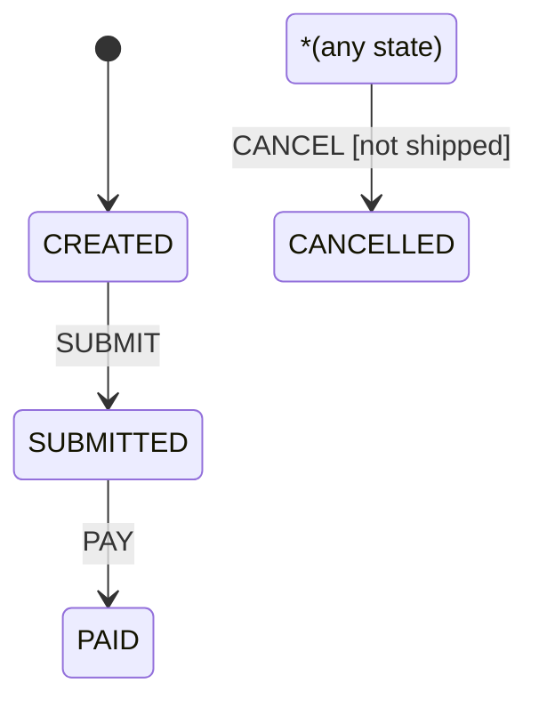

# 快速开始

本文介绍如何用 5 分钟定义并执行第一个状态机。以下代码均可直接编译运行，基于纯 Java 8，无 Lombok。

---

## 引入依赖

```xml
<dependency>
    <groupId>com.team4u</groupId>
    <artifactId>team4u-fsm</artifactId>
    <version>1.0.0-SNAPSHOT</version>
</dependency>
```

---

## 定义状态、事件与业务上下文

推荐状态与事件使用枚举，上下文就是业务对象本身：

```java
public class OrderFsmQuickStart {

    enum OrderState { CREATED, SUBMITTED, PAID, SHIPPED, CANCELLED }

    enum OrderEvent { SUBMIT, PAY, CANCEL, REMIND }

    static class Order {
        private OrderState state = OrderState.CREATED;
        private boolean paidOnline;

        OrderState getState() { return state; }
        void setState(OrderState state) { this.state = state; }
        boolean isPaidOnline() { return paidOnline; }
        void setPaidOnline(boolean paidOnline) { this.paidOnline = paidOnline; }
    }
}
```

## 构建状态机

构建器只在启动期使用，产出的定义不可变、可长期复用。注意显式书写泛型见证 `<OrderState, OrderEvent, Order>`，让后续链式调用全部获得类型检查：

```java
import com.team4u.framework.fsm.StateMachine;

StateMachine<OrderState, OrderEvent, Order> machine = StateMachine
        .<OrderState, OrderEvent, Order>builder("order", OrderState.CREATED)
        .from(OrderState.CREATED).on(OrderEvent.SUBMIT).to(OrderState.SUBMITTED)
            .named("created-submit")
            .action(ctx -> ctx.getContext().setPaidOnline(false))
        .from(OrderState.SUBMITTED).on(OrderEvent.PAY).to(OrderState.PAID)
        .fromAny().on(OrderEvent.CANCEL)
            .when("not shipped", ctx -> !OrderState.SHIPPED.equals(ctx.getFrom()))
            .to(OrderState.CANCELLED)
        .build();
```

这条定义包含三种典型规则：

- `from(...).on(...).to(...)`：精确规则（精确状态 + 精确事件）；
- `named(...)`：给迁移一个稳定标识，便于审计与诊断。不写则按声明序号自动生成 `transition-N`（N 从 1 开始）；若该标识已被显式命名占用，会追加确定性后缀（如 `transition-2-2`），因此生成标识与显式标识永不冲突；
- `fromAny().on(...).when(...)`：全局事件规则，属于单边通配（任意状态 + 精确事件），带守卫描述。注意它不是 any-any 全局兜底；只有 `fromAny().onAny()` 才是最后一层的全局兜底。

## 触发迁移并持久化状态

状态机不保存当前状态——调用方传入当前状态，拿回结果后自行写回业务对象：

```java
import com.team4u.framework.fsm.TransitionResult;

Order order = new Order();
TransitionResult<OrderState, OrderEvent, Order> result =
        machine.tryFire(order.getState(), OrderEvent.SUBMIT, order);

if (result.isAccepted()) {
    order.setState(result.getState());   // 写回业务对象，随后按需落库
} else {
    // result.getOutcome() 为 NO_TRANSITION 或 GUARD_REJECTED
}
```

`tryFire` 在被拒绝时返回语义化结果而不抛异常。若违反流转应当视为程序缺陷，可改用严格模式：

```java
// 没有可用迁移时抛出 TransitionRejectedException
OrderState next = machine.fire(OrderState.SUBMITTED, OrderEvent.PAY, order).getTo();
```

守卫或动作自身执行失败属于第三种情况：无论 `fire` 还是 `tryFire`，都会抛出携带完整迁移上下文与失败阶段（GUARD/ACTION）的 `TransitionExecutionException`，且不会回退重试其他候选规则。

## 渲染状态图

一条语句导出 Mermaid 文本，可直接粘贴到支持 Mermaid 的文档或 Markdown 中：

```java
import com.team4u.framework.fsm.StateMachineMermaid;

System.out.println(StateMachineMermaid.render(machine));
```

输出（实际验证过）：

```
stateDiagram-v2
    [*] --> s0
    state "CREATED" as s0
    state "SUBMITTED" as s1
    state "PAID" as s2
    state "CANCELLED" as s3
    state "*(any state)" as any_state
    s0 --> s1 : SUBMIT
    s1 --> s2 : PAY
    any_state --> s3 : CANCEL [not shipped]
```

渲染效果：



任意来源迁移渲染为合成节点 `*(any state)` 的出边，守卫以 `[描述]` 形式追加在边标签上，因此读图即可还原全部规则。

渲染器对状态名、事件名与守卫描述做逐字符转义（换行折叠为空格，双引号、分号、井号编码为 Mermaid 实体），常见的 `toString()` 输出可以安全渲染。图中出现的状态就是 `machine.getStates()` 的内容：只包含初始状态、各规则的精确来源状态与固定目标状态；仅在守卫或动作代码里引用、从未被定义声明的状态不会出现在状态图里。

## 常用守卫与动作组合

守卫可声明多个，按声明顺序短路与；动作同样按声明顺序执行。注意守卫必须写在 `to(...)`/`stay()` 之前：

```java
StateMachine<OrderState, OrderEvent, Order> machine = StateMachine
        .<OrderState, OrderEvent, Order>builder("order", OrderState.CREATED)
        .from(OrderState.CREATED).on(OrderEvent.SUBMIT)
            .when("not submitted", ctx -> !OrderState.SUBMITTED.equals(ctx.getFrom()))
            .when("context present", ctx -> ctx.getContext() != null)
            .to(OrderState.SUBMITTED)
            .named("created-submit")
            .action(ctx -> ctx.getContext().setPaidOnline(false))
            .action(ctx -> ctx.getContext().setState(ctx.getTo()))
        .build();
```

需要“执行某事件但状态不变”时使用 `stay()`，动作仍会正常执行：

```java
// 独立规则示例：PAID 状态收到 REMIND 事件后发送提醒但保持原状态
machine = StateMachine
        .<OrderState, OrderEvent, Order>builder("order", OrderState.CREATED)
        .from(OrderState.PAID).on(OrderEvent.REMIND).stay().named("paid-remind")
        .build();
```

## 部署与复用建议

- 构建一次、到处复用：定义放静态字段或容器单例（由你决定），运行期只读；
- 并发调用安全：`StateMachine` 不可变，多线程共享同一实例没有问题；但**你的守卫与动作可能被并发调用**，实现需自行保证线程安全；
- 状态持久化由你负责：`fire`/`tryFire` 之后，在事务里把 `result.getState()` 写回实体；需要通知下游时，消费 `TransitionResult` 或在动作里调用你自己的事件设施。
