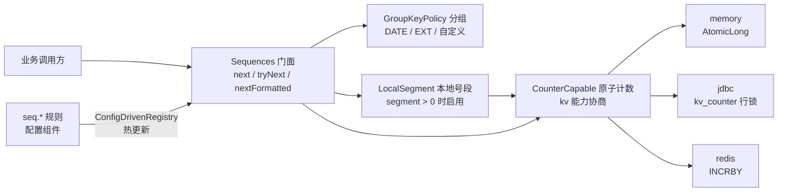

# 序号生成组件 (team4u-id)

# 背景

业务系统里到处都是序号生成的需求：

- 全局唯一的趋势递增数字标识：订单号、流水号、消息号；
- 周期重置的序号：按天/月分组，每个周期内从 1 开始；
- 固定额度分配：某渠道每天仅允许调用 N 次，用完即无额度；
- 循环使用的序号池：1~10000 用完后从头再来。

这些需求若由各业务自行实现，常见问题：

- 直接操作计数器（数据库行锁、Redis）竞争激烈，性能差；
- 步进、上限、重置周期等规则硬编码，调整需要发版；
- 生成逻辑与特定存储强耦合，切换成本高；
- 为提速自建号段缓存，又引入队列、生产者线程、清理器等一套常驻资源。

`team4u-id` 做一件事：**把序号生成收敛为「一条 JSON 规则 + kv 组件的原子计数能力」**。业务侧一个 `next` 方法完成取号，分组、额度、循环、号段加速、格式化全部规则化；存储不写一行代码，内存、JDBC、Redis 及其装饰器组合皆可作为计数后端。

---

# 设计

## 设计理念

组件不重复造底座，四个关注点全部复用框架既有能力：

- **规则驱动**：一条 JSON 规则（配置键 `seq.{name}`）经配置组件的 `ConfigDrivenRegistry` 加载，热更新安全替换（先建新再替换、失败保旧），调整步进/上限/号段长度无需重启；
- **计数能力复用**：序号的「计数」本质是键值存储的一种能力（kv 组件的 `CounterCapable`，内存 `AtomicLong`、JDBC 行锁、Redis `INCRBY`），组件经 `KvStores.capabilityOf` 能力协商取用，自身零存储依赖；
- **纯算术**：耗尽与循环在取号层以等差数列换算（`位置 = (计数 - start) / step`），不回写存储、无并发竞争；
- **号段去线程化**：本地号段采用惰性取段（耗尽时才批量取号）+ LRU 淘汰，无生产者线程、无清理器。



执行流程：

```text
next(name)
├── 规则加载：ConfigDrivenRegistry 按配置键 seq.{name} 输出 SeqRule
├── 分组计算：GroupKeyPolicy 输出分组标识（未配置分组则为空）
├── 计数取位：segment > 0 ? 本地号段发号 : 计数器直增 1
│             计数键 = {键空间}:{规则标识}.{分组标识}，分组变化即重新计数
└── 算术换算：位置 → start + 位置×step；越界则拒绝（耗尽）或取模（循环）
```

## 核心概念

| 概念 | 说明 |
| :--- | :--- |
| `Sequences` | 序号门面：`next`（耗尽抛异常）、`tryNext`（耗尽返回 null，额度语义）、`nextFormatted`（模板渲染） |
| `SequenceService` | 门面默认实现：组装规则加载、分组、计数、号段四个关注点 |
| `SeqRule` | 序号规则：存储名、分组、start/step/maxValue/recycle、segment、format 一条 JSON 说清 |
| `CounterCapable` | kv 组件原子计数能力：`incrementAndGet(key, delta, ttlMillis)`（id 组件传 `ttl=0` 永不过期，周期重置靠换键），内存/JDBC/Redis 三后端内置 |
| `GroupKeyPolicy` | 分组键策略（`KeyedPolicy`）：输出分组标识参与计数键，分组变化即重新计数 |
| `DateGroupKeyPolicy` | 内置策略 `DATE`：按时间格式生成分组标识（yyyyMMdd 按天、yyyyMM 按月），时钟可注入 |
| `ExtGroupKeyPolicy` | 内置策略 `EXT`：分组标识取调用上下文扩展属性（按商户、渠道等业务维度） |
| `GroupKeyPolicies` | 分组策略注册表与全局门面，自定义策略注册即生效 |
| `SeqStores` | 序号存储注册表与全局门面：规则按名引用存储，实现一套规则多存储分工 |
| `LocalSegment` | 本地号段：一次批量取号本地发号，惰性取段 + CAS 无锁发号 + 取段 singleflight，零常驻线程 |
| `AbstractSequencesContractTest` | 行为契约测试基类：任意计数后端跑同一套契约，保证跨存储行为一致 |

## 设计目标

- **易使用**：一个 `next` 方法 + 一条 JSON 规则完成取号；
- **零存储依赖**：计数交给 kv 组件能力协商，无 `-store-jdbc` / `-store-redis` 子模块，装饰器（观测、重试、热交换）自由组合；
- **可配置**：分组、步进、上限、循环、号段长度、格式化全部规则化，集中管理、热更新生效；
- **可扩展**：分组策略、存储均为 `KeyedPolicy` 注册体系，SPI / Spring 自动发现 / 手工注册三通道一致；
- **高性能**：号段模式将存储访问降低 N 倍（N = 号段长度），本地 CAS 发号近乎零开销；无生产者线程、无清理器；
- **跨后端一致**：取号、耗尽、循环、分组、号段语义由契约测试在 CI 强制（对齐 kv-test 惯例）。

## 快速上手

下面这个例子可以在单进程内直接运行（仅依赖 `team4u-id`）：

```java
package demo;

import com.team4u.framework.config.core.ConfigManager;
import com.team4u.framework.config.core.spi.InMemoryConfigSource;
import com.team4u.framework.id.core.SequenceService;
import com.team4u.framework.kv.memory.InMemoryKvStore;

public final class FirstSeqDemo {
    public static void main(String[] args) {
        // 1. 配置源：写入一条规则（生产环境接配置中心/数据库，见配置组件文档）
        InMemoryConfigSource source = new InMemoryConfigSource("demo", 0);
        source.put("seq.order", "{\"segment\":100}");
        ConfigManager configManager = ConfigManager.builder()
                .addSource(source).addWatcher(source).build();

        // 2. 序号服务：默认存储为内存计数（行为与 JDBC/Redis 一致，同一套契约测试保证）
        SequenceService sequences = new SequenceService(configManager, new InMemoryKvStore());

        // 3. 取号
        System.out.println(sequences.next("order"));    // 1
        System.out.println(sequences.next("order"));    // 2
    }
}
```

你应该看到：

```text
1
2
```

更完整的路径（JDBC/Redis 计数、周期重置、额度分配、格式化单号）见[快速开始](quick-start.md)。

## 模块结构

```text
team4u-id                        # 单模块：存储经 kv 组件能力协商，无存储子模块
└── com.team4u.framework.id
    ├── api                      # Sequences 门面与异常体系
    ├── config                   # SeqRule 规则模型
    ├── group                    # 分组策略：GroupKeyPolicy + DATE/EXT + 注册表
    ├── store                    # 命名存储注册表：SeqStores
    └── core                     # SequenceService 组装、LocalSegment 本地号段
```

| 依赖 | 用途 | 按需引入 |
| :--- | :--- | :--- |
| `team4u-kv-core` | `CounterCapable` 计数能力、`KvStores` 能力协商 | 必需 |
| `team4u-config-core` | `ConfigDrivenRegistry` 规则加载与热更新 | 必需 |
| `team4u-policy` / `team4u-base` | `KeyedPolicyRegistry` 策略注册、`TextTemplate` 模板、LRU 缓存 | 必需 |
| `team4u-kv-store-jdbc` | JDBC 计数后端 | 数据库计数时 |
| `team4u-kv-store-redis` | Redis 计数后端 | Redis 计数时 |

## 文档导航

- [快速开始](quick-start.md)：从引入依赖到生成第一个序号
- [规则配置](id-rule.md)：规则模型、配置格式、计数键、热更新
- [分组策略](id-group.md)：内置 `DATE`/`EXT` 与自定义分组
- [本地号段](id-segment.md)：号段机制、并发模型与空洞语义
- [常见案例](id-sample.md)：全局唯一、周期重置、额度分配、循环使用、格式化单号
