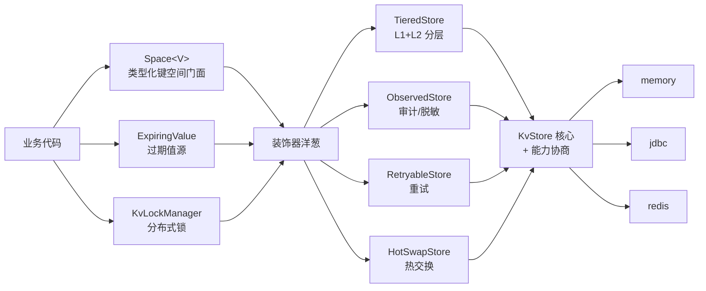

# 键值存储组件 (team4u-kv)

# 背景

业务系统里到处都是键值形态的数据：会话缓存、第三方 Token、分布式锁、幂等标识、任务结果。如果每个业务各自选型并直接对接存储（Map、Redis、数据库表），会遇到三个问题：

- 同一套读写逻辑在不同存储间重复实现，切换存储要改业务代码；
- 过期、原子写入、比较替换这些通用能力分散在各业务里，行为不一致；
- 单元测试依赖外部存储（Redis、数据库），难以轻量运行。

`team4u-kv` 做一件事：**把键值操作收敛为最小的 `KvStore` 核心接口，其余一切能力都通过「能力接口」和「装饰器」叠加**。换存储不改业务代码，通用语义（过期、SETNX、CAS）跨存储一致，单测用内存实现零依赖。

---

# 设计

## 设计理念

组件分为三层：

- **核心层**：`KvStore` 只有 4 个原子操作（`get` / `put` / `remove` / `expire`），恰好是锁、幂等、TTL 缓存的最小完备集。没有一个是「内存实现容易、外部存储做不动」的操作——每个都能映射到 Redis 原生命令（GET / SET+NX / DEL / EXPIRE）或一组简单 SQL（原子性由唯一索引/行锁保证）；
- **能力层**：需要更多能力的实现按接口声明——`CasCapable`（原子比较替换）、`CounterCapable`（带 TTL 的原子计数）、`ScoredWindowCapable`（原子计分窗口）、`ScanCapable`（扫描与清理）、`WatchCapable`（变更订阅）、`NativeTtlCapable`（原生过期）。调用方按 `instanceof` 协商，接口即文档；
- **组合层**：分层缓存、观测、重试、热交换都是可自由拼装的装饰器（`TieredStore` / `ObservedStore` / `RetryableStore` / `HotSwapStore`），不引入继承体系。



三个治理组件站在装饰器之上：`KvLockManager`（锁）、`ExpiringValue`（过期值续期）、`PollingWatcher`/`KvCleaner`（订阅与清理）。

## 核心概念

| 概念 | 说明 |
| :--- | :--- |
| `SpaceKey` | 键标识：`space:key`。键空间（space）实现多业务数据隔离，space 与 key 均不允许包含 `:` |
| `KvRecord` | 不可变记录：值 + 过期时间戳（epoch 毫秒，`0` 为永不过期） |
| `KvStore` | 核心接口：`get` / `put`(SET\|IF_ABSENT) / `remove` / `expire` |
| `CasCapable` | 原子比较替换/删除/续期（按值精确匹配，含保序的 `compareAndExpire`），锁与所有权安全续期的基础 |
| `CounterCapable` | 键级原子计数（`incrementAndGet(key, delta, ttlMillis)`，`ttl>0` 过期后从 0 重计），序号生成（`team4u-id`）与固定窗口限流（`team4u-ratelimiter`）的基础 |
| `ScoredWindowCapable` | 原子「裁剪 → 计数 → 条件添加」的有序计分窗口（Offer/Verdict），精确滑动窗口限流的基础；memory 与 redis 实现，JDBC 暂未实现 |
| `ScanCapable` | 按键空间扫描存活键、批量物理清理过期残留 |
| `WatchCapable` | 订阅键空间的变更事件（PUT / REMOVE） |
| `NativeTtlCapable` | 标记存储自身支持过期淘汰（如 Redis），清理器自动跳过 |
| `Space` / `Spaces` | 类型化键空间门面与策略注册表，读写自动 JSON 序列化 |
| `TieredStore` | L1 本地缓存（base 的 `Cache`）+ L2 远程存储装饰器 |
| `KvLockManager` / `KvLock` | 持有者令牌 + 心跳续约 + fencing 安全释放的分布式锁 |
| `ExpiringValue<V>` | 过期值源：cache-aside / refresh-ahead / singleflight 声明化 |
| `AbstractKvStoreContractTest` | 15 项行为契约测试基类（派生 `AbstractCounterTtlContractTest`、`AbstractScoredWindowCapableContractTest` 补充计数 TTL 与计分窗口契约），保证多后端行为一致 |

## 设计目标

- **最小核心**：4 个操作覆盖锁、幂等、TTL 缓存的最小完备集；扫描/批量/订阅全部走能力接口，核心不为长尾需求膨胀；
- **能力协商**：实现做不到的就不声明，调用方 `instanceof` 探测或快速失败，不出现「实现了但语义错误」的接口；
- **复用不重造**：本地缓存复用 base 的 `Cache`/`TimedCache`，热交换使用 KV 本地 `HotSwap` 契约与 JDK 动态代理，重试复用 retry 的 INLINE 模式，键空间注册表复用 policy 的 `KeyedPolicyRegistry`（Copy-On-Write，读路径无锁）；
- **跨实现一致**：过期精度、SETNX 原子性、CAS 语义、异常约定在接口 Javadoc 固化为契约，并由 `team4u-kv-test` 的契约测试在 CI 强制；
- **轻量可测**：内存实现零依赖；所有 TTL/租约逻辑注入 `Clock`，测试用虚拟时钟精确推进时间。

## 快速上手

下面这个例子可以在单进程内直接运行（仅依赖 `team4u-kv-core`）：

```java
package demo;

import com.team4u.framework.kv.KvRecord;
import com.team4u.framework.kv.KvStore;
import com.team4u.framework.kv.PutMode;
import com.team4u.framework.kv.SpaceKey;
import com.team4u.framework.kv.memory.InMemoryKvStore;

public final class FirstKvDemo {
    public static void main(String[] args) {
        // 1. 内存存储：零依赖，行为与 JDBC/Redis 实现一致（同一套契约测试保证）
        KvStore kv = new InMemoryKvStore();
        SpaceKey key = SpaceKey.of("user.session", "u1");

        // 2. 写入：值 + 有效期（毫秒），0 为永不过期
        kv.put(key, KvRecord.of("token-abc", 3600_000, System.currentTimeMillis()), PutMode.SET);

        // 3. 读取：不存在或已过期返回 null
        System.out.println(kv.get(key).getValue());

        // 4. 原子写（SETNX）：仅当键不存在时成功——幂等控制与锁的基础
        System.out.println(kv.put(key, KvRecord.of("new"), PutMode.IF_ABSENT));  // false：键已存在
    }
}
```

你应该看到：

```text
token-abc
false
```

更完整的路径（类型化门面、分层存储、锁、Token 续期）见[快速开始](quick-start.md)。

## 模块结构

```text
team4u-kv
├── team4u-kv-core            # 核心抽象、能力接口、内存实现、装饰器、热交换
├── team4u-kv-space           # Space / Spaces / SpacePolicy 类型化 JSON 门面；NamedKvStore / NamedKvStoreRegistry 命名存储注册表
├── team4u-kv-lock            # CAS 化分布式锁
├── team4u-kv-lifecycle       # 过期值源、轮询订阅、清理器
├── team4u-kv-retryable       # 重试装饰器（复用 team4u-retry）
├── team4u-kv-store-jdbc      # 原生 JDBC 存储（仅依赖 DataSource）
├── team4u-kv-store-redis     # Redis 存储（原生 TTL、Lua CAS、SCAN）
└── team4u-kv-test            # 契约测试基类 + TestKvContext
```

| 模块 | 依赖 | 按需引入 |
| :--- | :--- | :--- |
| `team4u-kv-core` | base、slf4j-api | 必需 |
| `team4u-kv-space` | kv-core、policy、serializer-json | 使用类型化 JSON 键空间或命名存储注册表时 |
| `team4u-kv-lock` | kv-core | 使用锁时 |
| `team4u-kv-lifecycle` | kv-core、kv-lock、serializer-json | 使用值续期/订阅/清理时 |
| `team4u-kv-retryable` | kv-core、retry-core | 存储抖动治理时 |
| `team4u-kv-store-jdbc` | kv-core | 数据库存储时 |
| `team4u-kv-store-redis` | kv-core、spring-data-redis | Redis 存储时 |
| `team4u-kv-test` | kv-core、junit | 为新存储写契约测试时 |

`Space` 与命名存储注册表位于 `team4u-kv-space`：`NamedKvStore` / `NamedKvStoreRegistry` 的 FQCN 不变（`com.team4u.framework.kv.NamedKvStore` / `com.team4u.framework.kv.NamedKvStoreRegistry`），1.0 仅将它们从 kv-core 迁移到 `team4u-kv-space`——依赖 `team4u-kv-space` 即可继续使用，id / ratelimiter / singleflight 等组件已作为传递依赖引入。JSON 值编解码由应用显式提供 JSON 引擎：添加 `team4u-serializer-jackson` 或注册自定义 `JsonSerializerPolicy`。`team4u-kv-core` 的 `KvStore`、装饰器与热交换路径不需要 JSON、policy、proxy、Jackson 或 ByteBuddy。

## 文档导航

- [快速开始](quick-start.md)：从引入依赖到读写第一个键值
- [核心抽象](kv-store.md)：`KvStore` 四操作契约、能力接口、内存实现
- [分层存储](kv-tiered.md)：TieredStore 的读写删路径、墓碑、负缓存与并发边界
- [装饰器](kv-decorators.md)：ObservedStore、RetryableStore、HotSwapStore 与组合规约
- [类型化键空间](kv-space.md)：Space / SpacePolicy / Spaces
- [锁服务](kv-lock.md)：tryAcquire / 心跳续约 / fencing 释放与正确性边界
- [值生命周期](kv-lifecycle.md)：ExpiringValue、PollingWatcher、KvCleaner
- [存储后端](kv-stores.md)：JDBC / Redis 实现细节与建表
- [契约测试](kv-test.md)：AbstractKvStoreContractTest 与新存储接入指南
- [常见案例](kv-sample.md)：会话缓存、幂等控制、Token 续期、任务结果等待
