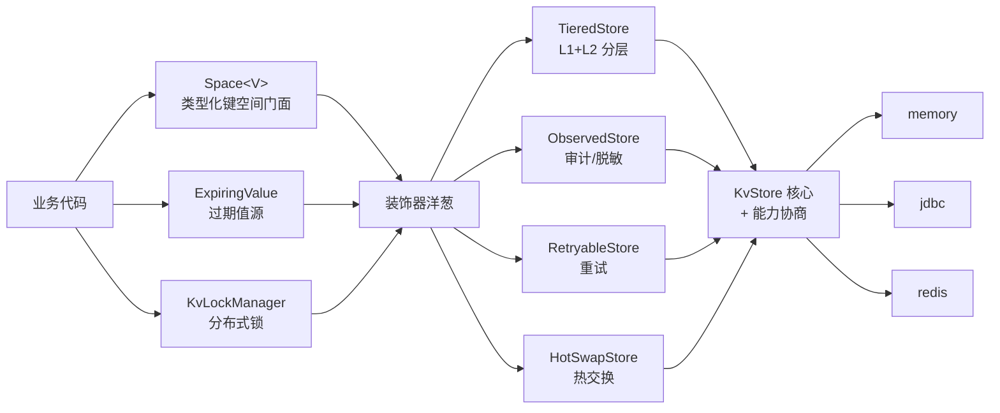

# 键值存储组件

# 背景

业务系统中存在大量键值（Key-Value）形态的数据：会话缓存、第三方Token、分布式锁、幂等标识等。如果每个业务各自选型并直接对接存储，会带来读写逻辑重复、通用能力（过期、原子写、CAS）行为不一致、单元测试依赖外部存储等问题。

team4u-kv 将键值操作抽象为最小核心接口 `KvStore`（4 类原子操作），以**可选能力接口**扩展原子替换/扫描/订阅等能力，以**装饰器**组合分层缓存、重试、观测、热交换等横切关注点，在此之上提供 CAS 化分布式锁与值生命周期（过期续期、订阅、清理）。

# 设计

## 设计理念

- **最小核心**：核心接口只有 `get` / `put`(SET|IF_ABSENT) / `remove` / `expire` 四类原子操作，恰好覆盖锁、幂等、TTL 缓存的最小完备集，且每个操作都能映射到 Redis 原生命令与 JDBC 单条语句
- **能力协商**：原子比较替换（`CasCapable`）、扫描清理（`ScanCapable`）、变更订阅（`WatchCapable`）、原生TTL（`NativeTtlCapable`）按实现能力声明，接口即文档
- **装饰器组合**：分层存储、可观测、可重试、热交换均为可自由拼装的 `KvStore` 装饰器，而非继承体系
- **复用不重造**：本地缓存复用 base 的 `Cache`/`TimedCache`，热交换复用 proxy 的 `Swappable`，重试复用 retry 的 INLINE 模式，键空间注册表复用 policy 的 `KeyedPolicyRegistry`（COW 无锁读）
- **契约保证一致性**：`team4u-kv-test` 提供行为契约测试基类，任意新存储实现继承即可验证与内存实现行为一致



## 核心概念

| 概念 | 模块 | 说明 |
| --- | --- | --- |
| `KvStore` | core | 核心接口：`get` / `put`(SET\|IF_ABSENT) / `remove` / `expire` |
| `KvRecord` / `SpaceKey` | core | 不可变记录（值+expireAt）与键标识（`space:key`） |
| `CasCapable` | core | 原子比较替换/删除：锁与所有权安全续期的基础 |
| `ScanCapable` / `WatchCapable` / `NativeTtlCapable` | core | 扫描清理 / 变更订阅 / 原生TTL 能力声明 |
| `InMemoryKvStore` | core | 零依赖内存实现，全能力，Clock 可注入 |
| `TieredStore` | core | L1(base Cache)+L2 分层装饰器：读穿透回填、写直通、删除墓碑、负缓存 |
| `ObservedStore` | core | 结构化审计日志、慢操作告警、值脱敏视图 |
| `HotSwapStore` | core | 运行时原子换后端，Safe Swap + 宽限期关闭 |
| `Space` / `SpacePolicy` / `Spaces` | core | 类型化键空间门面与策略注册表（COW 热更新） |
| `KvLockManager` / `KvLock` | lock | 持有者令牌 + 心跳续约 + fencing 安全释放的分布式锁 |
| `ExpiringValue<V>` | lifecycle | 过期值源：cache-aside / refresh-ahead / singleflight 声明化 |
| `PollingWatcher` | lifecycle | 基于 ScanCapable 的轮询订阅降级 |
| `KvCleaner` | lifecycle | 周期清理过期残留（可选锁互斥、跳过原生TTL存储） |
| `RetryableStore` | retryable | 复用 team4u-retry INLINE 模式的重试装饰器 |
| `JdbcKvStore` | store-jdbc | 原生JDBC实现：唯一索引 SETNX、条件UPDATE CAS |
| `RedisKvStore` | store-redis | 原生TTL、SETNX、Lua CAS、SCAN |
| `AbstractKvStoreContractTest` | test | 多后端行为契约测试基类 |
| `TestKvContext` | test | 零依赖测试上下文（内存存储+虚拟时钟） |

## 快速开始

```java
// 核心 API：任意存储
KvStore kv = new InMemoryKvStore();
kv.put(SpaceKey.of("user.session", "u1"),
        KvRecord.of("token-abc", 3600_000, System.currentTimeMillis()), PutMode.SET);
String token = kv.get(SpaceKey.of("user.session", "u1")).getValue();

// 幂等控制：SETNX 语义
boolean first = kv.put(SpaceKey.of("idem", "order-1"), KvRecord.of("1"), PutMode.IF_ABSENT);

// 类型化门面：注册键空间策略后按类型读写
Spaces.global().register(new SpacePolicy()
        .setName("user.session").setValueType(Session.class).setDefaultTtlMillis(3600_000));
Space<Session> sessions = Spaces.global().use("user.session", kv);
sessions.put("u1", new Session("token-abc"));
Session session = sessions.get("u1");

// 分层存储：L1 本地缓存 + L2 任意远程存储
KvStore tiered = new TieredStore(jdbcStore, 60_000,
        new TieredStore.Config().setTombstoneTtlMillis(5_000));

// 装饰器自由组合
KvStore composed = new ObservedStore(
        new TieredStore(new RetryableStore(redisStore), 30_000, new TieredStore.Config()));

// 分布式锁：fencing 安全
try (KvLock lock = lockManager.acquire("report.daily", 30_000, 5_000)) {
    doGenerate();
}

// 过期值源：Token 续期
ExpiringValue<Token> wechatToken = ExpiringValue.<Token>builder(Token.class)
        .store(kv).key("auth", "wechat_token")
        .loader(() -> wechatClient.getAccessToken())
        .ttlOf(t -> Duration.ofSeconds(t.getExpiresIn()).toMillis())
        .refreshAhead(600_000)
        .scope(ExpiringValue.Scope.CLUSTER)   // 跨实例 singleflight
        .lockManager(lockManager)
        .build();
Token t = wechatToken.get();
```

## 模块依赖

| 模块 | 依赖 | 说明 |
| --- | --- | --- |
| `team4u-kv-core` | base、proxy、policy、serializer-json | 核心抽象+内存实现+装饰器+类型化门面 |
| `team4u-kv-lock` | kv-core | CAS 化分布式锁 |
| `team4u-kv-lifecycle` | kv-core、kv-lock、serializer-json | 过期值源、轮询订阅、清理器 |
| `team4u-kv-retryable` | kv-core、retry-core | 重试装饰器 |
| `team4u-kv-store-jdbc` | kv-core | 原生JDBC存储（仅依赖 DataSource） |
| `team4u-kv-store-redis` | kv-core、spring-data-redis | Redis存储 |
| `team4u-kv-test` | kv-core、junit | 契约测试基类、TestKvContext |

## 实现契约（摘要）

- **异常**：基础设施故障抛 `KvStoreException`（非受检）；「键不存在/已过期」以 `null`/`false` 表达
- **过期精度**：`get` 返回的 `expireAt` 必须精确到 epoch 毫秒（0 仅表示永不过期），Redis 实现以 PTTL 换算
- **原子性**：`put(IF_ABSENT)` 必须原子（Redis SETNX / 数据库唯一索引）；CAS 能力由实现保证原子，否则不实现该接口
- **expire 语义**：`ttlMillis <= 0` 表示改为永不过期（对应 Redis PERSIST）
- **值域**：值限定 `String`（JSON 等文本负载），二进制负载规划由后续能力接口扩展

## 一致性边界

- `TieredStore` 跨层组合为尽力而为（墓碑防复活窗口内仍可能被极端交错的回填覆盖），建议 `l1TtlMillis > 0` 使陈旧窗口有上界；多实例间无 L1 失效广播，一致性窗口 = L1 TTL
- `KvLockManager` 解决误删/误放/宕机锁死；适合「尽量互斥」场景，高精度互斥请叠加业务幂等
- `PollingWatcher` 只能发现两次轮询之间的最终状态，同键多次变更合并为一次事件
- `KvCleaner` 为惰性过期的止血机制，需按存储（跳过 NativeTtlCapable）与键空间（`addSpace`）显式注册

## 测试策略

- 每个存储实现继承 `AbstractKvStoreContractTest`（13 项契约：读写、过期、SETNX 原子性、并发单胜者、CAS 语义与过期、扫描、订阅），内存与 H2/JDBC 双实现已在 CI 验证一致
- 时间相关逻辑全部注入 `Clock`（`TestKvContext.SettableClock` 虚拟推进）
- 并发语义有专项测试：IF_ABSENT 单胜者、锁竞争单胜者、singleflight 单次加载
