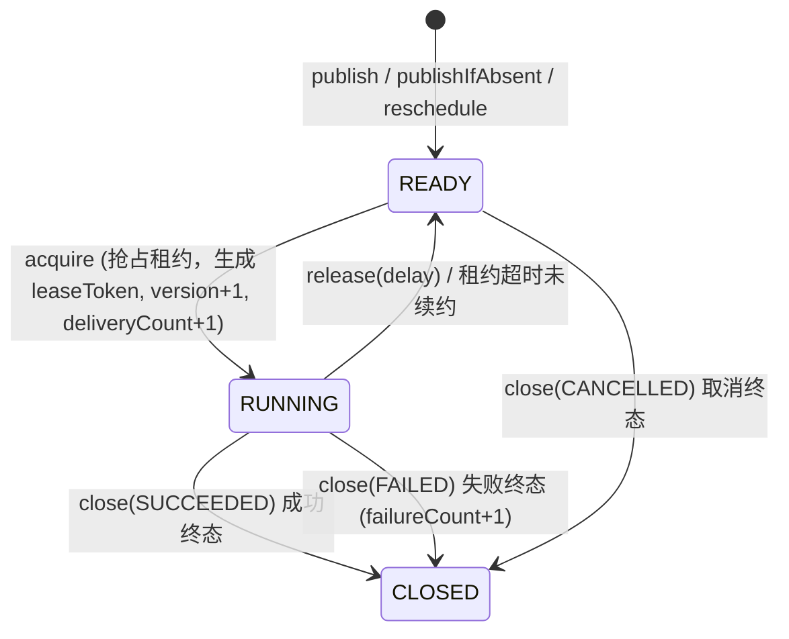

# 租约与排他任务组件 (team4u-lease)

# 背景

在分布式与微服务架构中，经常面临这样一类“排他性长任务”或“分布式独占处理”需求：

- **排他性单节点执行**：同一个任务在同一时刻只能由一个 Worker 节点处理，杜绝多节点并发冲突。
- **长任务与宕机自动接管**：长耗时任务需要持续续约；若执行节点中途宕机、网络分区或进程崩溃，租约过期后任务应能被其他健康节点自动接管继续执行。
- **状态可见与可运维**：任务需要完整保留执行状态、投递次数 (`deliveryCount`)、失败次数 (`failureCount`)、失败原因 (`failureReason`)、业务上下文 (`payload`/`attributes`) 与执行结果，支持控制台分页检索与人工重试干预。
- **轻量可靠存储**：业务希望基于现有关系型数据库（如 MySQL）实现可靠调度与排他抢占，而不愿为了轻量排他任务引入复杂的重量级 MQ 或大型工作流中间件。

`team4u-lease` 基于“**可抢占的任务记录 + 可过期的独占租约令牌 (Lease Token) + 乐观锁版本控制**”机制，为分布式排他任务提供了一套轻量、可靠且具备生产级容灾能力的解决方案。

---

# 设计

## 设计理念

框架采用乐观锁版本控制与租约心跳续约机制，提供 **At-Least-Once（至少一次）** 的高可用执行保障：



## 核心概念

| 概念 | 说明 |
| :--- | :--- |
| **租约 (Lease)** | Worker 抢占任务成功后获得的一段有期限的独占执行权，包含 `taskId`、`workerId` 与 `leaseToken` |
| `taskGroup` (任务分组) | 决定任务被哪一组 Worker 订阅与拉取，表达任务的路由与处理能力隔离 |
| `taskType` (任务类型) | 决定任务在分组内被哪一个具体的本地 `LeaseTaskHandler` 处理 |
| `businessKey` | 业务幂等唯一键，配合 `publishIfAbsent` 与数据库唯一索引 `(task_group, business_key)` 保证相同业务请求仅建档一次 |
| `LeaseTaskState` | 任务生命周期状态：`READY` (待命/延迟就绪)、`RUNNING` (执行中)、`CLOSED` (终态) |
| `LeaseTaskOutcome` | 终态结果：`SUCCEEDED` (成功)、`FAILED` (失败)、`CANCELLED` (已取消) |
| `LeaseTaskFailureReason` | 失败原因枚举：`HANDLER_EXCEPTION`、`RETRY_EXHAUSTED`、`ABORTED_BY_POLICY`、`MISSING_HANDLER`、`MANUAL_FAIL`、`HANDLER_CONTRACT_VIOLATION` |
| `LeaseProducer` | 任务发布门面，支持即时发布、延迟发布与基于 `businessKey` 的幂等发布 |
| `LeaseWorker` | 任务执行工作节点，负责拉取任务、分发执行、维持心跳续约与终态提交 |
| `LeaseQueryService` / `LeaseAdminService` | 任务查询与控制面管理服务，支持任务列表检索、重新调度与属性原子修改 |

---

## 模块结构

| 模块 | 说明 | 适用场景 |
| :--- | :--- | :--- |
| **`team4u-lease-core`** | 统一模型、核心接口、Worker 引擎与心跳调度 | 核心抽象与本地执行 |
| **`team4u-lease-jdbc`** | 基于 JDBC 的持久化存储（含 MySQL schema、复合索引与版本乐观锁） | 生产环境 |
| **`team4u-lease-memory`** | 基于 `ConcurrentHashMap` 与 `DelayQueue` 的内存实现 | 本地开发与单测 |
| **`team4u-lease-test`** | 统一契约测试基类，保障不同存储实现行为一致 | 测试支撑与扩展存储验证 |

---

## 组件位置与包结构

```text
com.team4u.framework.lease
├── api                              # 核心服务接口
│   ├── LeaseProducer.java           # 任务发布接口
│   ├── LeaseRuntimeClient.java      # 运行时抢占/续约/释放/关闭接口
│   ├── LeaseAdminService.java       # 运维管控与重调度接口
│   ├── LeaseQueryService.java       # 任务详情与分页查询接口
│   └── LeaseBackend.java            # 组合型后端接口
├── enums                            # 核心枚举定义
│   ├── LeaseTaskState.java          # READY, RUNNING, CLOSED
│   ├── LeaseTaskOutcome.java        # SUCCEEDED, FAILED, CANCELLED
│   ├── LeaseTaskFailureReason.java  # 失败原因细分
│   ├── LeaseRuntimeResult.java      # APPLIED, LEASE_LOST, TASK_NOT_FOUND, CLOSED
│   ├── LeaseAdminResult.java        # APPLIED, TASK_NOT_FOUND, CLOSED, ACTIVE_LEASE_PRESENT
│   └── MissingHandlerStrategy.java  # FAIL_FAST, RETRY_LATER
├── handler                          # 任务处理器与注册表
│   ├── LeaseTaskHandler.java        # 普通任务处理器
│   ├── LeaseLifecycleAwareTaskHandler.java # 生命周期感知型处理器
│   ├── LeaseTaskHandlerRegistry.java
│   └── DefaultLeaseTaskHandlerRegistry.java
├── model                            # 请求与领域模型
│   ├── LeaseAcquireRequest.java
│   ├── LeaseCloseRequest.java
│   ├── LeaseGrant.java
│   ├── LeaseHandle.java
│   ├── LeasePublishRequest.java
│   ├── LeasePublishResult.java
│   ├── LeaseQueryRequest.java
│   ├── LeaseReleaseRequest.java
│   ├── LeaseTaskGroupSubscription.java
│   ├── LeaseTaskPage.java
│   ├── LeaseTaskRecord.java
│   └── LeaseUpdateRequest.java
├── runtime                          # Worker 执行引擎与上下文
│   ├── LeaseWorker.java             # 轮询拉取、执行分发与心跳续约
│   ├── LeaseWorkerPolicy.java       # Worker 运行策略配置
│   ├── LeaseExecutionContext.java   # 执行上下文（含手动心跳触发）
│   └── LeaseLifecycleExecutionContext.java # 增强型生命周期上下文
├── jdbc                             # JDBC 持久化后端 (team4u-lease-jdbc)
│   ├── JdbcLeaseBackend.java        # 基于 SQL 乐观锁与版本控制的持久化存储
│   ├── JdbcLeaseTaskDao.java        # 底层 SQL 数据访问对象
│   ├── LeaseTaskEntity.java         # 数据库实体映射
│   ├── codec/LeaseJsonCodec.java    # 扩展属性 JSON 编解码
│   └── dialect/MySqlLeaseDbDialect.java # MySQL 专用方言与索引优化
├── memory                           # 内存后端 (team4u-lease-memory)
│   └── InMemoryLeaseBackend.java    # ConcurrentHashMap + DelayQueue 高性能内存后端
└── test                             # 契约测试支撑 (team4u-lease-test)
    ├── AbstractLeaseContractSupport.java
    ├── AbstractLeaseRuntimeContractTest.java
    ├── AbstractLeaseAdminContractTest.java
    ├── AbstractLeaseQueryContractTest.java
    └── AbstractLeaseStateSemanticsContractTest.java
```

---

## 文档导航

- [快速开始](quick-start.md)：依赖引入、存储初始化、任务发布与 Worker 处理
- [租约核心模型与状态机](lease-model.md)：LeaseToken 机制、状态机流转、Outcome/FailureReason 与幂等建档
- [Worker 执行与心跳续约](lease-worker.md)：LeaseWorker 线程模型、自动心跳、MissingHandlerStrategy 与优雅停机
- [存储后端实现 (JDBC/Memory)](lease-backend.md)：MySQL 表结构、索引优化、乐观锁版本控制与内存模型对比
- [运维管控与查询服务](lease-admin.md)：任务分页查询、失败任务手动重调与属性修改
- [实战案例](lease-sample.md)：未支付订单超时取消与第三方支付结果长耗时轮询补偿
