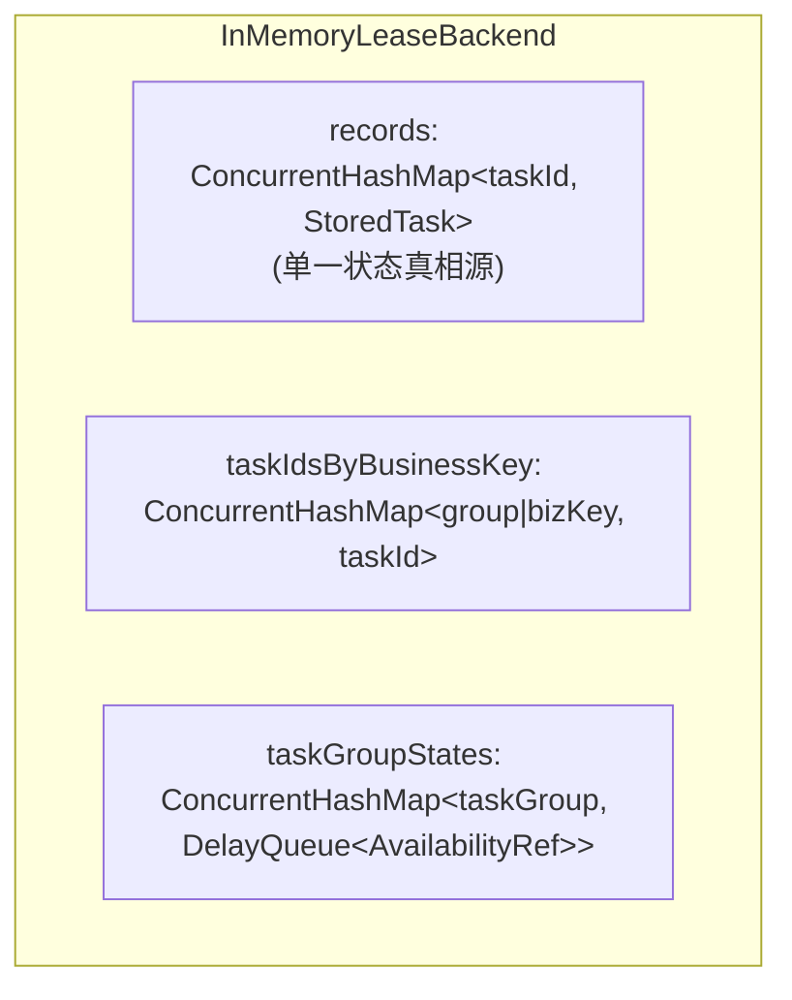

# 存储后端实现 (JDBC / Memory)

`team4u-lease` 采用存储与引擎分离的分层架构，提供了生产级 JDBC 持久化后端与高性能单机内存后端。

---

## 后端实现对比

| 特性维度 | `JdbcLeaseBackend` | `InMemoryLeaseBackend` |
| :--- | :--- | :--- |
| **底层存储** | 关系型数据库 (MySQL / PostgreSQL / H2 + JDBC) | `ConcurrentHashMap` + `DelayQueue` |
| **持久化能力** | 数据落地磁盘，进程崩溃或重启可 100% 恢复 | 纯 JVM 内存，进程重启数据全部丢失 |
| **多节点协同** | 支持数十至数百个分布式节点竞争抢占与故障接管 | 仅限单 JVM 进程内运行 |
| **锁与并发控制** | 基于 SQL 乐观锁 (`version`) 与行级条件更新 | 基于 `synchronized` 与 `ConcurrentMap` 线程安全容器 |
| **拉取等待机制** | 50ms 短轮询循环 + 批量拉取 (`batchSize = 10`) | `wait / notifyAll` + `DelayQueue` 精确延迟唤醒 |
| **推荐场景** | 生产环境、高可靠业务任务、跨节点容灾接管 | 本地单元测试、本地调试、轻量单机任务 |

---

## JDBC 后端并发控制与索引设计 (`JdbcLeaseBackend`)

### 1. 抢占 SQL 语义与版本乐观锁 (`tryAcquire`)

在多 Worker 并发竞争场景下，`JdbcLeaseBackend` 依靠单条原子 `UPDATE` 语句完成抢占：

```sql
UPDATE lease_task
SET state = 'RUNNING',
    worker_id = ?,
    lease_token = ?,
    lease_expires_at = ?,
    delivery_count = delivery_count + 1,
    version = version + 1,
    updated_at = ?
WHERE task_id = ?
  AND version = ?
  AND (
       (state = 'READY' AND visible_at <= ?)
    OR (state = 'RUNNING' AND lease_expires_at <= ?)
  );
```

> [!NOTE]
> **并发安全性保障**：
> 1. `version = expectedVersion`：确保抢占操作严格基于 Worker 查找到该任务时的快照版本，杜绝脏写。
> 2. 条件分支：仅当任务处于 `READY` 且已到期（`visible_at <= now`），或任务处于 `RUNNING` 但原持有者租约已过期（`lease_expires_at <= now` 宕机接管）时才允许抢占。
> 3. 更新行数返回 `1` 表示抢占成功，返回 `0` 表示已被其他 Worker 抢先抢占。

---

### 2. MySQL 方言与 `UNION ALL` 复合索引优化 (`MySqlLeaseDbDialect`)

如果使用单条含 `OR` 条件的 SQL 扫描待抢占候选任务，数据库查询优化器极易放弃索引走全表扫描。

`MySqlLeaseDbDialect` 采用 **`UNION ALL`** 派生表重构扫描 SQL，分别精准命中两组专用复合索引：

```sql
SELECT task_id, task_group, task_type, payload, business_key, state, outcome, failure_reason,
       priority, delivery_count, failure_count, worker_id, lease_token, lease_expires_at, visible_at,
       created_at, updated_at, version, error_message, attributes_json
FROM (
    -- 1. 命中就绪任务索引: idx_lease_task_acquire_ready (task_group, state, visible_at, priority, created_at, task_id)
    SELECT task_id, task_group, task_type, payload, business_key, state, outcome, failure_reason,
           priority, delivery_count, failure_count, worker_id, lease_token, lease_expires_at, visible_at,
           created_at, updated_at, version, error_message, attributes_json
    FROM lease_task
    WHERE task_group IN (?, ?) AND state = 'READY' AND visible_at <= ?
    
    UNION ALL
    
    -- 2. 命中超时任务索引: idx_lease_task_acquire_expired (task_group, state, lease_expires_at, priority, created_at, task_id)
    SELECT task_id, task_group, task_type, payload, business_key, state, outcome, failure_reason,
           priority, delivery_count, failure_count, worker_id, lease_token, lease_expires_at, visible_at,
           created_at, updated_at, version, error_message, attributes_json
    FROM lease_task
    WHERE task_group IN (?, ?) AND state = 'RUNNING' AND lease_expires_at <= ?
) acquire_candidates
ORDER BY priority DESC, created_at ASC, task_id ASC
LIMIT ?;
```

---

### 3. 短轮询等待机制 (Short Polling)

当 Worker 调用 `acquire(request)` 且设置了 `waitTimeoutMillis` 时：
1. 立即执行一次 `tryAcquireOnce`。
2. 若未抢占到任务且未超时，当前线程休眠 `Math.min(50ms, remaining)` 后再次尝试。
3. 达到 `deadline` 时返回 `null`。

---

### 4. 幂等发布冲突处理 (`publishIfAbsent`)

`JdbcLeaseBackend.publishIfAbsent` 利用 MySQL 唯一约束 `uk_lease_task_business (task_group, business_key)`：
- 首先尝试 `INSERT INTO lease_task ...`。
- 若抛出 `SQLIntegrityConstraintViolationException` 或 SQLState 以 `23` 开头的异常，捕获后通过 `findByBusinessKey(taskGroup, businessKey)` 查询已有记录并组装返回（`created = false`）。

---

### 5. 管理面安全防护 (`applyAdminWhere`)

为了防止运维后台误操作修改正在正常运行的长任务，`JdbcLeaseTaskDao` 在执行管理面 `reschedule`、`update`、`close` 时增加保护条件：

```sql
WHERE task_id = ?
  AND state <> 'CLOSED'
  AND NOT (state = 'RUNNING' AND lease_expires_at >= now)
```
- 若目标任务持有有效租约，操作返回 0 行，管理服务将其识别为 `LeaseAdminResult.ACTIVE_LEASE_PRESENT` 并拒绝改写，保护业务执行一致性。

---

## 内存后端设计 (`InMemoryLeaseBackend`)

`InMemoryLeaseBackend` 适合单机集成测试与高吞吐内存计算：



1. **状态真相源**：`records` 存储全量不可变 `StoredTask` 快照，所有状态变迁生成新的快照实例并原子替换。
2. **延迟与可见性索引**：每组维护一个 `DelayQueue<AvailabilityRef>`。`AvailabilityRef` 实现了 `Delayed` 接口，排序规则为：`availableAtMillis 升序 -> priority 降序 -> createdAtMillis 升序`。
3. **过期陈旧引用过滤**：`DelayQueue` 中可能留有任务历史状态的旧引用。在 `claim()` 阶段，Worker 会调用 `current.isClaimable(ref.availableAtMillis, now)` 校验引用时间是否与最新快照吻合，自动丢弃陈旧引用。
4. **唤醒机制**：每次发布新任务或释放任务时，调用 `notifyAll()` 唤醒所有正在 `acquire` 阻塞的 Worker 线程。

---

## 统一契约测试套件 (`team4u-lease-test`)

为了确保 JDBC 与 Memory（以及未来自定义的 Redis/Mongo 存储）行为完全一致，`team4u-lease-test` 提供了完整的抽象契约测试基类：

- **`AbstractLeaseRuntimeContractTest`**：验证 `acquire`、`heartbeat`、`close`、`release` 的租约令牌流转与互斥隔离。
- **`AbstractLeaseAdminContractTest`**：验证 `reschedule`、`rescheduleFailed`、`update`、`close` 以及 `ACTIVE_LEASE_PRESENT` 安全防护。
- **`AbstractLeaseQueryContractTest`**：验证 `get`、`getByBusinessKey` 与 `list` 多维分页组合查询。
- **`AbstractLeaseStateSemanticsContractTest`**：验证状态机单向流转、终态不变性与失败次数计数语义。

