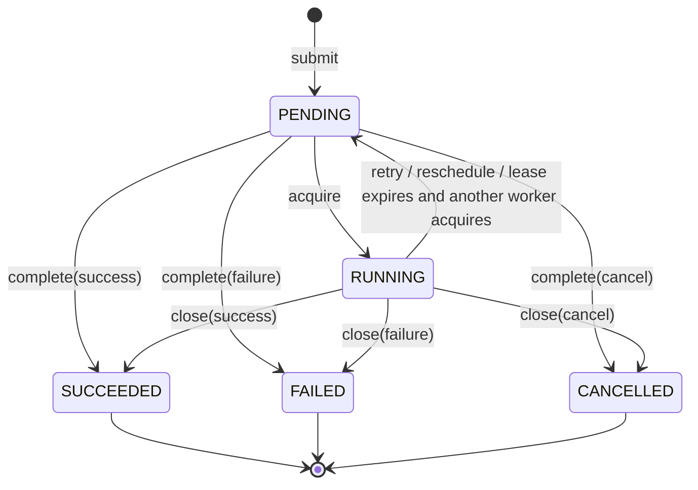

# 任务模型与状态机

## 核心对象

| 对象 | 说明 |
| :--- | :--- |
| `Task` | 发布任务的不可变输入：类型、String payload、可选幂等键、延迟、优先级和属性 |
| `Submission` | 提交结果：`taskId`、是否新建、提交后的 `TaskSnapshot` |
| `TaskSnapshot` | 后端当前可见的任务快照，包含状态、时间、尝试次数和业务数据 |
| `TaskResult` | Handler 的处理决策：成功、失败、取消或延迟重试 |
| `TaskContext` | Handler 可见的任务上下文，不暴露租约句柄 |

`Task.of(type, payload)` 是最小创建方式，其余字段通过返回新实例的派生方法配置：

```java
Task task = Task.of("payment.reconcile", "{\"paymentId\":\"P-1001\"}")
        .deduplicationKey("P-1001")
        .delay(Duration.ofMinutes(5))
        .priority(20)
        .attribute("tenant", "team4u")
        .attributes(Collections.singletonMap("traceId", "T-1001"));
```

`attributes(...)` 会替换之前设置的全部属性；`attribute(...)` 是逐项追加。属性值必须是 `String` 且不能为 `null`。

## 状态机

任务只有五个状态：



| 状态 | 含义 | 租约字段 |
| :--- | :--- | :--- |
| `PENDING` | 已建档，尚未被抢占；只有当前时间到达 `visibleAt` 才可抢占 | 必须为空 |
| `RUNNING` | 某个 Worker 持有有效租约并应处理任务 | 必须有 `workerId` 和 `leaseExpiresAt` |
| `SUCCEEDED` | 成功终态 | 必须为空 |
| `FAILED` | 失败终态 | 必须为空 |
| `CANCELLED` | 取消终态 | 必须为空 |

租约过期时记录不会立即从 `RUNNING` 变成 `PENDING`；它会保留旧的 Worker 信息，直到下一个 Worker 抢占成功并写入新的租约。`FAILED` 只有管理面 `retry(...)` 能重新进入 `PENDING`。

## 交付语义

`team4u-lease` 是 **at-least-once** 调度。以下情况都会导致同一任务再次执行：

- Worker 进程崩溃或被强制终止；
- 心跳失败且租约到期；
- Handler 已完成业务动作，但终态写回因网络或数据库失败；
- 前一个 Worker 被暂停很久后恢复，业务逻辑继续执行。

因此 handler 和外部系统必须按业务键做幂等。租约和 fencing token 只保证同一时刻的写回权归属，不能把业务副作用变成只执行一次。

## 幂等建档

`deduplicationKey` 的唯一范围是：

```text
(queue, taskType, deduplicationKey)
```

- 未设置 key 时，每次提交都会创建新任务；
- 设置 key 后，同一三元组重复提交返回已有任务；
- 不同 type 可以使用相同 key；
- 不同 queue 也可以使用相同 key；
- 三个字段都区分大小写。

重复提交不会把旧 payload 改成新 payload，只返回现有 `TaskSnapshot`。这个机制解决“重复建档”，不解决重复执行。

## 时间字段

| 字段 | 类型 | 说明 |
| :--- | :--- | :--- |
| `createdAt` | `Instant` | 建档时间 |
| `visibleAt` | `Instant` | 最早可抢占时间；`submit(delay)` 后为 `createdAt + delay` |
| `leaseExpiresAt` | `Instant` | 当前租约到期时间；仅 `RUNNING` 任务有值 |

`visibleAt` 和 `leaseExpiresAt` 是两类不同门槛：

- 到达 `visibleAt` 前，`PENDING` 任务对抢占不可见；
- 到达 `leaseExpiresAt` 后，其他 Worker 可以接管 `RUNNING` 任务；
- 抢占和心跳不会修改 `visibleAt`；
- runtime retry 和管理面重调度会把 `visibleAt` 设置为“当前时间 + delay”。

业务 API 的时间参数使用 `Duration`，快照使用 `Instant`。`Duration` 必须能无损转换为毫秒：负数、包含不足 1 毫秒纳秒、或超过毫秒表示范围都会被拒绝。后端还会统一拒绝“当前时间 + 时长”超过 `Long.MAX_VALUE` 的计算。

## 排序与尝试

抢占候选按以下顺序全局排序，跨越 Worker 订阅的多个 task type：

1. `priority` 降序；
2. `createdAt` 升序；
3. `taskId` 升序。

`visibleAt` 是资格过滤条件，不参与排序比较：一个晚创建但高优先级的任务，到达可见时间后会先于早创建的低优先级任务被抢占。

`attemptCount` 表示任务被成功抢占的次数：

- 新任务为 0；
- 每次 acquire 成功加 1；
- runtime retry、租约过期接管、失败后管理面 retry 再抢占，都会在后续 acquire 时继续累计。

它不是 handler 抛异常次数，也不是失败任务数量。

## Fencing

每次抢占成功都会生成新的 `leaseToken`。运行时写回必须携带 `(taskId, workerId, leaseToken)`：

- token 不匹配或租约已过期时，写回返回 `LEASE_LOST`，不会修改任务；
- 任务被接管后，旧 Worker 的成功、失败或重试写回都会被拒绝；
- 这个 fencing 机制防止慢 Worker 在租约丢失后覆盖新 Worker 的结果。

业务 handler 不接触 `leaseToken`；框架在 `TaskWorker` 内部完成校验和写回。
