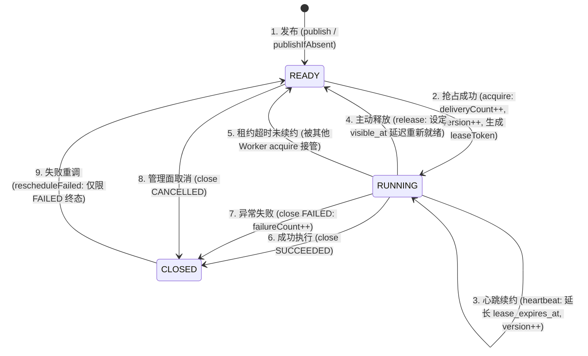

# 租约核心模型与状态机

理解租约的生命周期、版本令牌隔离与状态机流转是使用 `team4u-lease` 的关键。

---

## 什么是租约 (Lease)？

与传统阻塞式互斥锁不同，租约不是“永久排他性占有”，而是**一段具备物理过期时间上限的独占执行凭证**。

当 Worker 节点成功抢占（`acquire`）一个任务时，存储后端会原子生成唯一的 `leaseToken`（如 `lease-token-uuid`），将任务状态切换为 `RUNNING`，并将 `lease_expires_at` 设置为 `now + leaseMillis`，同时行版本号 `version + 1`，投递计数 `delivery_count + 1`。

Worker 获得的任务句柄 `LeaseHandle` 封装了 `taskId`、`workerId` 与 `leaseToken`。后续针对该任务的所有写回操作（心跳续约 `heartbeat`、成功/失败完成 `close`、延迟重新入队 `release`）都必须携带此句柄：

- **有效租约**：`worker_id` 与 `lease_token` 均匹配且 `lease_expires_at >= now`，状态写回成功，返回 `LeaseRuntimeResult.APPLIED`。
- **租约过期或被接管 (Fencing Token 防御)**：若原 Worker 执行阻塞导致心跳中断，租约超时后被其他健康 Worker 抢占（生成新 `leaseToken`），原 Worker 恢复后的写回操作将被存储后端安全拒绝，返回 `LeaseRuntimeResult.LEASE_LOST`，**杜绝脑裂覆盖**。

---

## 任务生命周期状态机

---

## 核心枚举与语义定义

### 1. 任务状态 (`LeaseTaskState`)

| 状态 | 说明 | 是否可被 Worker 抢占 |
| :--- | :--- | :--- |
| **`READY`** | 就绪待命状态。包含即时任务与延迟任务。 | 当且仅当 `visible_at <= now` 时可被抢占 |
| **`RUNNING`** | 运行中。已分配给特定 `worker_id` 并持有有效 `lease_token`。 | 正常不可抢占；但若 `lease_expires_at <= now`（租约超时宕机），允许其他节点抢占接管 |
| **`CLOSED`** | 终态。任务已结束，存储层不再自动推进。 | 否 |

---

### 2. 终态结果 (`LeaseTaskOutcome`)

当任务状态进入 `CLOSED` 时，记录最终执行结论：

- **`SUCCEEDED`**：任务业务逻辑正常执行完毕并提交成功。
- **`FAILED`**：任务执行失败或发生契约违反，不再自动继续。
- **`CANCELLED`**：由业务主动取消或运维人员强制取消。

---

### 3. 失败诱因 (`LeaseTaskFailureReason`)

当 `outcome = FAILED` 时，框架记录详细的失败分类：

| 失败原因 | 触发场景 | 来源 |
| :--- | :--- | :--- |
| **`HANDLER_EXCEPTION`** | 本地 `LeaseTaskHandler` 执行业务代码抛出未捕获异常。 | Worker 自动标记 |
| **`MISSING_HANDLER`** | Worker 抢占到任务但本地未注册对应 `taskType` 处理器，且策略为 `FAIL_FAST`。 | Worker 自动标记 |
| **`HANDLER_CONTRACT_VIOLATION`** | 生命周期感知型处理器 `LeaseLifecycleAwareTaskHandler` 方法执行结束但未显式调用 `close(...)` 或 `release(...)`。 | Worker 契约保护 |
| **`RETRY_EXHAUSTED`** | 任务经过多次分布式重试后仍未成功，达到策略配置的最大上限。 | 托管重试/业务判定 |
| **`ABORTED_BY_POLICY`** | 触发熔断策略或系统防护机制被主动终止。 | 策略引擎 |
| **`MANUAL_FAIL`** | 运维人员通过管理后台或 API 显式标记任务失败。 | 管理面调用 |

---

### 4. 运行时写回结果 (`LeaseRuntimeResult`)

Worker 节点向后端提交 `heartbeat`、`close` 或 `release` 时的执行响应：

| 结果 | 含义 | 处理建议 |
| :--- | :--- | :--- |
| **`APPLIED`** | 操作已成功原子应用。 | 正常流程 |
| **`LEASE_LOST`** | 租约已过期或已被其他节点抢占（`lease_token` 失效）。 | 放弃后续操作，日志告警 |
| **`TASK_NOT_FOUND`** | 任务 ID 在存储中不存在。 | 记录日志 |
| **`CLOSED`** | 任务已在终态。 | 忽略重复写回 |

---

### 5. 管理面操作结果 (`LeaseAdminResult`)

运维人员或管理后台调用 `LeaseAdminService` 时的执行响应：

| 结果 | 含义 | 说明 |
| :--- | :--- | :--- |
| **`APPLIED`** | 管理操作已成功生效。 | 成功 |
| **`TASK_NOT_FOUND`** | 目标任务不存在。 | 检查 taskId |
| **`CLOSED`** | 任务处于终态，或在调用 `rescheduleFailed` 时任务非 `CLOSED+FAILED`。 | 拒绝无效重调 |
| **`ACTIVE_LEASE_PRESENT`** | 任务当前正在 `RUNNING` 且租约尚未过期（`lease_expires_at >= now`）。 | **安全防御**：拒绝强行覆盖活跃执行中的任务 |

---

## 核心计数器与属性模型

每个 `LeaseTaskRecord` 包含完整的执行追踪字段：

- **`deliveryCount` (投递次数)**：每次被 Worker 节点成功 `acquire` 抢占时累加 1。反映任务被拉起尝试的总体次数（包含因节点崩溃未完成的尝试）。
- **`failureCount` (失败次数)**：仅当任务被标记为 `outcome = FAILED` 提交终态时累加 1。
- **`version` (行版本号)**：每次状态流转、心跳续租或属性更新时严格自增 1（`version = version + 1`），作为底层乐观锁并发控制的核心依据。
- **`attributes` (`attributes_json`)**：`Map<String, String>` 扩展属性字典，支持业务透传链路 TraceId、操作人、标签及审计上下文。
- **`priority`**：任务优先级整数，数值越大在同批就绪任务中越优先被抢占拉取。

---

## 幂等建档与 At-Least-Once 语义

1. **`businessKey` 幂等建档**：
   - 数据库表通过 `uk_lease_task_business (task_group, business_key)` 建立唯一索引。
   - 调用 `producer.publishIfAbsent(...)` 时，若底层捕获唯一键冲突，自动回查并返回已存在任务的详情快照（`created = false`），保证分布式并发发布时的绝对幂等。
2. **At-Least-Once（至少一次）执行保证**：
   - 当正在执行任务的 Worker 发生宕机、OOM 崩溃或网络断开时，其租约将在 `lease_expires_at` 到期后自动失效。
   - 其他健康 Worker 在下一轮 `acquire` 扫描中会通过 `idx_lease_task_acquire_expired` 索引自动发现超时的 `RUNNING` 任务并重新接管执行。
   - 因此，**业务任务的 Handler 实现必须具备幂等性**。

