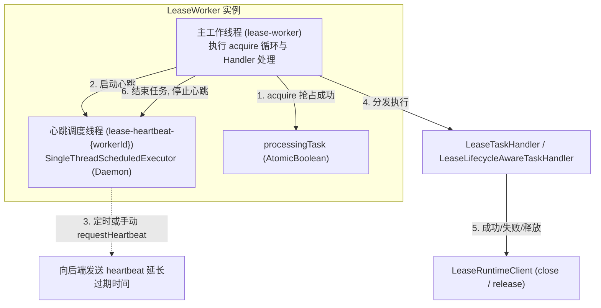
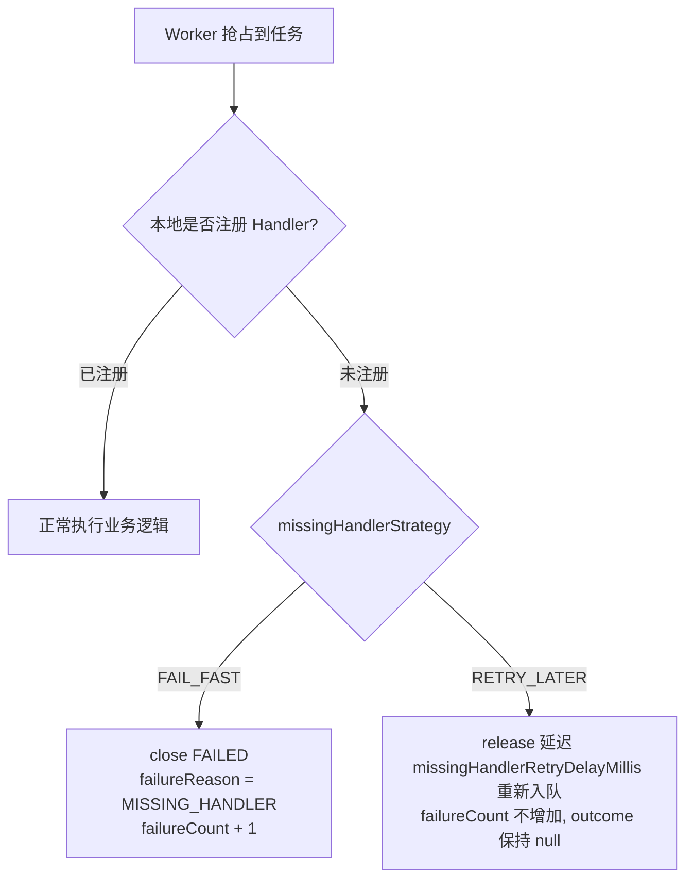

# Worker 执行与心跳续约

`LeaseWorker` 是驱动分布式排他任务拉取、本地分发、后台心跳续约与终态提交的核心执行引擎。

---

## 线程模型与架构

每个 `LeaseWorker` 实例维护两个独立的线程机制：



1. **主工作线程 (`workerThread`)**：
   - 命名：默认 `lease-worker`，支持在 `start(String threadName)` 时自定义。
   - 职责：运行 `run()` 主循环，周期性从 `LeaseRuntimeClient` 抢占待处理任务，分发给本地处理器执行，并在执行完毕后写回终态。
2. **后台心跳线程池 (`heartbeatExecutor`)**：
   - 命名：`lease-heartbeat-{workerId}`，守护线程（Daemon）。
   - 职责：在任务执行期间，以 `heartbeatIntervalMillis` 为周期自动向存储后端发送心跳续租请求。同时响应业务代码触发的手动心跳请求（`context.requestHeartbeat()`）。

---

## 策略配置 (`LeaseWorkerPolicy`)

`LeaseWorkerPolicy` 通过流式 Builder 构建，内置完整的参数约束与默认值填充：

| 配置参数 | 类型 | 默认值 | 约束与说明 |
| :--- | :--- | :--- | :--- |
| `workerId` | `String` | `lease-worker-{UUID}` | Worker 节点的全局唯一标识，推荐配置为 `IP:PID` 或容器主机名 |
| `leaseMillis` | `long` | `30,000 ms` | 每次抢占租约锁定时长。**必须大于 0** |
| `pollWaitMillis` | `long` | `1,000 ms` | 任务队列为空时长轮询休眠等待时间。**必须 $\ge 0$** |
| `heartbeatEnabled` | `boolean` | `true` | 是否启用后台自动心跳续约 |
| `heartbeatIntervalMillis` | `long` | `leaseMillis / 3` | 心跳自动续约周期。**必须 $>0$ 且 $< leaseMillis$** |
| `missingHandlerStrategy` | `MissingHandlerStrategy` | `FAIL_FAST` | 本地未注册对应 `taskType` 时的处理策略：`FAIL_FAST` 或 `RETRY_LATER` |
| `missingHandlerRetryDelayMillis` | `long` | `pollWaitMillis` | 在 `RETRY_LATER` 模式下任务释放回队列的延迟可见时间。**必须 $\ge 0$** |

---

## 核心机制详解

### 自动心跳与并发控制

- **自动周期续约**：任务开始执行后，Worker 立即启动 `HeartbeatTask`，通过 `scheduleAtFixedRate` 周期性执行。每次心跳将 `lease_expires_at` 延后至 `now + leaseMillis`。
- **手动即时续约**：业务代码如预知后续将执行耗时较长的重计算，可调用 `context.requestHeartbeat()` 触发即时续租。
- **并发防重 (`AtomicBoolean heartbeating`)**：`HeartbeatTask` 内部通过 CAS 状态锁防止“定时心跳”与“手动心跳”并发重叠执行，保证同一时刻只有一个心跳 RPC/SQL 在路上。
- **异常降级与租约丢失**：
  - 心跳若因网络抖动偶发失败，Worker 会记录 WARN 日志，但**不会中断业务处理**。
  - 若租约已超时被其他 Worker 抢占接管，后端将返回 `LEASE_LOST`。后续任务完成提交 `close` 时，后端同样返回 `LEASE_LOST` 并拒绝覆写，**防止脑裂冲突**。

---

### 缺失处理器策略 (`MissingHandlerStrategy`)

当 Worker 抢占到一个任务，但本地 `DefaultLeaseTaskHandlerRegistry` 未找到对应 `taskType` 的 Handler 时：



- **`FAIL_FAST` (默认模式)**：
  - 立即向存储后端提交 `close(FAILED, MISSING_HANDLER)`，累加 `failureCount`。
  - **适用场景**：单体应用、所有节点能力对等的微服务集群，快速暴露漏配 Handler 的代码缺陷。
- **`RETRY_LATER` (平滑升级 / 灰度发布模式)**：
  - 调用 `release(missingHandlerRetryDelayMillis)`，将任务安全释放回队列，并设定延迟可见（默认等于 `pollWaitMillis`）。
  - **不计入失败次数**，任务保持 `READY` 状态，等待集群中已完成新版部署、注册了该 Handler 的节点抢占处理。
  - **适用场景**：多版本滚动发布、微服务异构 Worker 组协同。

---

### 生命周期感知型处理器 (`LeaseLifecycleAwareTaskHandler`) 与契约保护

框架支持两类处理器接口：

1. **普通处理器 (`LeaseTaskHandler`)**：
   - 接口方法：`void handle(LeaseExecutionContext context) throws Exception`。
   - 自动闭环：方法正常返回，Worker 自动调用 `close(SUCCEEDED)`；方法抛出异常，Worker 自动调用 `close(FAILED, HANDLER_EXCEPTION)`。
2. **生命周期感知型处理器 (`LeaseLifecycleAwareTaskHandler`)**：
   - 接口方法：`void handleLifecycle(LeaseLifecycleExecutionContext context) throws Exception`。
   - 自主控制：处理器通过 `context.close(...)` 或 `context.release(...)` 自行决定任务终态或延迟退避重新入队。
   - **契约违规保护 (`HANDLER_CONTRACT_VIOLATION`)**：
     - 若处理器方法返回时，`context.isLifecycleHandled()` 仍为 `false`（即业务代码既未 close 也未 release），Worker 会**强制将其标记为失败**：
       ```java
       runtimeClient.close(grant.getHandle(), LeaseCloseRequest.failed(
               LeaseTaskFailureReason.HANDLER_CONTRACT_VIOLATION,
               "LeaseLifecycleAwareTaskHandler executed without close/release"
       ));
       ```
     - 彻底避免由于业务遗漏调用而导致任务在数据库中处于僵死状态。

---

### 优雅停机 (Graceful Shutdown)

在容器缩容、应用发布（`SIGTERM`）或调用 `close()` 时，Worker 提供两阶段优雅停机保护：

```java
// 优雅停机，等待当前任务完成，最大等待 10 秒
boolean stoppedCleanly = worker.shutdownGracefully(10_000L);
```

#### 停机流程：
1. **标记停止状态**：设置 `shutdown = true, running = false`。
2. **空闲中断**：如果 Worker 当前处于 `acquireNextGrant()` 阻塞轮询或休眠阶段（`!processingTask.get()`），立即对工作线程发起 `interrupt()`，促使其瞬间退出。
3. **在跑任务保护**：如果 Worker 正在执行具体任务逻辑（`processingTask.get() == true`），不打断业务执行，允许其在 `timeoutMillis` 期限内完成并提交 `close`。
4. **等待线程汇合**：主线程等待工作线程退出（`workerThread.join(remaining)`）。
5. **心跳池清理**：工作线程退出后，安全关闭 `heartbeatExecutor`。若超时仍未退出，执行 `shutdownNow()` 强行终止。

