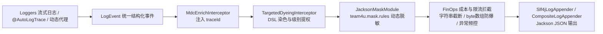

# 结构化日志组件 (team4u-log-core / team4u-log-governance)

# 背景

在云原生与微服务架构中，日志已不再是单纯用于排查异常的辅助文本，而是用于指标监控、调用链追踪、业务审计与大数据分析的核心数据资产。

传统日志打印通常面临以下严重痛点：

- **非结构化字符串拼接**：`log.info("user: " + userId + ", action: " + act)` 导致日志解析依赖昂贵的正则，难以被 ELK / SLS 等分析引擎高效检索与聚合。
- **敏感信息明文泄漏**：代码中打印包含手机号、身份证、银行卡等信息的对象时，极易违反数据合规与隐私安全政策。
- **排障依赖全局开启 DEBUG**：线上排查特定用户或商户的偶发问题时，若要抓取详细日志，不得不全局调低日志级别，产生海量垃圾日志甚至导致磁盘爆盘。
- **日志风暴与成本失控 (FinOps)**：未受控的超大报文、`byte[]` 序列化膨胀、死循环日志或下游报错引发的异常堆栈风暴，极易拖垮日志采集链路并带来高昂的存储成本。

核心与治理的分工如下：`team4u-log-core` 默认输出安全明文/`toString`，不携带 Jackson、Spring、ByteBuddy、Config、Mask、Criterion 或 Proxy；`team4u-log-governance` 传递 `team4u-serializer-jackson` 与 Jackson，负责治理配置、脱敏、代理和 Spring 集成。

---

# 设计

## 设计理念

框架将日志打印抽象为统一事件模型与多阶段动态治理流水线：



## 核心特性

- **统一结构化事件 (`LogEvent`)**：业务字段统一沉淀至 `payload`；core 默认输出明文/`toString`，governance 安装 Jackson 序列化后输出标准 JSON。
- **流式构建器 (`Loggers`)**：支持 `action()`、`duration()`、`put()`、`derive()` 模板派生与 `LogSpan` 耗时区间统计。
- **声明式方法追踪 (`@AutoLogTrace`)**：自动记录方法入参、返回值与执行耗时，支持慢调用阈值告警与特定业务异常降级。
- **动态条件染色 (`team4u.log.dyeing`)**：基于 `team4u-criterion` DSL，针对特定用户、特定 Action 临时将日志提权为 DEBUG/TRACE，无需全局调级。
- **FinOps 成本保护 (`team4u.log.finops`)**：内置单字段最大长度限制 (`maxStringLength`)、整条日志上限截断 (`maxLogLength`)、`byte[]` 字节防爆以及异常风暴限流 (`errorLimitPerSecond`) 机制。
- **测试支持 (`TestLogHelper`)**：提供单测专用的复合内存日志断言工具，自动恢复原始环境，单测零副作用。

---

## 核心概念

| 概念 | 说明 |
| :--- | :--- |
| `Loggers` | 流式结构化日志入口门面，支持 `of(Class)`、`action`、`put`、`success`、`failed`、`log` |
| `LogSpan` | 耗时区间追踪器，支持 `logStart()` 打印开始日志，并在结束时自动计算 `durationMs` |
| `@AutoLogTrace` | 方法切面追踪注解，自动拦截并记录入参、返回值、耗时与业务异常降级 |
| `LogEvent` | 统一日志事件模型，包含 `loggerName`、`level`、`traceId`、`action`、`status`、`durationMs`、`payload`、`exception`、`suppressed` |
| `LogProxyFactory` | 动态代理工厂，用于非 Spring 对象或第三方 SDK 实例的自动日志切面包装 |
| `TestLogHelper` | 单测日志捕获辅助工具，基于 `CompositeLogAppender` 实现控制台与内存同时捕获断言 |

---

## 配置总表

| 配置 Key | 作用 | 是否支持热重载 | 默认值 / 典型场景 |
| :--- | :--- | :--- | :--- |
| `team4u.mask.rules` | 动态脱敏规则 | 是 | 指定类或特定字段进行脱敏掩码（如手机号、身份证） |
| `team4u.log.dyeing` | 条件染色规则 | 是 | 基于 DSL 针对特定用户或租户临时提权日志级别 |
| `team4u.log.finops` | 成本保护与限流阈值 | 是 | `maxLogLength=5000`, `maxStringLength=2000`, `errorLimitPerSecond=10` |
| `team4u.log.proxy` | 第三方类动态代理规则 | 是 | 配置第三方类的拦截方法列表、慢调用阈值与降级异常 |
## 依赖选择

只需流式日志与内存/SLF4J 输出时：

```xml
<dependency>
    <groupId>com.team4u</groupId>
    <artifactId>team4u-log-core</artifactId>
</dependency>
```

需要 JSON、配置热更新、脱敏、方法代理或 Spring AOP 时：

```xml
<dependency>
    <groupId>com.team4u</groupId>
    <artifactId>team4u-log-governance</artifactId>
</dependency>
```

`team4u-log-governance` 传递 `team4u-log-core`、`team4u-serializer-jackson` 与 Jackson；不要额外为该消费者重复声明 provider 或 Jackson 依赖。

## 文档导航

- [快速开始](quick-start.md)：3 分钟完成模块启动与第一条结构化日志输出
- [结构化流式日志 (Loggers)](log-loggers.md)：Loggers API、payload 规范、derive 模板派生与 LogSpan
- [方法切面追踪 (@AutoLogTrace)](log-auto-trace.md)：注解配置、Spring AOP 整合与第三方类动态代理
- [动态治理与 FinOps 成本保护](log-governance.md)：条件染色提权、脱敏集成、字段截断与异常限流
- [架构原理与模型设计](log-architecture.md)：LogEvent 模型设计、流水线管道与 TestLogHelper 测试支持
- [实战案例](log-sample.md)：订单流转日志、慢方法追踪与线上临时排障染色实战
