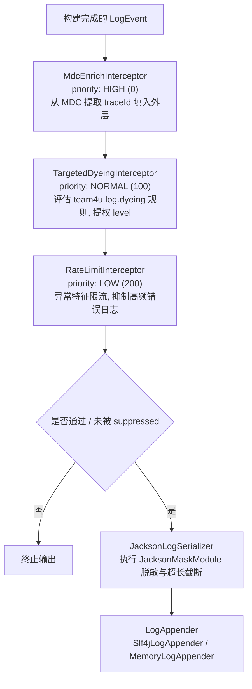

# 架构原理与模型设计

`team4u-log` 的底层模型、流水线编排与单元测试支持设计。

---

## 统一日志事件模型 (`LogEvent`)

所有日志输入（`Loggers`、`@AutoLogTrace`、动态代理）最终都归一化为不可变的 `LogEvent` 实例：

```java
package com.team4u.framework.log.core;

import lombok.Data;
import lombok.experimental.Accessors;
import org.slf4j.event.Level;
import java.util.Map;
import java.util.LinkedHashMap;

@Data
@Accessors(chain = true)
public class LogEvent {
    private String loggerName;                   // 日志记录器全限定名
    private Level level;                         // 日志级别 (TRACE, DEBUG, INFO, WARN, ERROR)
    private String traceId;                      // 分布式链路 ID (自动从 MDC 抽取)
    private String action;                       // 业务动作标识
    private String status;                       // 业务状态 (如 start, success, failed, slow_success, business_error)
    private long durationMs = -1;                // 耗时 (毫秒)，-1 代表未设置
    private Throwable exception;                 // 异常对象 (failed 状态时绑定)
    private Map<String, Object> payload = new LinkedHashMap<>(); // 业务数据载荷
    private boolean suppressed = false;          // 是否被限流拦截器抑制输出

    // 便捷操作方法
    public Object get(String key);
    public <T> T getOrDefault(String key, T defaultValue);
    public LogEvent put(String key, Object value);
    public LogEvent putAll(Map<String, Object> entries);
    public LogEvent derive();                    // 浅拷贝 payload 生成独立事件实例
}
```

---

## 治理流水线与拦截器链 (`LogInterceptorManager`)

`LogEngine` 内部维护了由 `LogInterceptorManager` 调度的有序拦截器链：



### 拦截器优先级契约
- `MdcEnrichInterceptor`（最高优先级，`HIGH = 0`）：确保后续拦截器在进行染色决策时能读取到 MDC 链路元数据。
- `TargetedDyeingInterceptor`（常规优先级，`NORMAL = 100`）：完成染色与日志级别提升。
- `RateLimitInterceptor`（最低优先级，`LOW = 200`）：对染色后的最终日志事件执行异常频控。

---

## 日志输出器适配 (`LogAppender`)

| 追加器实现 | 作用 | 适用场景 |
| :--- | :--- | :--- |
| `Slf4jLogAppender` | 默认追加器，调用底层 SLF4J `Logger.info/warn/error` 输出 JSON 字符串 | 生产环境与常规开发环境 |
| `MemoryLogAppender` | 内存追加器，将 `LogEvent` 保存在内存列表 (`List<LogEvent>`) 中 | 单元测试断言与日志捕获 |
| `CompositeLogAppender` | 组合追加器，将日志广播分发至内部维护的多个 `LogAppender` | 结合单测助手同时输出控制台与内存 |

---

## 单元测试支持 (`TestLogHelper`)

为了在编写业务单元测试时，能够可靠且零副作用地断言日志输出（如验证动作名、耗时、业务字段或脱敏结果），框架提供了 `TestLogHelper`。

### 原理与生命周期
1. 调用 `TestLogHelper.start()` 时，会自动创建 `MemoryLogAppender` 并将其包装为 `CompositeLogAppender` 注入 `LogEngine`。这样既保留了控制台原有日志打印，又能在内存中捕获日志事件；
2. 在测试结束时调用 `helper.stop()`，会自动解除挂载并安全恢复原有的 Appender，消除跨用例的状态泄漏。

### 单测使用示例
```java
import com.team4u.framework.log.core.LogEvent;
import com.team4u.framework.log.support.TestLogHelper;
import org.junit.Assert;
import org.junit.Test;

public class OrderServiceTest {

    @Test
    public void testCreateOrderLogs() {
        // 1. 启动单测捕获助手
        TestLogHelper helper = TestLogHelper.start();
        try {
            orderService.createOrder("ORD_1001", "13800138000");

            // 2. 获取并断言结构化 LogEvent
            LogEvent event = helper.lastEvent();
            Assert.assertNotNull(event);
            Assert.assertEquals("CreateOrder", event.getAction());
            Assert.assertEquals("success", event.getStatus());
            Assert.assertEquals("ORD_1001", event.get("orderId"));

            // 3. 获取序列化后的 JSON 字符串并断言脱敏
            String json = helper.lastJson();
            Assert.assertTrue(json.contains("\"mobile\":\"138*****000\""));

        } finally {
            // 4. 关闭助手，恢复原始环境
            helper.stop();
        }
    }
}
```
