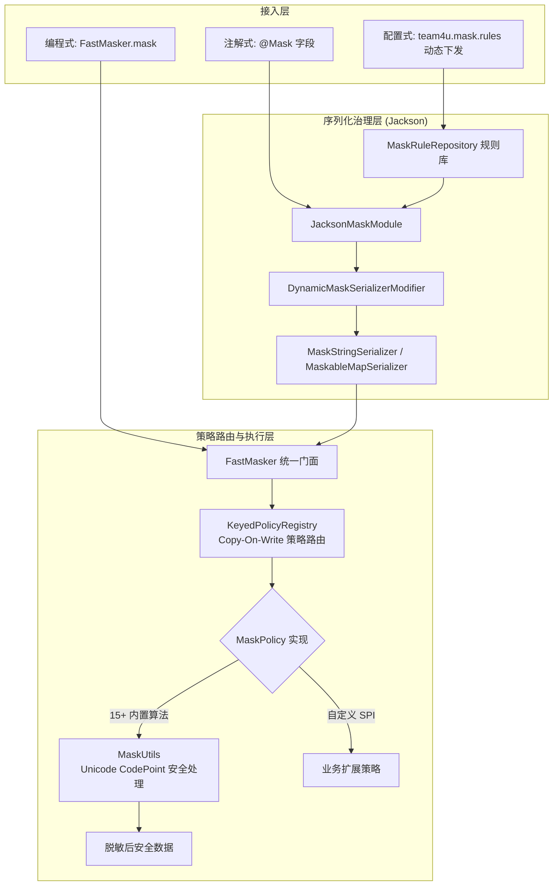

# 数据脱敏组件 (team4u-mask)

# 背景

随着数据安全与隐私合规要求的日益严格，用户敏感数据（如手机号、身份证号、银行卡号、姓名、邮箱、详细地址等）在日志记录、接口出参以及数据导出等场景下必须进行统一的脱敏处理。

传统的手动脱敏方案通常面临如下痛点：

- **侵入性过重**：在每处打印日志或接口返回前手写 `MaskUtil.mask(mobile)`，代码冗余且极易遗漏。
- **无法治理第三方对象**：对于依赖的第三方 SDK 对象或不可修改的外部 DTO，无法在源码中添加注解。
- **规则调整需重新发版**：合规政策调整（例如掩码规则微调）必须修改代码并重新编译上线。
- **Unicode 与 Emoji 乱码截断**：常规 `String.substring` 在处理 4 字节 Emoji 或生僻字（Surrogate Pair 代理对）时，容易截断半个字符导致乱码或乱码异常。

`team4u-mask` 是一个轻量级、高性能、支持动态治理的 Java 数据脱敏模块。它提供了 **编程式极速脱敏 (`FastMasker`)**、**注解式声明脱敏 (`@Mask`)** 与 **配置中心动态规则 (`team4u.mask.rules`)** 三位一体的防护体系。

---

# 设计

## 设计理念



---

## 核心特性

- **高性能无锁策略路由**：底层基于 `team4u-policy` 的 `KeyedPolicyRegistry` 读写分离架构，核心路径无反射、无正则开销。
- **内置 15 种标准脱敏算法**：开箱覆盖姓名（支持中英文智能区分）、手机号、身份证、银行卡、邮箱、地址、密码、居中百分比掩码等。
- **Jackson 无侵入自动脱敏**：注册 `JacksonMaskModule` 后，自动接管 JavaBean 与 Map 的 JSON 序列化输出，内存对象中的真实值完全不受影响。
- **配置中心动态治理 (`team4u.mask.rules`)**：联动 `team4u-config`，无需修改代码即可针对特定 Class、第三方 DTO 或全局字段名动态下发脱敏规则。
- **Unicode CodePoint 安全机制**：所有字符串长度计算与截取严格基于 Unicode CodePoint 算法，完美兼容 Emoji 与生僻字。
- **超长报文截断保护 (`MaskConfig`)**：支持配置 `maxStringLength`，防止超大报文或 Base64 文本打满磁盘日志。

---

## 核心概念

| 概念 | 类路径 / 接口 | 说明 |
| :--- | :--- | :--- |
| `FastMasker` | `com.team4u.framework.mask.FastMasker` | 极速脱敏核心门面，提供 `mask(value, MaskType)` 与 `mask(value, String)` |
| `MaskType` | `com.team4u.framework.mask.MaskType` | 内置标准脱敏策略枚举（`MOBILE`、`NAME`、`ID_CARD_NO`、`BANK_CARD_NO` 等 15 种） |
| `MaskPolicy` | `com.team4u.framework.mask.MaskPolicy` | 脱敏策略 SPI 接口（继承 `KeyedPolicy<String>`），支持业务自由扩展 |
| `@Mask` | `com.team4u.framework.mask.Mask` | 字段级声明式脱敏注解，指定执行的 `MaskType` |
| `MaskRuleRepository` | `com.team4u.framework.mask.config.MaskRuleRepository` | 动态规则仓库，支持类精确匹配与 `*` 全局通配匹配，支持配置中心热更 |
| `MaskBootstrap` | `com.team4u.framework.mask.MaskBootstrap` | 全局引导类，绑定 `ConfigManager` 并启动动态脱敏规则热重载监听 |
| `JacksonMaskModule` | `com.team4u.framework.mask.jackson.JacksonMaskModule` | Jackson 模块，自动注册动态序列化修饰器 |
| `MaskUtils` | `com.team4u.framework.mask.MaskUtils` | Unicode CodePoint 字符安全计算与掩码工具类 |

---

## 组件位置与包结构

```text
com.team4u.framework.mask
├── config                           # 规则管理
│   └── MaskRuleRepository.java      # 动态脱敏规则仓库 (team4u.mask.rules)
├── jackson                          # Jackson 序列化脱敏集成
│   ├── DynamicMaskSerializerModifier.java # 动态序列化修饰器
│   ├── JacksonMaskModule.java       # Jackson 脱敏模块
│   ├── JacksonSerializationContext.java  # 序列化上下文工具
│   ├── MaskConfig.java              # 序列化上下文配置 (maxStringLength)
│   ├── MaskStringSerializer.java    # 字符串脱敏序列化器
│   └── MaskableMapSerializer.java   # Map 动态脱敏序列化器
├── policy                           # 内置脱敏策略实现 (15 种)
│   ├── AbstractKeyedMaskPolicy.java  # 参数化策略的 key 载体基类
│   ├── AddressMaskPolicy.java       # 地址 (保留前9字符)
│   ├── BankCardNoMaskPolicy.java    # 银行卡 (保留前4后2)
│   ├── EmailMaskPolicy.java         # 电子邮箱 (@前保留首字符)
│   ├── HideMaskPolicy.java          # 全部隐藏 (固定为*)
│   ├── IdCardNoMaskPolicy.java      # 身份证 (保留前5后2)
│   ├── MaskPolicyBinder.java        # 枚举名 -> 参数化策略实例的绑定器
│   ├── MobileMaskPolicy.java        # 手机号 (保留前3后3)
│   ├── NameMaskPolicy.java          # 姓名 (中英文智能识别)
│   ├── NoneMaskPolicy.java          # 不脱敏 (返回明文)
│   ├── NullMaskPolicy.java          # 固定返回 null
│   ├── PasswordMaskPolicy.java      # 密码 (固定为******)
│   ├── PercentMaskPolicy.java       # 百分比居中掩码 (可选限长)
│   └── PrefixSuffixMaskPolicy.java  # 保留前N后M字符
├── FastMasker.java                  # 极速脱敏核心门面
├── Mask.java                        # 字段脱敏注解
├── MaskBootstrap.java               # 动态规则启动引导类
├── MaskPolicy.java                  # 策略 SPI 接口
├── MaskType.java                    # 标准脱敏枚举
└── MaskUtils.java                   # Unicode 字符安全工具类
```

---

## 文档导航

- [快速开始](quick-start.md)：依赖引入与最小可用示例
- [内置脱敏算法与类型](mask-types.md)：15 种内置脱敏算法实现逻辑与掩码效果一览
- [注解式脱敏与 Jackson 集成](mask-annotation.md)：`@Mask` 注解、`JacksonMaskModule` 与出参保护
- [动态规则与配置驱动](mask-dynamic.md)：`team4u.mask.rules` 配置格式、通配符与优先级
- [扩展机制与 Unicode 安全](mask-extension.md)：自定义 MaskPolicy、SPI 发现与超长截断保护
- [实战案例](mask-sample.md)：用户信息脱敏、第三方 DTO 无侵入治理与日志出参保护
