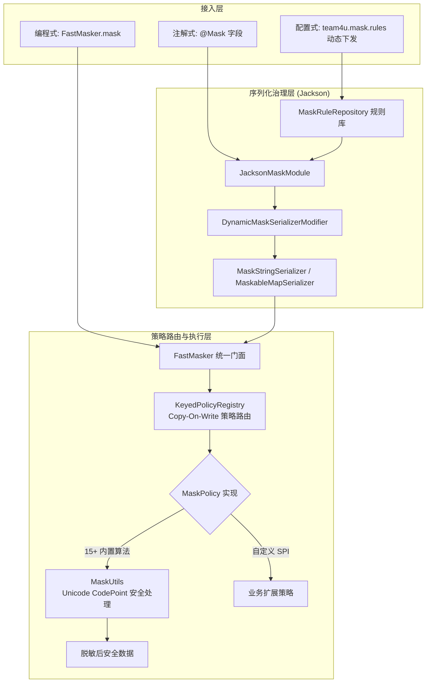

# 数据脱敏组件 (mask / mask-jackson / mask-config)

# 背景

Task 15 将脱敏能力拆为三个 artifact：`team4u-mask` 是核心脱敏模块，提供编程式极速脱敏 (`FastMasker`) 与注解声明 (`@Mask`)；`team4u-mask-jackson` 提供 Jackson 序列化适配；`team4u-mask-config` 提供配置中心动态规则与生命周期引导。

传统的手动脱敏方案通常面临如下痛点：

- **侵入性过重**：在每处打印日志或接口返回前手写 `MaskUtil.mask(mobile)`，代码冗余且极易遗漏。
- **无法治理第三方对象**：对于依赖的第三方 SDK 对象或不可修改的外部 DTO，无法在源码中添加注解。
- **规则调整需重新发版**：合规政策调整（例如掩码规则微调）必须修改代码并重新编译上线。
- **Unicode 与 Emoji 乱码截断**：常规 `String.substring` 在处理 4 字节 Emoji 或生僻字（Surrogate Pair 代理对）时，容易截断半个字符导致乱码或乱码异常。

`team4u-mask` 是一个轻量级、高性能的核心脱敏模块。它提供了 **编程式极速脱敏**(`FastMasker`) 与 **注解式声明脱敏** (`@Mask`)；配置中心动态规则由 `team4u-mask-config` 提供。

---

# 设计

## 设计理念



---

## 核心特性

- **高性能线程安全策略路由**：复用 `team4u-policy` 的 `KeyedPolicyRegistry` 与标准 `ServiceLoader`，核心路径无正则、Jackson 或配置依赖。
- **内置 15 种标准脱敏算法**：开箱覆盖姓名（支持中英文智能区分）、手机号、身份证、银行卡、邮箱、地址、密码、居中百分比掩码等。
- **未知策略 fail-closed**：未注册、null、空串或空白策略标识抛出 `IllegalArgumentException`；只有显式 `NONE` 返回原文。
- **Jackson 无侵入显式脱敏**：观测向序列化经 `MaskedJson` 门面（或向自建 mapper 注册 `JacksonMaskModule`）后，自动接管 JavaBean 与 Map 的 JSON 序列化输出，内存对象中的真实值完全不受影响；全局 `JsonUtil` 奉行无损契约，脱敏永不默认生效（`team4u-mask-jackson` 使用核心 `MaskRuleResolver`，不依赖 mask-config）。
- **配置中心动态治理** (`team4u.mask.rules`)：添加 `team4u-mask-config` 并启动 `MaskBootstrap`；规则解析只依赖 `team4u-serializer-json` SPI（应用需显式提供 `team4u-serializer-jackson` 或自定义 `JsonSerializerPolicy`），无需修改代码即可针对特定 Class、第三方 DTO 或全局字段名动态下发脱敏规则。另注：`team4u-mask-jackson` 与 mask-config 无依赖关系，它显式 compile 依赖 provider `team4u-serializer-jackson`，不直接消费 serializer-json SPI。
- **Unicode CodePoint 安全机制**：所有字符串长度计算与截取严格基于 Unicode CodePoint 算法，兼容 Emoji 与生僻字。
- **超长报文截断保护** (`MaskConfig`)：支持配置 `maxStringLength`，防止超大报文或 Base64 文本打满磁盘日志。

---

## 核心概念

| 概念 | 类路径 / 接口 | 说明 |
| :--- | :--- | :--- |
| `FastMasker` | `com.team4u.framework.mask.FastMasker` | 极速脱敏核心门面，提供 `mask(value, MaskType)` 与 `mask(value, String)` |
| `MaskType` | `com.team4u.framework.mask.MaskType` | 内置标准脱敏策略枚举（`MOBILE`、`NAME`、`ID_CARD_NO`、`BANK_CARD_NO` 等 15 种） |
| `MaskPolicy` | `com.team4u.framework.mask.MaskPolicy` | 脱敏策略 SPI 接口（继承 `KeyedPolicy<String>`），支持业务自由扩展 |
| `MaskRuleResolver` | `com.team4u.framework.mask.MaskRuleResolver` | 纯 Java 动态规则解析 SPI；默认 no-op，可安装/重置核心全局 resolver |
| `MaskRuleRepository` | `com.team4u.framework.mask.config.MaskRuleRepository` | 动态规则仓库，支持类精确匹配与 `*` 全局通配匹配，支持配置中心热更 |
| `MaskBootstrap` | `com.team4u.framework.mask.config.MaskBootstrap` | 全局引导类，绑定 `ConfigManager`，安装/卸载核心 resolver 并启动动态规则热重载监听 |
| `JacksonMaskModule` | `com.team4u.framework.mask.jackson.JacksonMaskModule` | Jackson 脱敏模块（仅观测向显式叠加，不注册全局） |
| `MaskedJson` | `com.team4u.framework.mask.jackson.MaskedJson` | 观测向脱敏门面：`toJsonStr` / `maskedWriter`，内部共享 mapper 副本 + 脱敏模块 |
| `MaskUtils` | `com.team4u.framework.mask.MaskUtils` | Unicode CodePoint 字符安全计算与掩码工具类 |

---

## 组件位置与包结构

三个 artifact 的生产包如下：

```text
team4u-mask: com.team4u.framework.mask
├── policy                           # 内置脱敏策略实现 (15 种)
│   ├── AbstractKeyedMaskPolicy.java  # 参数化策略的 key 载体基类
│   ├── AddressMaskPolicy.java       # 地址 (保留前9字符)
│   ├── BankCardNoMaskPolicy.java    # 银行卡 (保留前4后2)
│   ├── EmailMaskPolicy.java         # 电子邮箱 (@前保留首字符)
│   ├── HideMaskPolicy.java          # 全部隐藏 (固定为*)
│   ├── IdCardNoMaskPolicy.java      # 身份证 (保留前5后2)
│   ├── MaskPolicyBinder.java        # 枚举名 -> 参数化策略实例的绑定器
│   ├── MobileMaskPolicy.java        # 手机号 (保留前3后3)
│   ├── NameMaskPolicy.java          # 姓名 (中英文智能识别)
│   ├── NoneMaskPolicy.java          # 不脱敏 (返回明文)
│   ├── NullMaskPolicy.java          # 固定返回 null
│   ├── PasswordMaskPolicy.java      # 密码 (固定为******)
│   ├── PercentMaskPolicy.java       # 百分比居中掩码 (可选限长)
│   └── PrefixSuffixMaskPolicy.java  # 保留前N后M字符
├── FastMasker.java                  # 极速脱敏核心门面
├── Mask.java                        # 字段脱敏注解
├── MaskPolicyRegistry.java          # 复用 policy 线程安全策略注册表
├── MaskRuleResolver.java            # 动态规则 SPI / 全局生命周期
├── MaskPolicy.java                  # 策略 SPI 接口
├── MaskType.java                    # 标准脱敏枚举
└── MaskUtils.java                   # Unicode 字符安全工具类
```

```text
team4u-mask-jackson: com.team4u.framework.mask.jackson
└── JacksonMaskModule / DynamicMaskSerializerModifier / serializers

team4u-mask-config: com.team4u.framework.mask.config
└── MaskBootstrap / MaskRuleRepository
```

---

## 文档导航

- [快速开始](quick-start.md)：依赖引入与最小可用示例
- [内置脱敏算法与类型](mask-types.md)：15 种内置脱敏算法实现逻辑与掩码效果一览
- [注解式脱敏与 Jackson 集成](mask-annotation.md)：`@Mask` 注解、`JacksonMaskModule` 与出参保护
- [动态规则与配置驱动](mask-dynamic.md)：`team4u.mask.rules` 配置格式、通配符与优先级
- [扩展机制与 Unicode 安全](mask-extension.md)：自定义 MaskPolicy、SPI 发现与超长截断保护
- [实战案例](mask-sample.md)：用户信息脱敏、第三方 DTO 无侵入治理与日志出参保护
