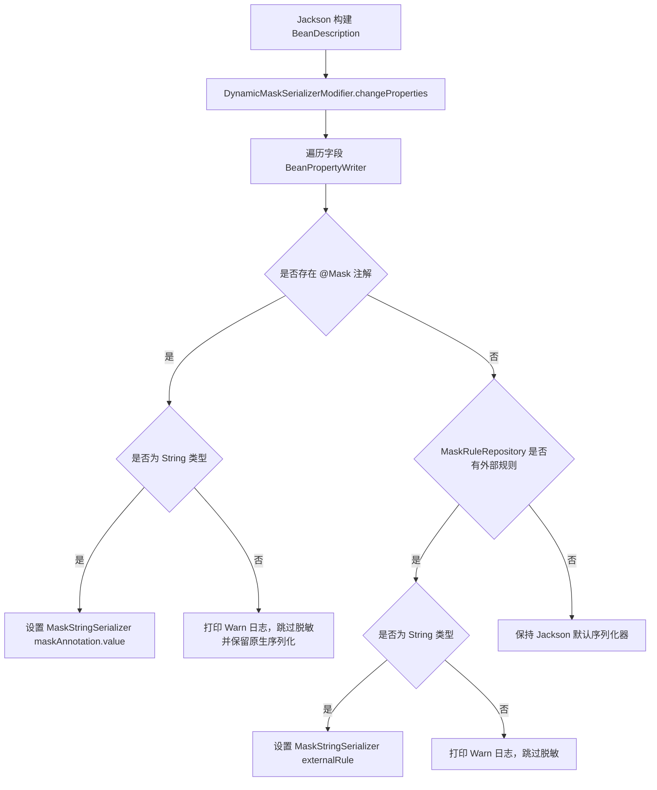

# 注解式脱敏与 Jackson 集成

通过集成 Jackson 序列化体系，`team4u-mask` 实现了出参序列化时的无侵入自动脱敏。

---

## 声明式注解 (`@Mask`)

`@Mask` 用于标注在 JavaBean 字段上，指定该字段在序列化为 JSON 时执行的脱敏算法。

### 注解源码定义
```java
package com.team4u.framework.mask;

import java.lang.annotation.*;

@Target({ElementType.FIELD})
@Retention(RetentionPolicy.RUNTIME)
@Documented
public @interface Mask {
    /**
     * 脱敏类型枚举
     */
    MaskType value();
}
```

### 使用范例

```java
import com.team4u.framework.mask.Mask;
import com.team4u.framework.mask.MaskType;
import lombok.Data;

@Data
public class CustomerVO {
    private Long id;

    // 1. 姓名脱敏
    @Mask(MaskType.NAME)
    private String realName;

    // 2. 手机号脱敏
    @Mask(MaskType.MOBILE)
    private String mobilePhone;

    // 3. 身份证号脱敏
    @Mask(MaskType.ID_CARD_NO)
    private String idCardNo;

    // 4. 银行卡号脱敏
    @Mask(MaskType.BANK_CARD_NO)
    private String bankCardNo;

    // 5. 密码字段脱敏
    @Mask(MaskType.PASSWORD)
    private String password;

    // 6. 非 String 字段安全保护
    // 若在 Long / Integer / Date 字段上误加 @Mask，框架会自动忽略并保留原生类型序列化，同时打印 warn 日志
    @Mask(MaskType.MOBILE)
    private Long accountId;
}
```

> [!NOTE]
> `@Mask` 注解仅在 Jackson 序列化输出 JSON 时生效，**内存中 Java 对象字段的真实值完全不受影响**，业务逻辑仍可安全读取明文。

---

## 注册 `JacksonMaskModule`

### 1. Spring Boot 应用配置
在 Spring Boot 项目中，只需将 `JacksonMaskModule` 注册为一个 Spring `@Bean` 或注入到 `ObjectMapper` 中：

```java
import com.fasterxml.jackson.databind.ObjectMapper;
import com.team4u.framework.mask.jackson.JacksonMaskModule;
import org.springframework.context.annotation.Bean;
import org.springframework.context.annotation.Configuration;

@Configuration
public class JacksonMaskConfig {

    @Bean
    public JacksonMaskModule jacksonMaskModule() {
        return new JacksonMaskModule();
    }
}
```

### 2. 独立客户端代码注册
```java
import com.fasterxml.jackson.databind.ObjectMapper;
import com.team4u.framework.mask.jackson.JacksonMaskModule;

ObjectMapper mapper = new ObjectMapper();
mapper.registerModule(new JacksonMaskModule());
```

---

## 核心序列化机制解析

`JacksonMaskModule` 在构造时注册了 `DynamicMaskSerializerModifier`：



### 1. `DynamicMaskSerializerModifier` 的性能优化
- 规则匹配与注解解析**仅在 Jackson 构建序列化器时执行一次**（首次序列化类时完成解析并被 Jackson 缓存），在后续高频的对象序列化过程中**零反射、零注解扫描**。

### 2. `MaskStringSerializer`
- 委托 `FastMasker.mask(value, maskType)` 执行脱敏；
- 检查 `SerializerProvider` 上下文中的 `MaskConfig`，若设置了 `maxStringLength` 则执行截断保护。

### 3. `MaskableMapSerializer` 对 Map 结构的动态支持
- 拦截 Map 类型的序列化，针对 Map 中的每个 Entry，若 key 为 String 且 value 为 String，根据 `MaskRuleRepository` 匹配规则进行脱敏；
- **写时优化**：仅在 Map 内真正存在发生脱敏或截断的条目时才创建新的 LinkedHashMap，未命中的 Map 直接原样写出，保障高并发性能。
