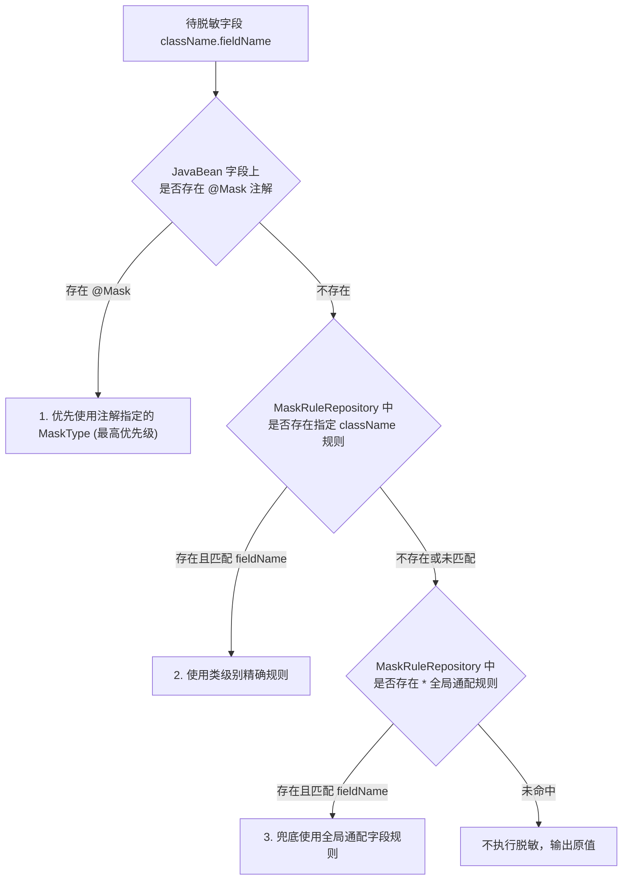

# 动态规则与配置驱动

对于第三方依赖库中的类、不可修改源码的外部 DTO 或动态 `Map<String, Object>` 报文，无法在源码中添加 `@Mask` 注解。

`team4u-mask` 提供了基于 `team4u-config` 的**动态规则驱动脱敏机制**，支持在运行期通过配置中心秒级下发和更新脱敏规则，实现全局无侵入的数据隐私治理。

---

## 启动动态规则监听 (`MaskBootstrap`)

在应用启动时，将 `ConfigManager` 绑定至 `MaskBootstrap`：

```java
import com.team4u.framework.config.core.ConfigManager;
import com.team4u.framework.mask.MaskBootstrap;

// 1. 获取配置中心管理器实例
ConfigManager configManager = ConfigManager.global();

// 2. 启动脱敏动态规则监听
MaskBootstrap.global().start(configManager);

// 3. 应用停机或测试清理时
// MaskBootstrap.global().stop();
```

---

## 规则配置格式 (`team4u.mask.rules`)

在配置中心下发 JSON 格式的规则配置：

- **配置 Key**：`team4u.mask.rules`
- **数据结构**：`Map<className, Map<fieldName, maskTypeKey>>`

```json
{
  "*": {
    "mobile": "MOBILE",
    "phoneNumber": "MOBILE",
    "idCardNo": "ID_CARD_NO",
    "password": "PASSWORD"
  },
  "com.alipay.api.response.AlipayTradeQueryResponse": {
    "buyerLogonId": "EMAIL",
    "buyerPayAmount": "NONE"
  },
  "java.util.HashMap": {
    "cardNumber": "BANK_CARD_NO",
    "userSecret": "HIDE"
  }
}
```

---

## 规则匹配优先级机制

当 `DynamicMaskSerializerModifier` 或 `MaskableMapSerializer` 对某个对象的属性进行脱敏评估时，遵循严格的优先级链条：



### 规则查找实现 (`MaskRuleRepository.findRule`)
```java
public String findRule(String className, String fieldName) {
    Map<String, Map<String, String>> rules = currentRules();

    // 1. 精确匹配类名（优先级最高，允许特殊类覆盖全局规则）
    Map<String, String> classRules = rules.get(className);
    if (classRules != null) {
        String classRule = classRules.get(fieldName);
        if (classRule != null) {
            return classRule;
        }
    }

    // 2. 兜底匹配：全局通配符规则（配置了 "*" 的字段）
    Map<String, String> globalRules = rules.get("*");
    if (globalRules != null) {
        return globalRules.get(fieldName);
    }

    return null;
}
```

---

## 单元测试与手动规则注入

在编写单元测试时，若无需启动配置中心，可直接通过 `setRuleCache` 快速注入模拟规则：

```java
import com.team4u.framework.mask.config.MaskRuleRepository;
import org.junit.After;
import org.junit.Before;
import org.junit.Test;
import java.util.HashMap;
import java.util.Map;

public class MaskRuleUnitTest {

    @Before
    public void setUp() {
        Map<String, Map<String, String>> mockRules = new HashMap<>();
        
        Map<String, String> globalFieldRules = new HashMap<>();
        globalFieldRules.put("mobile", "MOBILE");
        mockRules.put("*", globalFieldRules);

        // 手动注入规则缓存
        MaskRuleRepository.getInstance().setRuleCache(mockRules);
    }

    @After
    public void tearDown() {
        // 重置规则状态
        MaskRuleRepository.getInstance().reset();
    }

    @Test
    public void testGlobalRule() {
        String rule = MaskRuleRepository.getInstance().findRule("com.example.OrderVO", "mobile");
        Assert.assertEquals("MOBILE", rule);
    }
}
```
