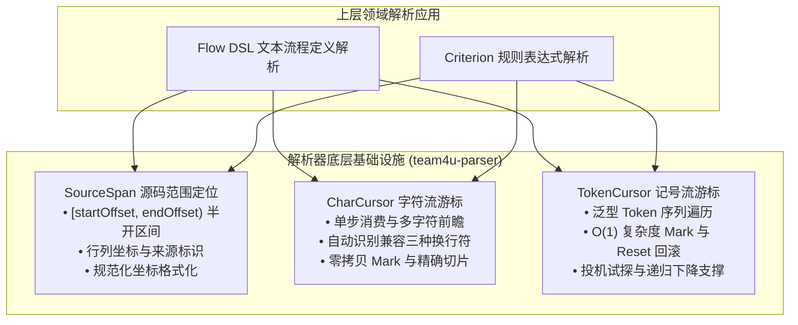

# 解析器基础设施组件 (team4u-parser)

`team4u-parser` 是 Team4u Framework 提供的纯 Java 8 零依赖解析器底层基础设施。它抽离了词法扫描与语法解析中的通用计算机制（如源码区间定位、字符游标滑动、换行自动折算与记号流试探回滚），为框架内各领域语言（如轻量化流程编排 DSL、Criterion 规则表达式引擎等）提供高性能、高可靠的公共解析骨架。

---

## 设计理念与核心原则

- **共享解析机制，不共享语言语义** ：`team4u-parser` 仅沉淀位置跟踪、字符游标遍历与记号回滚等通用解析机制，不定义任何具体语言的 Token、AST 节点或业务语法；
- **纯粹零依赖** ：严格基于 JDK 8 标准库实现，不引入任何三方库（无 Lombok、无 Spring、无日志框架），并作为独立基础模块供全工程依赖；
- **高性能与零多余分配** ：游标操作均达到 $O(1)$ 复杂度，通过游标标记 (`Mark`) 与区间切片避免解析过程中的临时字符串构造；
- **标准化源码定位** ：统一基于不可变的数据模型表达字符偏移量、行号与列号，实现统一规范的诊断报错。

---

## 核心能力矩阵



| 核心组件 | 职责与特性 | 核心方法与数据模型 |
| :--- | :--- | :--- |
| [`SourceSpan`](file:///root/code/team4u-framework/modules/parser/core/src/main/java/com/team4u/framework/parser/SourceSpan.java) | 源码区间定位模型，采用 `[startOffset, endOffset)` 半开区间 | `point(...)`、`range(...)`、`startOffset()`、`startLine()`、`format()` |
| [`CharCursor`](file:///root/code/team4u-framework/modules/parser/core/src/main/java/com/team4u/framework/parser/CharCursor.java) | 字符流游标，自动折算 `\n`、`\r` 与 `\r\n` 行列坐标 | `peek()`、`advance()`、`mark()`、`spanFrom(mark)`、`offset()` |
| [`TokenCursor`](file:///root/code/team4u-framework/modules/parser/core/src/main/java/com/team4u/framework/parser/TokenCursor.java) | 泛型记号流游标，支持递归下降与无惩罚投机试探 | `peek()`、`advance()`、`mark()`、`reset(mark)`、`has(...)` |

---

## 模块坐标

在 Maven 项目中按需引入：

```xml
<dependency>
    <groupId>com.team4u</groupId>
    <artifactId>team4u-parser</artifactId>
</dependency>
```
