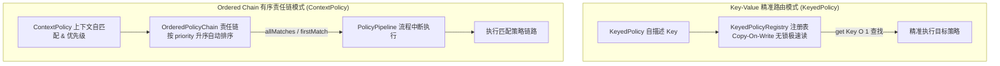
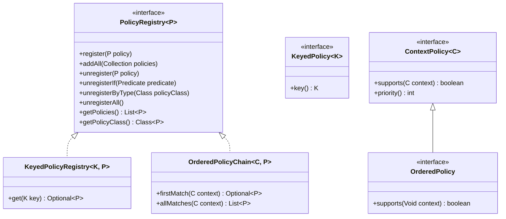

# 策略模式组件 (team4u-policy)

# 背景

策略模式（Strategy Pattern）与责任链模式（Chain of Responsibility）是面向对象设计中最基础且高频使用的设计模式。然而在实际业务研发中，传统的实现方式往往存在如下痛点：

- **简单 Map 查找的局限**：使用简单的 `Map<String, Handler>` 模式中，Key 与 Handler 是分离维护的；当策略需要在不同组件间流转时，极易丢失身份标识；且原生 `ConcurrentHashMap` 在超高并发读取下仍有哈希分段与 volatile 读开销。
- **责任链排序与过滤繁琐**：传统的责任链需要手写链表或在每个 Handler 里维护下一节点的引用，新增策略时必须修改组装代码，侵入性大。
- **策略注册缺乏自动化**：每新增一个策略实现类，都必须手动 `new` 并注入到注册表中，难以做到“**实现即注册、即插即用**”。
- **Spring 容器与独立运行脱节**：底层 SDK 既希望能脱离 Spring 容器快速启动，又希望在 Spring 环境下自动发现容器内注册的策略 Bean。

`team4u-policy` 是一个专为高性能业务架构设计的策略管理与责任链组件。它提供了 **O(1) 复杂度 Copy-On-Write 读写分离精准路由**、**自排序与上下文自匹配的责任链**，以及基于 **SPI / 包扫描 / Spring Bean 自动注册** 的完整解决方案。

---

# 设计

## 设计理念

组件将策略模式抽象为两大核心模型：



## 核心接口继承层次



---

## 核心特性

- **自描述策略身份 (`KeyedPolicy`)**：策略对象通过 `key()` 接口自声明身份标识，实现 Key 与 Handler 的强内聚。
- **Copy-On-Write 低开销读取**：`KeyedPolicyRegistry` 与 `OrderedPolicyChain` 在写入时维护不可变只读列表缓存（`unmodifiablePolicies`），读取路径无锁，直接返回缓存列表，避免逐次拷贝与临时对象分配。
- **智能优先级与自动升序排序**：`ContextPolicy` 内置 `HIGHEST`、`HIGH`、`NORMAL`、`LOW`、`LOWEST` 优先级常量，`OrderedPolicyChain` 注册时自动完成稳定排序（数值越小越优先）。
- **重复注册策略控制 (`DuplicatePolicyMode`)**：支持 `APPEND`（多实例并存）与 `REPLACE_BY_CLASS`（同类新实例覆盖旧实例）两种模式。
- **流程中断流水线 (`PolicyPipeline`)**：支持在顺序遍历策略链时，根据策略执行结果即时决定继续或短路中断（用于风控拦截、参数校验链）。
- **三位一体自动发现**：支持通过 `PolicyScanner` 进行包路径反射扫描、Java 标准 SPI (`ServiceLoader`) 装载，以及通过 `@PolicyAutoRegister` 实现 Spring 容器 Bean 的全自动注入。

---

## 核心概念

| 概念 | 类路径 / 接口 | 说明 |
| :--- | :--- | :--- |
| `KeyedPolicy<K>` | `com.team4u.framework.policy.api.KeyedPolicy` | 自描述键值策略接口，提供 `K key()` 唯一身份标识 |
| `KeyedPolicyRegistry<K, P>` | `com.team4u.framework.policy.core.KeyedPolicyRegistry` | O(1) 复杂度查表注册表，写时更新只读快照缓存，读操作无锁 |
| `ContextPolicy<C>` | `com.team4u.framework.policy.api.ContextPolicy` | 上下文自匹配策略基接口，提供 `supports(context)` 与 `priority()` |
| `OrderedPolicy` | `com.team4u.framework.policy.api.OrderedPolicy` | 继承自 `ContextPolicy<Void>`，为无需上下文匹配的纯排序策略提供简化适配 |
| `OrderedPolicyChain<C, P>` | `com.team4u.framework.policy.core.OrderedPolicyChain` | 自排序责任链容器，自动维护升序排列，支持 `firstMatch` 与 `allMatches` |
| `DuplicatePolicyMode` | `com.team4u.framework.policy.core.DuplicatePolicyMode` | 重复策略处理模式枚举（`APPEND`, `REPLACE_BY_CLASS`） |
| `PolicyPipeline<C, P>` | `com.team4u.framework.policy.engine.PolicyPipeline` | 责任链流程执行引擎，支持单步执行与返回 `false` 时即时短路中断 |
| `PolicyException` | `com.team4u.framework.policy.exception.PolicyException` | 策略组件统一异常，提供类型不匹配、Key 为空等标准化静态工厂方法 |
| `PolicyScanner` | `com.team4u.framework.policy.util.PolicyScanner` | 策略扫描发现工具，支持反射包扫描（自动过滤抽象类与接口）与 SPI 加载 |
| `@PolicyAutoRegister` | `com.team4u.framework.policy.spring.PolicyAutoRegister` | Spring 自动注入注解，标记在注册表 Bean 上触发自动装配 |
| `SpringPolicyAutoRegistrar` | `com.team4u.framework.policy.spring.SpringPolicyAutoRegistrar` | Spring 容器初始化监听器，自动发现标注注解的注册表并拉取对应策略 Bean |

---

## 组件位置与包结构

```text
com.team4u.framework.policy
├── api                              # 核心接口定义
│   ├── ContextPolicy.java           # 上下文自匹配策略基接口 (supports, priority)
│   ├── KeyedPolicy.java             # 自描述键值策略接口 (key)
│   ├── OrderedPolicy.java           # 纯排序策略接口 (继承 ContextPolicy<Void>)
│   └── PolicyRegistry.java          # 策略注册表顶层接口 (register, unregister, addAll, getPolicies)
├── core                             # 核心注册表与模式实现
│   ├── DuplicatePolicyMode.java     # 重复策略注册模式 (APPEND, REPLACE_BY_CLASS)
│   ├── KeyedPolicyRegistry.java     # O(1) Copy-On-Write 键值策略注册表
│   └── OrderedPolicyChain.java      # 自排序有序责任链容器
├── engine                           # 执行引擎
│   └── PolicyPipeline.java          # 流程控制与中断流水线
├── exception                        # 异常定义
│   └── PolicyException.java         # 策略操作异常与静态工厂
├── spring                           # Spring 容器自动化集成
│   ├── PolicyAutoRegister.java      # 自动注册标记注解
│   └── SpringPolicyAutoRegistrar.java # Spring Bean 自动发现与注册器
└── util                             # 工具类
    └── PolicyScanner.java           # 反射包扫描与 SPI 发现工具
```

---

## 文档导航

- [快速开始](quick-start.md)：依赖引入、策略定义与最小使用范例
- [精准键值策略模式](policy-keyed.md)：KeyedPolicy、KeyedPolicyRegistry 与 Copy-On-Write 读优化
- [有序责任链模式](policy-ordered.md)：ContextPolicy、OrderedPolicyChain、优先级与 PolicyPipeline 中断
- [策略自动扫描与 Spring 发现](policy-scanner.md)：PolicyScanner、SPI 加载与 `@PolicyAutoRegister`
- [实战案例](policy-sample.md)：支付渠道路由、电商优惠券计算链与风控拦截流水线
