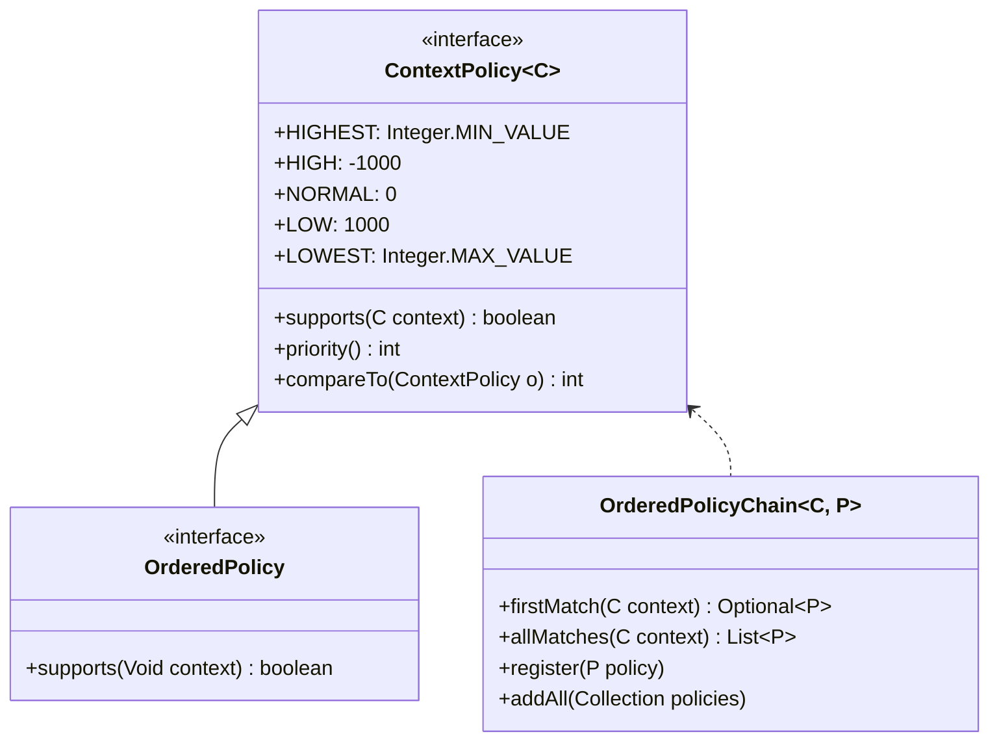
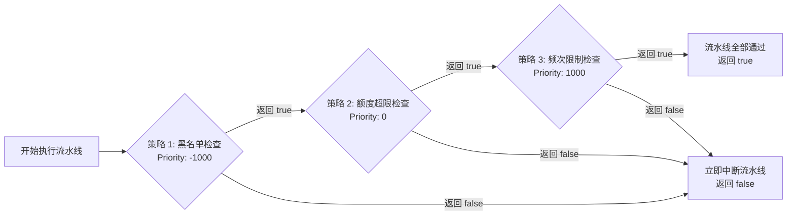

# 有序责任链模式

当需要遍历一组策略，根据业务上下文动态评估是否支持处理，且策略之间存在严格的执行先后顺序时，使用有序责任链模式。

---

## 核心接口与继承层次



### `ContextPolicy<C>` 接口
上下文自匹配策略基接口：
```java
package com.team4u.framework.policy.api;

public interface ContextPolicy<C> extends Comparable<ContextPolicy<C>> {

    int HIGHEST = Integer.MIN_VALUE; // 最高优先级
    int HIGH = -1000;                // 高优先级
    int NORMAL = 0;                  // 普通默认优先级
    int LOW = 1000;                  // 低优先级
    int LOWEST = Integer.MAX_VALUE;  // 最低优先级

    /**
     * 是否支持处理该业务上下文
     */
    boolean supports(C context);

    /**
     * 优先级数值（数值越小优先级越高，默认 0）
     */
    default int priority() {
        return NORMAL;
    }

    /**
     * 默认按 priority() 升序排序
     */
    @Override
    default int compareTo(ContextPolicy<C> o) {
        return Integer.compare(this.priority(), o.priority());
    }
}
```

### `OrderedPolicy` 接口
用于无需上下文匹配、仅需纯排序的策略场景（将上下文泛型固定为 `Void`，默认 `supports(Void)` 始终返回 `true`）：
```java
package com.team4u.framework.policy.api;

public interface OrderedPolicy extends ContextPolicy<Void> {
    @Override
    default boolean supports(Void context) {
        return true;
    }
}
```

---

## `OrderedPolicyChain` 容器与重复注册控制

`OrderedPolicyChain` 采用**手动写时复制 (Manual Copy-On-Write)** 机制。写入时自动按照 `priority()` 执行稳定升序排序，读取时零加锁、零对象创建。

### 重复策略处理模式 (`DuplicatePolicyMode`)
在构造 `OrderedPolicyChain` 时，可指定重复策略注册模式：

```java
public enum DuplicatePolicyMode {
    /**
     * 允许同一实现类的多个实例并存，按注册顺序参与同优先级排序 (默认模式)
     */
    APPEND,

    /**
     * 同一实现类重复注册时，后注册的实例替换先注册的实例
     */
    REPLACE_BY_CLASS
}
```

```java
// 使用 REPLACE_BY_CLASS 模式构造，后注册的同类策略将自动覆盖旧实例
OrderedPolicyChain<MyContext, MyPolicy> chain = 
        new OrderedPolicyChain<>(MyPolicy.class, DuplicatePolicyMode.REPLACE_BY_CLASS);
```

### 匹配查询方式
- **`firstMatch(context)`**：遍历已排序的策略链，返回**第一个**满足 `supports(context)` 的策略（`Optional<P>`），用于路由定位场景。
- **`allMatches(context)`**：返回**所有**满足条件的策略列表（`List<P>`），用于多级优惠叠加、全量风控过滤等场景。

---

## 策略执行流水线 (`PolicyPipeline`)

在复杂业务流程（如风控拦截、责任链校验、流水线审批）中，通常要求按顺序执行策略，并在某个节点校验失败时**立即短路中断**。

`PolicyPipeline` 封装了流水线调度与短路控制逻辑：



### 完整使用代码
```java
import com.team4u.framework.policy.core.OrderedPolicyChain;
import com.team4u.framework.policy.engine.PolicyPipeline;

// 1. 构建有序策略链
OrderedPolicyChain<RiskContext, RiskCheckPolicy> chain = 
        new OrderedPolicyChain<>(RiskCheckPolicy.class);
chain.register(new BlacklistRiskPolicy());  // priority = ContextPolicy.HIGH (-1000)
chain.register(new FrequencyRiskPolicy());  // priority = ContextPolicy.NORMAL (0)
chain.register(new AmountLimitRiskPolicy());// priority = ContextPolicy.LOW (1000)

// 2. 创建执行流水线
PolicyPipeline<RiskContext, RiskCheckPolicy> pipeline = new PolicyPipeline<>(chain);

RiskContext context = new RiskContext("USER_1001", 50000.0);

// 3. 执行流水线链条：当任意 action 返回 false 时立即中断并返回 false
boolean allPassed = pipeline.executeChain(context, (policy, ctx) -> {
    boolean pass = policy.check(ctx);
    if (!pass) {
        log.warn("风控策略未通过，中断后续执行: {}", policy.getClass().getSimpleName());
        return false; // 返回 false 立即短路中断流水线
    }
    return true; // 返回 true 继续执行下一个匹配的策略
});

if (allPassed) {
    System.out.println("所有风控策略校验通过，允许放行业务！");
}
```
