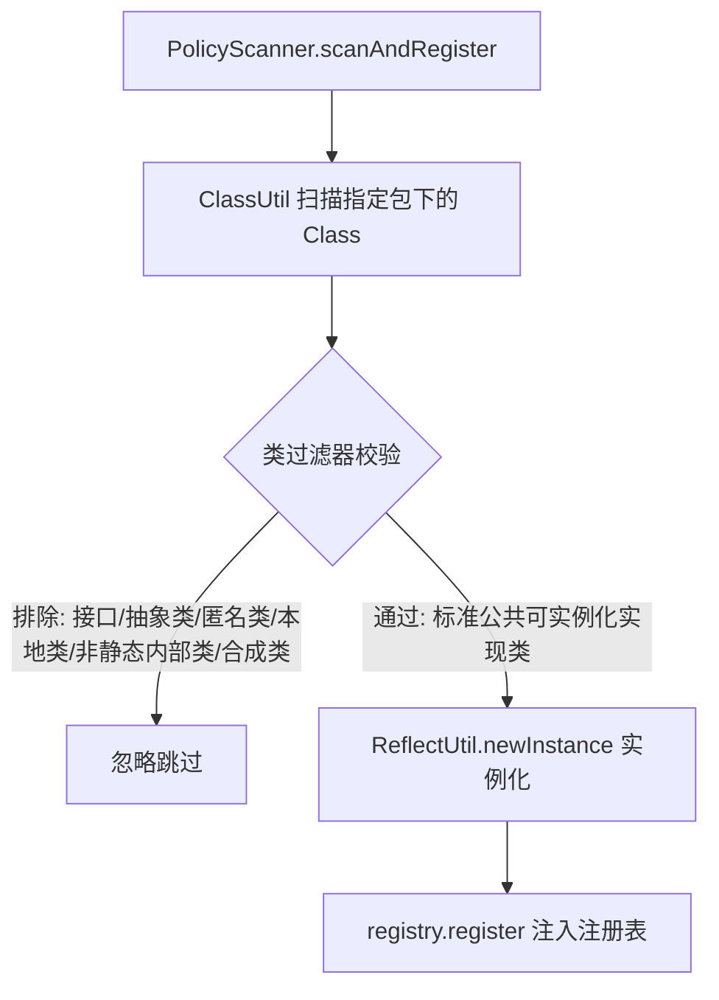

# 策略自动扫描与 Spring 发现

为了消除大量手写 `new` 策略对象的样板代码，`team4u-policy` 提供了 **反射包扫描 (Package Scan)**、**Java 标准 SPI** 以及 **Spring 容器自动装配** 三种自动化发现机制。

---

## 反射包扫描注册 (`PolicyScanner`)

`PolicyScanner` 支持扫描指定 ClassLoader / 包路径下所有实现指定策略接口的类，通过反射无参构造器实例化并注册到注册表中。



### 使用方式

```java
import com.team4u.framework.policy.core.KeyedPolicyRegistry;
import com.team4u.framework.policy.util.PolicyScanner;

KeyedPolicyRegistry<String, PaymentPolicy> registry = new KeyedPolicyRegistry<>(PaymentPolicy.class);

// 方式 1：自动扫描 PaymentPolicy 接口所在包及其子包下的所有实现类
PolicyScanner.scanAndRegister(registry);

// 方式 2：指定具体的包名进行扫描
PolicyScanner.scanAndRegister(registry, "com.mycompany.app.payment.policies");

// 方式 3：指定包名与明确的策略接口类型
PolicyScanner.scanAndRegister(registry, "com.mycompany.app.payment", PaymentPolicy.class);
```

---

## Java 标准 SPI 机制

基于 Java `ServiceLoader` 机制，在 `META-INF/services/` 中声明接口实现，解耦实现类与调用方：

1. 创建 SPI 配置文件：`META-INF/services/com.mycompany.payment.PaymentPolicy`
2. 写入具体实现类的全限定名：
   ```text
   com.mycompany.payment.impl.AlipayPolicy
   com.mycompany.payment.impl.WechatPolicy
   ```
3. 代码中一行完成 SPI 加载与注册：
   ```java
   PolicyScanner.registerFromServiceLoader(registry);
   ```

---

## Spring 容器自动集成 (`@PolicyAutoRegister`)

在 Spring Boot 或 Spring Framework 应用中，策略类往往需要依赖注入 Spring 的 `@Service`、`@Repository` 或 RPC 客户端。`team4u-policy` 提供了零侵入的自动化装配机制。

### 核心工作原理 (`SpringPolicyAutoRegistrar`)
1. `SpringPolicyAutoRegistrar` 实现了 Spring 的 `SmartInitializingSingleton` 接口；
2. 当所有 Spring 单例 Bean 初始化完成后，自动巡检容器内所有的 `PolicyRegistry` Bean；
3. 识别标注了 `@PolicyAutoRegister` 注解的注册表，获取其 `getPolicyClass()`；
4. 从 Spring 容器中提取所有属于该策略类型的 Spring Bean，并调用 `registry.addAll(policyBeans.values())` 自动注入。

### 配置与使用步骤

#### 步骤 1：配置注册表 Bean 与自动注册器
```java
import com.team4u.framework.policy.core.KeyedPolicyRegistry;
import com.team4u.framework.policy.core.OrderedPolicyChain;
import com.team4u.framework.policy.spring.PolicyAutoRegister;
import com.team4u.framework.policy.spring.SpringPolicyAutoRegistrar;
import org.springframework.context.annotation.Bean;
import org.springframework.context.annotation.Configuration;

@Configuration
public class PolicyConfig {

    // 1. 声明策略注册表 Bean，并标注 @PolicyAutoRegister
    @Bean
    @PolicyAutoRegister
    public KeyedPolicyRegistry<String, PaymentPolicy> paymentRegistry() {
        return new KeyedPolicyRegistry<>(PaymentPolicy.class);
    }

    @Bean
    @PolicyAutoRegister
    public OrderedPolicyChain<OrderContext, DiscountPolicy> discountChain() {
        return new OrderedPolicyChain<>(DiscountPolicy.class);
    }

    // 2. 注册自动注册基础设施 Bean
    @Bean
    public SpringPolicyAutoRegistrar springPolicyAutoRegistrar() {
        return new SpringPolicyAutoRegistrar();
    }
}
```

#### 步骤 2：编写 Spring 托管的策略组件
```java
import com.team4u.framework.policy.api.KeyedPolicy;
import org.springframework.beans.factory.annotation.Autowired;
import org.springframework.stereotype.Component;

@Component
public class AlipayPolicy implements PaymentPolicy {

    @Autowired
    private AlipaySdkClient alipaySdkClient; // 正常享受 Spring 依赖注入与事务管理

    @Override
    public String key() {
        return "ALIPAY";
    }

    @Override
    public void pay(double amount) {
        alipaySdkClient.doPay(amount);
    }
}
```

#### 步骤 3：业务层直接注入注册表使用
```java
@Service
public class CheckoutService {

    @Autowired
    private KeyedPolicyRegistry<String, PaymentPolicy> paymentRegistry;

    public void checkout(String channelCode, double amount) {
        paymentRegistry.get(channelCode)
                .orElseThrow(() -> new IllegalArgumentException("不支持的支付渠道: " + channelCode))
                .pay(amount);
    }
}
```
