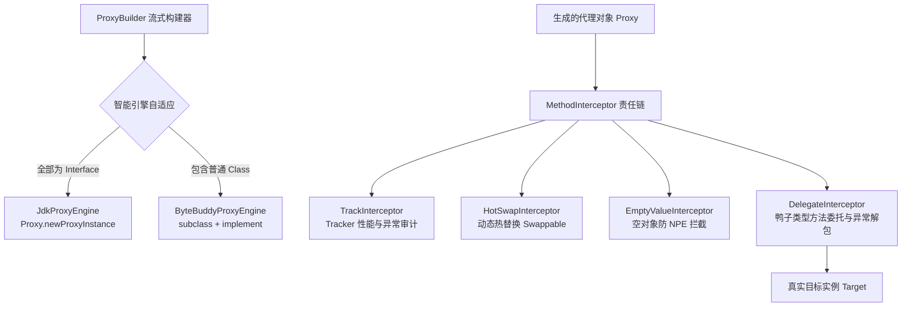

# 动态代理组件 (team4u-proxy)

# 背景

动态代理与 AOP 是 Java 生态中实现横切关注点、装饰模式与运行时解耦的基石技术。然而在实际使用中，开发者常常遇到以下痛点：

- **JDK Proxy 与 CGLib 的技术鸿沟**：JDK Proxy 仅支持接口代理；CGLib 在 Java 9+ / Java 17+ 等高版本中面临模块反射限制与维护停滞问题。
- **动态方法转发需显式实现接口**：第三方不可修改源码的类即使具备完全相同的方法签名，也无法直接适配给现有接口（缺乏鸭子类型 Duck Typing 原生支持）。
- **深层链式调用的 NPE 痛点**：对于深层嵌套的配置或级联对象（如 `app.getDb().getPool().getUrl()`），若中间某一层为 `null`，极易抛出空指针异常。
- **运行时动态切换底层目标**：在服务平滑发布、A/B 实验动态切流或故障快速降级场景中，传统的静态代理对象无法在线原子替换其背后的真实实例。

`team4u-proxy` 是一个高性能、易扩展的 Java 动态代理库。它屏蔽了底层技术差异，在 **JDK Proxy** 与 **ByteBuddy** 之间智能自适应切换，并向外提供基于 **职责链模式 (Interceptor Chain)** 的 AOP 编程模型与极简 Fluent Builder API。

---

# 设计

## 设计理念



## 核心特性

- **双引擎智能自适应**：全接口类型自动采用轻量 JDK Proxy，普通类自动采用高兼容性的 ByteBuddy，彻底告别 CGLib 兼容性隐患。
- **鸭子类型方法委托 (Duck Typing)**：即使委托对象没有显式实现目标接口，只要拥有相同方法签名，即可透明代理并映射执行。
- **动态热交换 (`HotSwap`)**：允许在应用运行期间，线程安全地原子替换代理对象背后的真实实例（代理对象自动实现 `Swappable` 接口）。
- **零 NPE 空对象模式 (`asEmptyObject`)**：自动拦截链式调用中的空值并返回安全的默认值或嵌套空代理单例，彻底终结空指针异常。
- **调用链追踪 (`Tracker`)**：提供极简的 `before` / `after` / `onException` 切面钩子，无需引入重量级 AOP 框架。
- **可重放的拦截器链**：`ReflectiveMethodInvocation` 在执行后安全回退游标，为重试拦截器等上层扩展提供天然重放支持。

---

## 核心概念

| 概念 | 类/接口路径 | 说明 |
| :--- | :--- | :--- |
| `ProxyBuilder<T>` | `com.team4u.framework.proxy.ProxyBuilder` | 流式代理构建器，提供 `forClass`、`forObject`、`proxy` 快捷入口 |
| `MethodInterceptor` | `com.team4u.framework.proxy.core.MethodInterceptor` | AOP 方法拦截器契约接口，定义 `invoke(MethodInvocation)` |
| `MethodInvocation` | `com.team4u.framework.proxy.core.MethodInvocation` | 方法调用上下文，提供 `getMethod()`, `getArguments()`, `getTarget()`, `getProxy()`, `proceed()` |
| `Tracker` | `com.team4u.framework.proxy.support.Tracker` | 轻量级方法执行监听器（包含 `before`, `after`, `onException`） |
| `Swappable` | `com.team4u.framework.proxy.support.Swappable` | 热交换接口，提供 `hotswap(newInstance)` 在线原子替换目标实例 |
| `TrackInterceptor` | `com.team4u.framework.proxy.interceptor.TrackInterceptor` | 追踪器拦截器实现 |
| `DelegateInterceptor` | `com.team4u.framework.proxy.interceptor.DelegateInterceptor` | 鸭子类型方法委托拦截器，内置反射缓存与异常剥离 |
| `HotSwapInterceptor` | `com.team4u.framework.proxy.interceptor.HotSwapInterceptor` | 热交换拦截器，继承自 `DelegateInterceptor` |
| `EmptyValueInterceptor`| `com.team4u.framework.proxy.interceptor.EmptyValueInterceptor`| 空对象拦截器，配合单例缓存池消除 NPE |

---

## 组件位置与包结构

```text
com.team4u.framework.proxy
├── core                                 # AOP 核心契约与职责链推进器
│   ├── MethodInterceptor.java          # 方法拦截器接口
│   ├── MethodInvocation.java           # 调用上下文接口
│   ├── ProxyEngine.java                # 代理引擎统一接口
│   ├── ProxyException.java             # 代理异常
│   └── ReflectiveMethodInvocation.java # 基于反射的职责链推进实现
├── engine                               # 底层代理生成引擎
│   ├── ByteBuddyProxyEngine.java       # 基于 ByteBuddy 的字节码增强引擎
│   ├── JdkProxyEngine.java             # 基于 JDK Proxy 的原生接口增强引擎
│   └── ProxyInvocationHandler.java     # 引擎与 AOP 拦截器链的桥接处理器
├── interceptor                          # 内置 AOP 拦截器实现
│   ├── DelegateInterceptor.java        # 鸭子类型方法委托拦截器
│   ├── EmptyValueInterceptor.java      # 空对象防 NPE 拦截器
│   ├── HotSwapInterceptor.java         # 运行时热交换拦截器
│   └── TrackInterceptor.java           # 追踪与性能审计拦截器
├── support                              # 辅助能力契约
│   ├── Swappable.java                  # 热交换标记接口
│   └── Tracker.java                    # 追踪器接口
├── ProxyBuilder.java                    # 流式代理建造者门面
└── ProxySample.java                     # 示例接口
```

---

## 文档导航

- [快速开始](quick-start.md)：依赖引入与基础接口/类代理构建
- [鸭子类型委托与反射缓存](proxy-delegate.md)：Duck Typing 转发、方法反射缓存与异常解包
- [调用链追踪与性能审计](proxy-track.md)：Tracker 接口与方法耗时及异常切面
- [运行时热交换 (HotSwap)](proxy-hotswap.md)：在线目标实例热替换与 Swappable 接口
- [空对象模式防 NPE](proxy-empty.md)：级联安全调用、单例池与默认值自动防御
- [自定义 AOP 拦截器链](proxy-interceptor.md)：MethodInterceptor、职责链推进与可重放机制
- [实战案例](proxy-sample.md)：动态算法热切换、配置安全防御与服务监控实战
