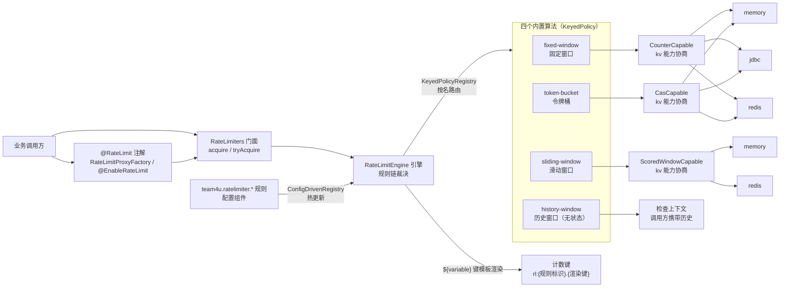

# 限流组件 (team4u-ratelimiter)

# 背景

业务系统里的限流需求形态各异：

- 接口配额：某接口每分钟最多放行 N 次（固定窗口够用）；
- 突发整形：允许短时突发、平均速率受限（令牌桶更合适）；
- 精确滚动：窗口边缘的突发不能叠加（精确滑动窗口）；
- 客户端自我节流：APP 端「推荐流每分钟最多刷 5 次」，服务端不想为此落任何状态。

这些需求若由各业务自行实现，常见问题：

- 计数器、令牌桶各自裸写 Redis/数据库脚本，正确性（原子性、过期、并发竞争）难保证；
- 阈值、窗口、维度（按用户/商户/接口）硬编码，调整需要发版；
- 限流逻辑与特定存储强耦合，单测要起 Redis、切换成本高。

`team4u-ratelimiter` 做一件事：**把限流收敛为「一条 JSON 规则 + kv 组件的能力协商」**。规则说清「在哪限、怎么限、限多少」，算法只做纯决策，全部状态保存在 KvStore 中；调整阈值、切换算法、更换存储都不改业务代码。这与 `team4u-id` 的「一条 JSON 规则 + kv 原子计数」是同一套模式在限流域的呼应——组件不重复造底座，底座全部复用。

---

# 设计

## 设计理念

- **规则与实现分离**：检查点（point）→ 规则组 → 算法的三层结构。业务代码只声明检查点（一个字符串），算法、阈值、维度键全部在规则 JSON 中，配置中心改完即热更新生效（先建新再替换、失败保旧）；
- **基于 kv 能力协商**：算法不绑定存储，只声明所需 kv 能力接口（如固定窗口要 `CounterCapable`、滑动窗口要 `ScoredWindowCapable`），引擎在规则加载期经 `KvStores.capabilityOf` 校验存储齐备，缺能力当场报配置错误而不是运行期行为错乱。内存、Redis、装饰器组合皆可作为后端；
- **配置驱动热更新**：规则经配置组件的 `ConfigDrivenRegistry` 加载，`team4u.ratelimiter.{point}` 配置键的值即该检查点的规则 JSON 数组，调整无需重启；
- **多规则规则链**：一个检查点可配多条规则，按 `priority` 升序（越小优先级越高）依次执行、首拒即停，形成「先严后宽」的规则链（如先按用户维度卡阈值，再按全局维度兜底）。



裁决流程：

```text
acquire(point, context, permits)
├── 规则加载：ConfigDrivenRegistry 按配置键 team4u.ratelimiter.{point} 输出规则列表
│             （按 priority 升序稳定排序，越小优先级越高；无规则直接放行，reason=NO_RULE）
├── 逐条裁决：键 = {规则标识}.{渲染后的键模板}，按 algorithm 查表路由到算法
│             ├── 算法所需能力在加载期已校验，运行期直接使用
│             └── 存储故障（KvStoreException）按规则 failOpen 处置：
│                 true 记 warn 视为该条通过继续；false 立即返回 STORE_ERROR 拒绝
└── 首拒即停：任一规则拒绝立即返回；全部通过返回最后一条通过规则的结果
```

## 核心概念

| 概念 | 说明 |
| :--- | :--- |
| `RateLimitEngine` | 限流引擎：组装规则加载、算法路由、键渲染、存储协商四个关注点，`acquire` 完成规则链裁决 |
| `RateLimitRule` | 限流规则（JSON 列表中的一个条目）：id / algorithm / store / key / priority / windowMillis / threshold / failOpen / config（算法私有配置槽） |
| `RateLimitAlgorithm` | 算法规约（`KeyedPolicy`）：`key()` 命名、`requiredCapabilities()` 声明所需 kv 能力、`tryAcquire` 纯决策 |
| `RateLimitResult` | 裁决结果（不可变）：allowed / point / ruleId / remaining / retryAfterMillis / decisionTimeMillis / reason |
| `RateLimitStores` | 命名存储注册表与全局门面：规则按 `store` 名引用存储，一套规则多存储分工（默认内存、热点走 Redis） |
| `RateLimiters` | 静态门面：持有全局引擎，`acquire`（返回完整裁决结果，拒绝不抛异常）与 `tryAcquire`（仅返回布尔）两种入口 |
| `@RateLimit` | 方法级注解：标注 `value`（`point` 简写别名）/ `permits` / `reject`，经代理拦截裁决，方法参数自动组装为检查上下文 |
| `RateLimitReason` | 裁决原因：`NO_RULE`（无规则放行）/ `PASS` / `THRESHOLD`（命中阈值）/ `STORE_ERROR`（故障关闭拒绝） |

## 算法选型

| 算法 | 语义保证 | 所需 kv 能力 | 状态归属 | 适用场景 | 权衡 |
| :--- | :--- | :--- | :--- | :--- | :--- |
| `fixed-window` | 窗口内计数 ≤ 阈值（浮动窗口：自本窗口首个请求起算） | `CounterCapable` | kv 计数键（服务端） | 粗粒度配额：API 每日调用上限、渠道额度 | 实现最轻（一次原子递增）；窗口边缘可能双倍突发，`retryAfter` 无法精确给出 |
| `token-bucket` | 平均速率 = capacity/windowMillis，允许突发至桶容量 | `CasCapable` | kv 值域（桶状态 JSON，服务端） | 突发整形：保护下游的同时容忍瞬时高峰 | 状态经 CAS 提交，极端并发下重试耗尽走故障路径；额度是浮点近似 |
| `sliding-window` | 任意连续 windowMillis 区间内请求数 ≤ 阈值（精确滚动） | `ScoredWindowCapable` | kv 计分窗口（服务端） | 精确平滑限流：不允许窗口边缘突发叠加 | 每个请求一个窗口成员，内存上界 = 键数 × threshold；JDBC 后端暂无该能力 |
| `history-window` | epoch 对齐固定窗口内（含客户端历史）计数 + 本次 ≤ 阈值 | 无（无状态） | 调用方携带（如 APP 客户端） | 客户端自我节流：推荐流频控，服务端零存储 | 历史由调用方携带、天然可伪造，是合作式限流而非防刷边界 |

> 能力与后端的对应关系：`CounterCapable` / `CasCapable` 在内存、JDBC、Redis 后端齐备；`ScoredWindowCapable` 仅内存与 Redis 实现，`JdbcKvStore` 暂未实现——`sliding-window` 规则绑定 JDBC 存储会在规则加载期报 `RateLimitConfigException`（能力校验不过），不会运行期出错。

## 快速上手

下面这个例子可以在单进程内直接运行（仅依赖 `team4u-ratelimiter`）：

```java
package demo;

import com.team4u.framework.config.core.ConfigManager;
import com.team4u.framework.config.core.spi.InMemoryConfigSource;
import com.team4u.framework.ratelimiter.api.RateLimiters;
import com.team4u.framework.kv.memory.InMemoryKvStore;

public final class FirstRateLimitDemo {
    public static void main(String[] args) {
        // 1. 配置源：写入一条规则（生产环境接配置中心/数据库，见配置组件文档）
        InMemoryConfigSource source = new InMemoryConfigSource("demo", 0);
        source.put("team4u.ratelimiter.order.create",
                "[{\"id\":\"per-user\",\"algorithm\":\"fixed-window\","
                        + "\"windowMillis\":60000,\"threshold\":5,\"key\":\"${userId}\"}]");
        ConfigManager configManager = ConfigManager.builder()
                .addSource(source).addWatcher(source).build();

        // 2. 初始化全局门面：默认内存存储（行为与 Redis 后端一致，同一套 kv 契约测试保证）
        RateLimiters.init(configManager, new InMemoryKvStore());

        // 3. 限流检查：按用户维度独立计数
        System.out.println(RateLimiters.tryAcquire("order.create",
                java.util.Collections.singletonMap("userId", "u1")));   // true
        System.out.println(RateLimiters.tryAcquire("order.create",
                java.util.Collections.singletonMap("userId", "u2")));   // true（不同用户独立额度）

        RateLimiters.destroy();
    }
}
```

你应该看到：

```text
true
true
```

更完整的路径（规则字段、四算法对比、注解接入、推荐场景案例）见[快速开始](quick-start.md)。

## 模块结构

```text
team4u-ratelimiter               # 单模块：存储经 kv 组件能力协商，无存储子模块
└── com.team4u.framework.ratelimiter
    ├── api                      # RateLimiters 门面、RateLimitResult、异常体系
    ├── config                   # RateLimitRule 规则模型
    ├── core                     # RateLimitEngine 引擎、四个内置算法、HistoryPaths 路径导航
    ├── store                    # 命名存储注册表：RateLimitStores / NamedStore
    ├── proxy                    # @RateLimit 注解、RateLimitInterceptor、RateLimitProxyFactory
    └── spring                   # @EnableRateLimit 自动代理（可选依赖）
```

| 依赖 | 用途 | 按需引入 |
| :--- | :--- | :--- |
| `team4u-kv-core` | `KvStore` 与 `CounterCapable`/`CasCapable`/`ScoredWindowCapable` 能力协商、内存实现 | 必需 |
| `team4u-config-core` | `ConfigDrivenRegistry` 规则加载与热更新 | 必需 |
| `team4u-policy` / `team4u-base` | `KeyedPolicyRegistry` 算法注册、`TextTemplate` 键模板 | 必需 |
| `team4u-serializer-json` | 规则 JSON 与令牌桶状态序列化 | 必需 |
| `team4u-proxy` | `@RateLimit` 注解代理（JDK / ByteBuddy 双引擎） | 使用注解时 |
| `spring-context` | `@EnableRateLimit` 自动代理 | Spring 环境 |
| `team4u-kv-store-redis` | Redis 限流后端（跨实例计数、滑动窗口） | Redis 存储时 |
| `team4u-kv-store-jdbc` | JDBC 限流后端（固定窗口、令牌桶） | 数据库存储时 |

## 文档导航

- [快速开始](quick-start.md)：依赖引入、规则配置、编程式/注解接入、推荐场景完整案例
- [算法详解](algorithms.md)：四算法语义、kv 原语契约、结果字段取值与故障行为
