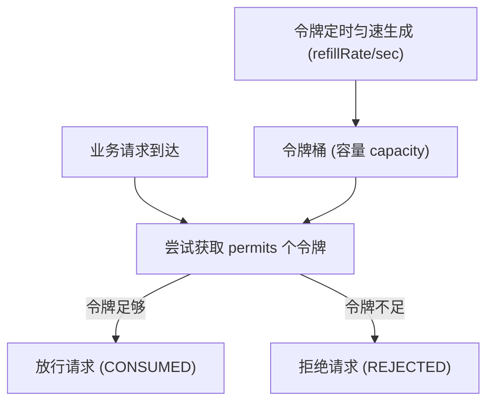
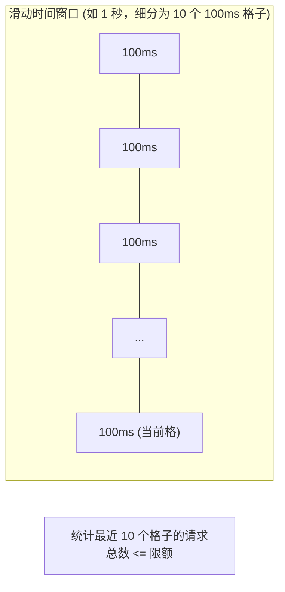
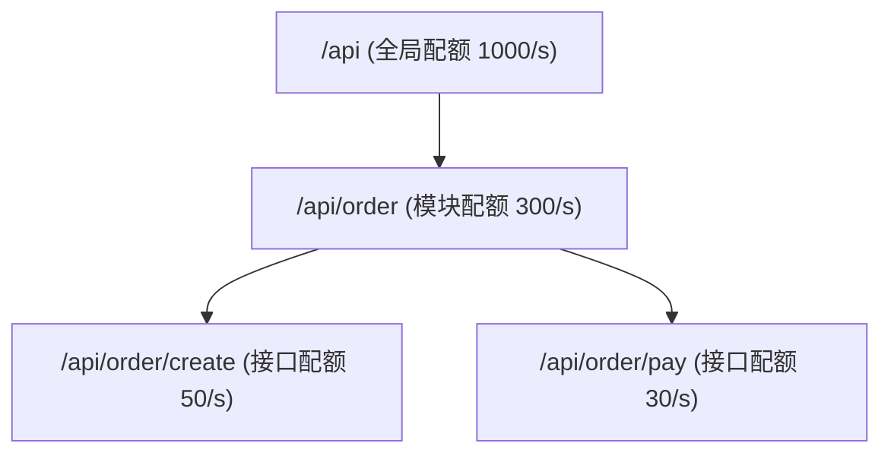

# 限流算法深度解析

在服务端高可用架构中，流量控制是防止系统被突发流量击垮的第一道防线。`team4u-ratelimiter` 内置了工业界主流的四种限流算法，并支持微秒级本地限流与分布式多维限流。

本文将深入剖析令牌桶、滑动窗口、固定窗口以及独创的历史路径窗口限流算法的设计原理与适用场景。

---

## 算法横向对比

| 算法类型 | 核心原理 | 流量平滑度 | 突发流量支持 | 内存与计算开销 | 典型适用场景 |
| :--- | :--- | :--- | :--- | :--- | :--- |
| **令牌桶 (Token Bucket)** | 恒定速率向桶中注入令牌，请求消耗令牌 | **极高**（严格匀速） | **支持**（允许消耗桶内积存令牌） | 极低（仅需记录时间戳与余量） | 外部 RPC 调用、网关入口流量整形、开放 API |
| **滑动窗口 (Sliding Window)** | 细分时间子窗口，动态统计移动时间跨度内的请求数 | **高**（消除边界双倍流量峰值） | **严格限制**（严格不超过阈值） | 中（需维护时间窗口环形数组） | 严格频次限制（如验证码发送、防刷限制） |
| **固定窗口 (Fixed Window)** | 按自然时间周期（如 1 秒）计数重置 | **低**（存在临界双倍流量风险） | **不支持** | 极低（单个 AtomicLong 计数） | 粗粒度统计、极简配额控制 |
| **历史路径窗口 (History Window)** | 基于层级路径树记录各层级请求频次并应用阶梯限流 | **高**（支持维度继承与衰减） | **灵活可配** | 中（树状路径节点缓存） | 用户级别分层防刷（IP -> 用户 -> 接口） |

---

## 令牌桶算法 (`TokenBucketAlgorithm`)



### 核心特性
- **平滑输出**：无论上游流量如何抖动，下游接收到的请求速率始终受限于令牌生成速率；
- **容忍突发**：如果系统此前处于空闲期，桶内积攒的令牌允许瞬间应对一次突发脉冲流量。

### 配置示例

```java
import com.team4u.framework.ratelimiter.config.RateLimitRule;
import com.team4u.framework.ratelimiter.core.TokenBucketAlgorithm;

RateLimitRule rule = RateLimitRule.builder()
        .capacity(100)       // 桶最大容量 100
        .refillRate(20)      // 每秒恒定生成 20 个令牌
        .build();
```

---

## 滑动窗口算法 (`SlidingWindowAlgorithm`)

固定窗口在窗口交界处（如 00:59 和 01:00）可能允许 2 倍于限流阈值的突发请求（临界突刺问题）。滑动窗口通过细分子时间格（Sub-buckets），动态计算当前滑动区间内的请求总和：



### 配置示例

```java
RateLimitRule rule = RateLimitRule.builder()
        .limit(100)                  // 窗口内最大请求数 100
        .window(Duration.ofSeconds(1)) // 时间窗口 1 秒
        .precision(10)               // 细分为 10 个子格
        .build();
```

---

## 历史路径窗口算法 (`HistoryWindowAlgorithm`)

在复杂的安全风控体系中，攻击者往往针对某一特定子路径发起攻击。历史路径算法结合层级路径（如 `/api/order/create`）与衰减权重，支持父子路径联动限流：



- 当子路径请求过于频繁时，优先触发子路径限流，不影响其他同级路径；
- 当总体流量超过根节点限额时，触发全局保护。

---

## 关联章节与进一步阅读

- 了解声明式注解与代理降级：[声明式注解与代理降级](ratelimiter-declarative.md)
- 了解 Spring 自动配置：[Spring 集成与自动装配](ratelimiter-spring.md)
- 了解动态上下文与多维路径提取：[动态上下文与分层路径限流](ratelimiter-context.md)
- 查看高并发秒杀防刷案例：[限流实战案例与最佳实践](ratelimiter-sample.md)
