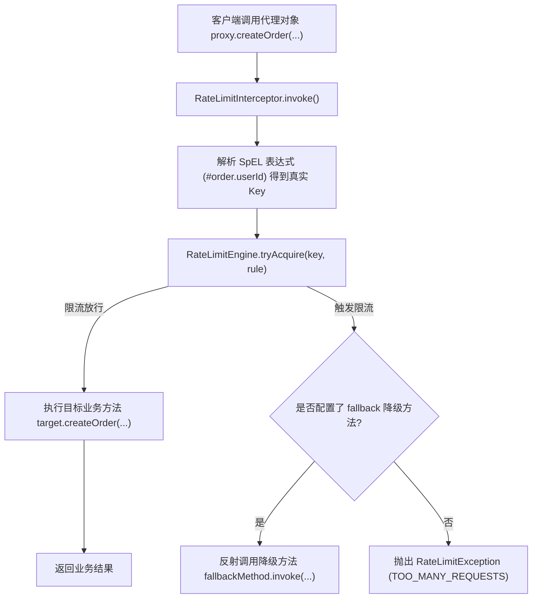

# 声明式注解与代理降级

在 Spring / 企业开发中，侵入式地编写限流代码会污染核心业务逻辑。`team4u-ratelimiter` 提供了强大的声明式注解 **`@RateLimit`**、动态代理拦截器与 **`@RateLimitReject` 降级兜底机制**。

---

## 声明式注解 `@RateLimit`

标注在 Service 或 Controller 方法上，自动对调用进行限流拦截：

```java
import com.team4u.framework.ratelimiter.proxy.RateLimit;
import org.springframework.stereotype.Service;

@Service
public class OrderService {

    /**
     * 对创建订单接口进行限流：按用户 ID 限流，每秒最多 5 次
     */
    @RateLimit(key = "#order.userId", limit = 5, period = 1)
    public OrderReceipt createOrder(OrderRequest order) {
        return processOrder(order);
    }
}
```

### 注解属性清单

| 属性 | 类型 | 默认值 | 作用说明 |
| :--- | :--- | :--- | :--- |
| **`key`** | `String` | `""` | SpEL 表达式提取的限流 Key。留空时默认以 `方法全限定名` 作为限流 Key |
| **`limit`** | `long` | 必填 | 周期内允许的最大请求数 |
| **`period`** | `int` | `1` | 限流周期（单位：秒） |
| **`algorithm`** | `String` | `"TOKEN_BUCKET"` | 限流算法：`TOKEN_BUCKET`、`SLIDING_WINDOW`、`FIXED_WINDOW` |
| **`fallback`** | `String` | `""` | 被限流时调用的降级方法名（需与原方法参数及返回值兼容） |

---

## `@RateLimitReject` 优雅降级兜底

当触发限流时，如果不希望直接抛出异常导致接口 500，可通过配置 fallback 降级方法提供友好的兜底响应：

```java
@Service
public class PromotionService {

    @RateLimit(key = "#userId", limit = 1, period = 3, fallback = "seckillFallback")
    public SeckillResult seckill(String userId, String goodsId) {
        // 执行高并发扣减库存
        return performSeckill(userId, goodsId);
    }

    /**
     * 限流降级方法：参数与原方法完全一致
     */
    @RateLimitReject
    public SeckillResult seckillFallback(String userId, String goodsId) {
        log.warn("用户 [{}] 请求过于频繁，触发秒杀降级", userId);
        return SeckillResult.fail("TOO_MANY_REQUESTS", "手速太快啦，请稍后重试");
    }
}
```

---

## 动态代理与拦截器底层机制



---

## 纯 Java 动态代理构建：`RateLimitProxyFactory`

在无 Spring 的环境下，亦可直接使用 `RateLimitProxyFactory` 为任意接口创建限流代理：

```java
import com.team4u.framework.ratelimiter.proxy.RateLimitProxyFactory;

OrderService rawService = new OrderServiceImpl();

// 为 rawService 创建限流动态代理
OrderService proxyService = RateLimitProxyFactory.createProxy(rawService, OrderService.class);
```

---

## 关联章节与进一步阅读

- 了解限流算法原理：[限流算法深度解析](ratelimiter-algorithms.md)
- 了解 Spring 自动配置：[Spring 集成与自动装配](ratelimiter-spring.md)
- 了解动态上下文与多维路径提取：[动态上下文与分层路径限流](ratelimiter-context.md)
- 查看高并发秒杀防刷案例：[限流实战案例与最佳实践](ratelimiter-sample.md)
