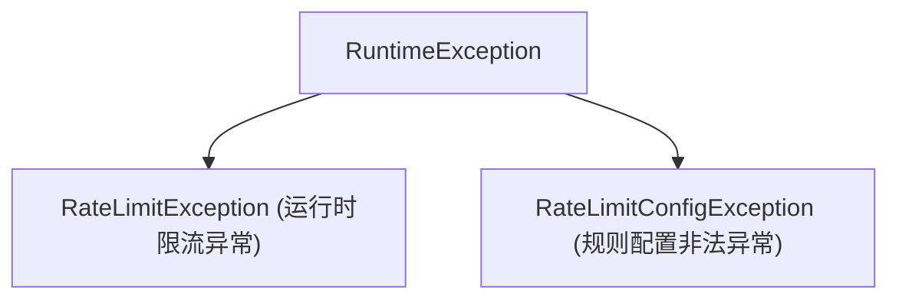

# 限流结果模型、原因码与异常处理

在流量治理中，限流结果应当向客户端与监控中心提供清晰的指标与诊断原因。`team4u-ratelimiter` 提供了不可变的结果对象 `RateLimitResult`、标准原因枚举 `RateLimitReason` 与异常类型体系。

---

## 1. 结果模型：`RateLimitResult`

每次调用限流引擎时，返回 `RateLimitResult`：

```java
public final class RateLimitResult {
    private final boolean allowed;        // 是否允许放行
    private final RateLimitReason reason; // 决策原因枚举
    private final long currentUsage;      // 当前周期内已使用配额
    private final long limit;             // 周期内最大配额上限
    private final long waitTimeMs;        // 若被限流，建议等待/重试时延 (毫秒)
}
```

### 决策原因枚举：`RateLimitReason`

| 枚举项 | 含义说明 | 典型处理建议 |
| :--- | :--- | :--- |
| **`ALLOWED`** | 请求在配额范围内，正常放行 | 正常执行业务代码 |
| **`RATE_EXCEEDED`** | 当前时间窗口或令牌桶内配额已耗尽 | 返回 429 Too Many Requests 或触发降级 |
| **`RULE_DISABLED`** | 限流规则处于关闭状态，直接放行 | 记录审计日志 |
| **`KEY_INVALID`** | 计算提取出的限流 Key 为空或非法 | 记录警告并根据配置放行或阻断 |

---

## 2. 异常类型体系



- **`RateLimitException`**：当未配置 fallback 降级方法且请求触发限流时抛出。包含 `key` 与 `result` 详情；
- **`RateLimitConfigException`**：当规则容量、周期配置为非正数或算法名称不存在时在启动期抛出。

---

## 关联章节与进一步阅读

- 了解声明式注解与代理降级：[声明式注解与代理降级](ratelimiter-declarative.md)
- 了解限流算法原理：[限流算法深度解析](ratelimiter-algorithms.md)
- 查看高并发秒杀防刷案例：[限流实战案例与最佳实践](ratelimiter-sample.md)
