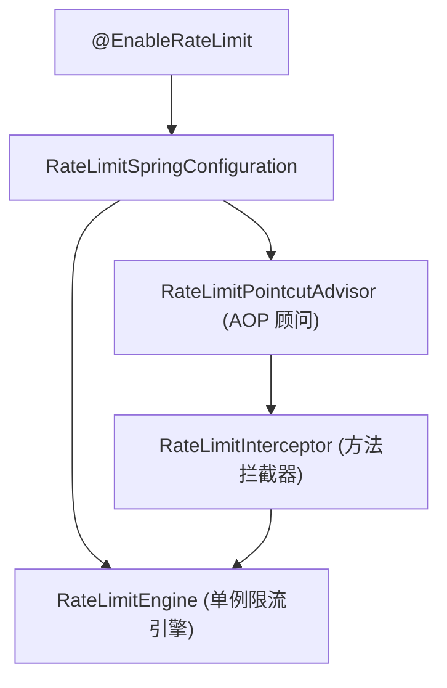

# Spring 集成与自动装配

`team4u-ratelimiter` 提供了针对 Spring / Spring Boot 环境的自动配置支持。通过 `@EnableRateLimit` 注解即可一键激活限流切面与组件扫描。

---

## 引入依赖

```xml
<dependencies>
    <!-- 限流核心与代理模块 -->
    <dependency>
        <groupId>com.team4u</groupId>
        <artifactId>team4u-ratelimiter</artifactId>
    </dependency>
</dependencies>
```

---

## 激活限流注解：`@EnableRateLimit`

在 Spring Boot 主类或任意 `@Configuration` 配置类上标注 `@EnableRateLimit`：

```java
import com.team4u.framework.ratelimiter.spring.EnableRateLimit;
import org.springframework.boot.SpringApplication;
import org.springframework.boot.autoconfigure.SpringBootApplication;

@SpringBootApplication
@EnableRateLimit // 激活限流 AOP 切面与自动配置
public class Application {

    public static void main(String[] args) {
        SpringApplication.run(Application.class, args);
    }
}
```

---

## 自动装配原理



1. **`RateLimitSpringConfiguration`**：注册单例 `RateLimitEngine` 与 SpEL 解析器；
2. **切点识别**：自动扫描所有标注了 `@RateLimit` 的类与方法；
3. **参数上下文桥接**：自动将当前方法的入参与方法签名绑定至 SpEL `EvaluationContext`，支持使用 `#paramName` 或 `#root.args[0]` 提取动态限流 Key。

---

## 关联章节与进一步阅读

- 了解声明式注解与代理降级：[声明式注解与代理降级](ratelimiter-declarative.md)
- 了解限流算法原理：[限流算法深度解析](ratelimiter-algorithms.md)
- 了解动态上下文与多维路径提取：[动态上下文与分层路径限流](ratelimiter-context.md)
- 查看高并发秒杀防刷案例：[限流实战案例与最佳实践](ratelimiter-sample.md)
