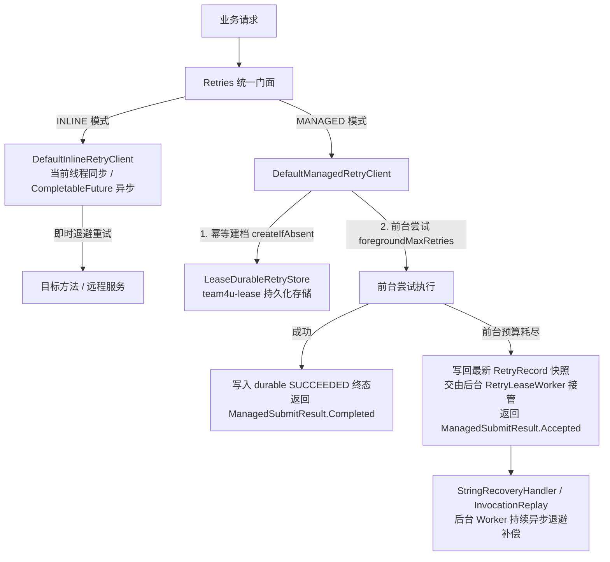

# 通用重试治理组件 (team4u-retry)

# 背景

在分布式服务调用与外部系统交互中，网络闪断、下游限流与短时抖动不可避免。传统的重试处理通常面临如下困境：

- **同步阻塞与线程耗尽**：在当前工作线程中进行长时间或多次休眠重试，极易打满 Web 容器线程池，导致服务雪崩。
- **进程重启后重试丢失**：传统重试仅存在于 JVM 内存中；一旦服务发版重启或容器崩溃，未完成的重试任务彻底丢失。
- **缺乏前台/后台分级**：业务往往希望“**先在前台快速重试 1~2 次；若仍失败，不阻塞用户，转入后台持久化接管并持续补偿重试**”。
- **缺乏退避抖动机制**：固定时间间隔重试极易在下游故障恢复瞬间引发“雷鸣重试风暴（Thundering Herd Problem）”。

`team4u-retry` 是一个支持 **进程内即时重试 (INLINE)** 与 **持久化托管重试 (MANAGED)** 的全功能 Java 重试与治理框架。

---

# 设计

## 设计理念

框架提供统一的 `Retries` 编程门面，并支持两套截然不同但高度协同的执行模式：



## 核心概念

| 概念 | 说明 |
| :--- | :--- |
| **`INLINE` 模式** | 所有重试都在当前进程内完成，支持同步阻塞与 `CompletableFuture` 异步调度，适合短链路与即时拿结果场景 |
| **`MANAGED` 模式** | 前台有限尝试 + 后台持久化托管接管，状态持久化在 `team4u-lease` 中，适合支付通知、回调与分布式补偿 |
| `Retries` | 统一流式门面工具类（`Retries.inline()` 与 `Retries.managed(client)`） |
| `RetryPolicy` | 重试策略模型，配置 `maxRetries`、`foregroundMaxRetries`、`backoff`、`retryOn`、`abortOn` 与 `condition` |
| `Backoffs` | 退避策略工具类，支持 `fixed` (固定)、`increment` (等差)、`exponential` (指数) 与 `exponentialJitter` (加抖动防风暴) |
| `@Retryable` | 声明式重试注解，支持标注在接口或类方法上，配合 `@RetryIgnore` 忽略无法序列化的参数 |
| `ManagedRetryRuntime` | 托管重试官方运行时容器，一键组装 Lease 存储、恢复处理器与 Worker 节点 |
| `InvocationReplay` | 代理方法调用通用回放器，配合 `RecoveryExecutionContext` 避免递归重复重试 |

---

## 模式对比与选择

| 维度 | INLINE 模式 | MANAGED 模式 |
| :--- | :--- | :--- |
| **执行位置** | 当前 JVM 进程内 | 当前进程前台 + 后台分布式 Worker |
| **持久化保障** | 否（进程退出任务丢失） | 是（基于 `lease_task` 持久化，进程重启可接管） |
| **前后台分级** | 不支持（无前台/后台概念，不可配置 `foregroundMaxRetries`） | 必须显式配置 `foregroundMaxRetries` |
| **返回值支持** | 支持泛型业务返回值与 `CompletableFuture` | 前台即时完成返回业务值；进入后台返回 `Accepted`（代理模式仅限 `void`） |
| **典型场景** | 下游 RPC/HTTP 短时抖动、数据库瞬间死锁 | 支付结果通知、回调补发、异步事件重试、第三方系统补偿 |

---

## 模块结构与包定位

```text
com.team4u.framework.retry
├── api                              # 核心接口与门面 (team4u-retry-core)
│   ├── Retries.java                 # 统一流式门面 (inline / managed)
│   ├── RetryPolicy.java             # 重试策略模型与判定引擎
│   ├── ManagedSubmitResult.java     # Completed, Accepted, Existing, Failed, Rejected
│   ├── RecoverySpec.java            # 恢复任务规格定义
│   ├── NamedRetryPolicyRegistry.java# 全局策略工厂注册表
│   └── NamedRetryPolicyFactory.java
├── common                           # 公共组件
│   ├── backoff/                     # 退避算法 (Fixed, Increment, Exponential, ExponentialJitter)
│   ├── concurrent/RetryExecutorManager.java # 全局与独立调度线程池管理
│   └── util/RetryExceptionUtil.java # 异常解包与中断状态维护工具
├── config                           # 配置与动态下发
│   ├── DynamicRetryPolicyRegistry.java # retry.policy.* 动态规则注册表
│   └── RetryPolicyParser.java       # JSON 策略解析器
├── inline                           # 进程内重试实现
│   ├── InlineRetryClient.java
│   └── DefaultInlineRetryClient.java# 同步循环与 CompletableFuture 异步调度
├── managed                          # 托管重试核心抽象
│   ├── client/DefaultManagedRetryClient.java # 前台执行 + Durable Handoff
│   ├── dispatch/RetryDispatcher.java# 后台分发器
│   ├── recovery/                    # 恢复处理器 (RecoveryHandler, RecoveryExecutionContext)
│   └── store/RetryStore.java        # 重试持久化仓储接口
├── proxy                            # 动态代理与注解增强 (team4u-retry-proxy)
│   ├── Retryable.java               # 声明式重试注解
│   ├── RetryMode.java               # INLINE, MANAGED
│   ├── RetryProxyFactory.java       # 编程式代理工厂
│   ├── RetryDelegate.java           # 核心拦截委托器
│   ├── RetryMethodResolver.java     # 方法元数据与桥接解析器
│   ├── InvocationReplay.java        # 代理方法调用反射回放器
│   └── serialize/RetryIgnore.java   # 参数忽略注解与 Jackson 序列化
├── spring                           # Spring 容器集成 (team4u-retry-spring)
│   ├── EnableRetry.java             # 开启注解支持
│   ├── RetrySpringConfiguration.java# 基础设施 Bean 装配与生命周期隔离
│   └── SpringRetryInterceptor.java  # AOP 拦截器
└── runtime.lease                    # 租约托管运行时 (team4u-retry-lease-runtime)
    ├── ManagedRetryRuntime.java     # 官方一站式托管运行时容器
    ├── RetryLeaseWorker.java        # 后台轮询恢复工作者
    ├── LeaseDurableRetryStore.java  # 基于 LeaseBackend 的存储与分发实现
    └── StringRecoveryHandler.java   # 字符串载荷恢复处理器
```

---

## 文档导航

- [快速开始](quick-start.md)：3 分钟上手 INLINE 与 MANAGED 推荐写法
- [进程内重试 (INLINE)](retry-inline.md)：同步/异步重试、异常智能拆包与熔断终止
- [托管持久化重试 (MANAGED)](retry-managed.md)：前台尝试、后台接管、幂等建档与状态机流转
- [退避策略与动态配置](retry-strategy.md)：固定/线性/指数/抖动算法与 `retry.policy.*` 动态下发
- [注解与代理模式](retry-proxy.md)：`@Retryable`、`@RetryIgnore` 与方法调用快照恢复
- [Spring 整合与生命周期](retry-spring.md)：`@EnableRetry`、独立线程池生命周期与 Handler 自动装配
- [实战案例](retry-sample.md)：第三方支付回调补偿、下游接口容灾与异步事件重试实战

