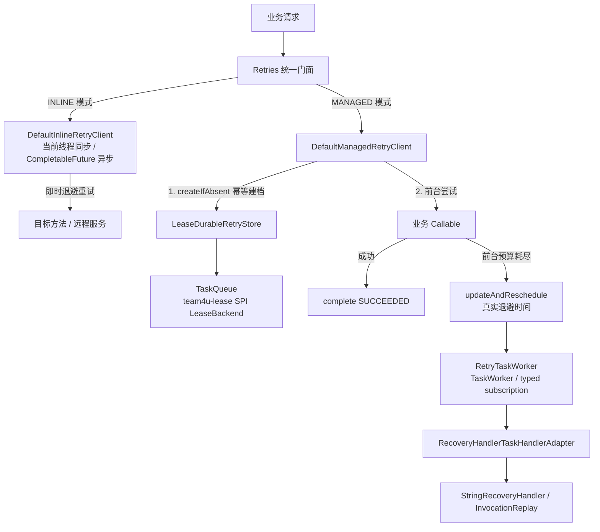

# 通用重试治理组件 (team4u-retry)

# 背景

在分布式服务调用与外部系统交互中，网络闪断、下游限流与短时抖动不可避免。传统的重试处理通常面临如下困境：

- **同步阻塞与线程耗尽**：在当前工作线程中进行长时间或多次休眠重试，极易打满 Web 容器线程池，导致服务雪崩。
- **进程重启后重试丢失**：传统重试仅存在于 JVM 内存中；一旦服务发版重启或容器崩溃，未完成的重试任务彻底丢失。
- **缺乏前台/后台分级**：业务往往希望“先在前台快速重试 1~2 次；若仍失败，不阻塞用户，转入后台持久化接管并持续补偿重试”。
- **缺乏退避抖动机制**：固定时间间隔重试极易在下游故障恢复瞬间引发“雷鸣重试风暴”。

`team4u-retry` 是一个支持 **进程内即时重试 (INLINE)** 与 **持久化托管重试 (MANAGED)** 的 Java 重试治理框架。

# 设计

## 设计理念

框架提供统一的 `Retries` 编程门面，并支持两套协同的执行模式：



MANAGED 的关键语义：

- `maxRetries` 不包含首次执行，总尝试上限是 `maxRetries + 1`；`-1` 表示无限重试。
- `foregroundMaxRetries` 不包含首次执行，必须显式配置，且不能大于 `maxRetries`。
- 前台和后台共享同一个持久化 `attempts` 计数，后台恢复从前台已失败次数之后继续。
- 初始 intent 默认有 5 分钟前台接管窗口。窗口内留给前台进程；进程崩溃或未能 handoff 时，到期自动被后台接管。
- 超过窗口仍在前台执行的极端场景可能与后台恢复重叠。这是 **at-least-once** 边界，恢复处理器必须幂等。
- 业务异常会驱动成功、延迟重试或终态失败；基础设施序列化异常和 interrupt 不伪造业务 `FAILED`，任务保留租约状态，租约到期后由 fencing 语义接管。

## 核心概念

| 概念 | 说明 |
| :--- | :--- |
| **`INLINE` 模式** | 所有重试都在当前进程内完成，支持同步阻塞与 `CompletableFuture` 异步调度，适合短链路与即时拿结果场景 |
| **`MANAGED` 模式** | 前台有限尝试 + 后台持久化接管，状态通过 `LeaseBackend` 存储在 Lease 队列中，适合支付通知、回调与分布式补偿 |
| `Retries` | 统一流式门面：`Retries.inline()` 与 `Retries.managed(client)` |
| `RetryPolicy` | 重试策略模型，配置 `maxRetries`、`foregroundMaxRetries`、`backoff`、`retryOn`、`abortOn` 与 `condition` |
| `Backoffs` | 退避策略工具类，支持 `fixed`、`increment`、`exponential` 与 `exponentialJitter` |
| `@Retryable` | 声明式重试注解，支持接口或类方法；配合 `@RetryIgnore` 忽略无法序列化的参数 |
| `ManagedRetryRuntime` | 托管重试运行时容器，组装 Lease 队列、存储、本地恢复处理器 registry 与 `RetryTaskWorker` |
| `RetryTaskWorker` | 后台租约 Worker；按已注册 handler 的 task type 精确订阅并执行恢复 |
| `LeaseRetryRecordSerializer` | 显式 `version=1` 持久化格式，不序列化 Java 实现类名或任意对象图 |
| `InvocationReplay` | 代理方法调用回放器，配合 `RecoveryExecutionContext` 避免递归重复重试 |

## 模式对比与选择

| 维度 | INLINE 模式 | MANAGED 模式 |
| :--- | :--- | :--- |
| **执行位置** | 当前 JVM 进程内 | 当前进程前台 + 后台分布式 Worker |
| **持久化保障** | 否（进程退出任务丢失） | 是（基于 Lease 队列，进程重启可接管） |
| **前后台分级** | 不支持，不可配置 `foregroundMaxRetries` | 必须显式配置 `foregroundMaxRetries` |
| **返回值支持** | 支持泛型返回值与 `CompletableFuture` | 前台完成返回业务值；进入后台返回 `Accepted`（代理模式仅限 `void`） |
| **交付语义** | 单次调用链内尽力执行 | at-least-once，恢复处理器必须幂等 |
| **典型场景** | 下游 RPC/HTTP 短时抖动、数据库瞬间死锁 | 支付结果通知、回调补发、异步事件重试、第三方系统补偿 |

## 模块结构与包定位

```text
com.team4u.framework.retry
├── api                              # 核心接口与门面 (team4u-retry-core)
│   ├── Retries.java                 # 统一流式门面 (inline / managed)
│   ├── RetryPolicy.java             # 重试策略模型与判定引擎
│   ├── ManagedSubmitResult.java     # Completed, Accepted, Existing, Failed, Rejected
│   ├── RecoverySpec.java            # 恢复任务规格定义
│   ├── NamedRetryPolicyRegistry.java
│   └── NamedRetryPolicyFactory.java
├── common
│   ├── backoff/                     # Fixed, Increment, Exponential, ExponentialJitter
│   ├── concurrent/RetryExecutorManager.java
│   └── util/RetryExceptionUtil.java
├── config
│   ├── DynamicRetryPolicyRegistry.java
│   └── RetryPolicyParser.java
├── inline
│   ├── InlineRetryClient.java
│   └── DefaultInlineRetryClient.java
├── managed
│   ├── client/DefaultManagedRetryClient.java
│   ├── dispatch/RetryDispatcher.java
│   ├── recovery/                    # RecoveryHandler, StringRecoveryHandler, RecoveryContext
│   ├── store/RetryStore.java
│   └── store/serialize/RetryRecordSerializer.java
├── proxy                            # 动态代理与注解增强 (team4u-retry-proxy)
│   ├── Retryable.java
│   ├── RetryMode.java
│   ├── RetryProxyFactory.java
│   ├── RetryDelegate.java
│   ├── RetryMethodResolver.java
│   ├── InvocationReplay.java
│   └── serialize/RetryIgnore.java
├── spring                           # Spring 容器集成 (team4u-retry-spring)
│   ├── EnableRetry.java
│   ├── RetrySpringConfiguration.java
│   └── SpringRetryInterceptor.java
└── runtime.lease                    # Lease 托管运行时 (team4u-retry-lease-runtime)
    ├── ManagedRetryRuntime.java
    ├── RetryTaskWorker.java
    ├── LeaseDurableRetryStore.java
    ├── LeaseRetryRecordSerializer.java
    └── RecoveryHandlerTaskHandlerAdapter.java
```

## 文档导航

- [快速开始](quick-start.md)：INLINE 与 MANAGED 推荐写法
- [进程内重试 (INLINE)](retry-inline.md)：同步/异步重试、异常拆包与中断安全
- [托管持久化重试 (MANAGED)](retry-managed.md)：前台尝试、后台接管、幂等建档、持久化格式与状态机
- [退避策略与动态配置](retry-strategy.md)：固定/线性/指数/抖动算法与动态配置下发
- [注解与代理模式](retry-proxy.md)：`@Retryable`、`@RetryIgnore` 与方法调用快照恢复
- [Spring 整合与生命周期](retry-spring.md)：`@EnableRetry`、线程池生命周期与 MANAGED Bean 装配
- [实战案例](retry-sample.md)：支付回调补偿、下游接口容灾与后台恢复处理
