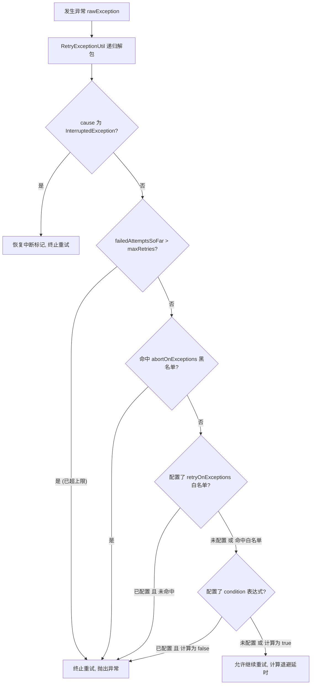

# 进程内重试 (INLINE)

`INLINE` 模式将所有重试动作限定在当前 JVM 进程内执行，适用于下游接口瞬时抖动、数据库死锁冲突等必须在当前调用链路中立即拿到结果的场景。

---

## 核心工作机制

`DefaultInlineRetryClient` 提供了同步与异步两套高性能重试执行器：

### 同步阻塞重试 (`call`)
- 在当前调用线程中循环执行 `Callable<T>`。
- 捕获异常后通过 `RetryPolicy.canRetry(failedAttemptsSoFar, ex)` 判定是否允许重试。
- 若允许重试，根据退避策略计算延迟时长 `delayMillis`，当前线程安全休眠（`Thread.sleep`）后进入下一轮尝试。
- 若达到重试上限或命中不可重试异常，将原始业务根因直接抛出。

### 异步非阻塞重试 (`callAsync`)
- 接收返回 `CompletableFuture<T>` 的任务供给函数 `Supplier<CompletableFuture<T>>`。
- **全链路非阻塞**：当 Future 异常完成且满足重试条件时，通过全局调度线程池（`RetryExecutorManager` 中的 `ScheduledExecutorService`）提交延迟重放任务，**全程不占用任何业务工作线程**。
- **取消信号桥接 (Cancellation Bridge)**：返回给调用方的 `resultFuture` 注册了级联取消监听器。若调用方对 `resultFuture.cancel(mayInterruptIfRunning)` 执行了取消操作，框架会自动联动取消当前正在执行中的异步 Future 及处于调度队列中的 `ScheduledFuture`，防止无效计算。
- **线程池满载与关闭保护**：若调度线程池因应用停机等原因拒绝任务（`RejectedExecutionException`），框架会将拒绝异常通过 `addSuppressed` 附加到原始业务异常上，并立即以业务异常异常完成 Future，保证根因清晰。

---

## 智能异常解包与中断安全 (`RetryExceptionUtil`)

1. **多层包装异常自动剥离 (Recursive Unwrapping)**：
   分布式与异步框架常产生多层包装异常。框架使用 `IdentityHashMap` 防循环引用的递归算法，自动对以下包装类型进行深度解包，提取核心业务根因进行匹配：
   - `java.util.concurrent.CompletionException`
   - `java.util.concurrent.ExecutionException`
   - `java.lang.reflect.InvocationTargetException`
   - `java.lang.reflect.UndeclaredThrowableException`
2. **中断信号绝对保护 (`InterruptedException`)**：
   - 若解包后发现根因为 `InterruptedException`，框架**绝不进入重试**，并立即调用 `Thread.currentThread().interrupt()` 恢复线程中断标记，严格遵守 Java 线程中断响应规范。
3. **严重 JVM 级错误防御 (`Error`)**：
   - 如 `OutOfMemoryError`、`StackOverflowError` 等严重 JVM 级 `Error` 默认直接抛出，绝不进入重试循环。

---

## 异常匹配与判定规则 (`RetryPolicy`)

`RetryPolicy` 的单次判定逻辑按以下顺序严格执行：



### 动态表达式判定 (`condition`)
框架集成了内置表达式引擎 `Criteria`，支持基于执行上下文的细粒度表达式过滤。表达式中可使用的内置变量包括：

| 变量名 | 类型 | 说明 |
| :--- | :--- | :--- |
| `retryCount` | `int` | 当前已重试失败的次数（从 0 开始计数，第 1 次重试时 `retryCount == 0`） |
| `maxRetries` | `int` | 策略配置的最大重试次数 |
| `cause` | `Throwable` | 经过解包后的原始业务异常对象 |
| `message` | `String` | 异常提示信息（`cause.getMessage()`，若为 null 则为空字符串） |

---

## 代码配置示例

```java
import com.team4u.framework.retry.api.Retries;
import com.team4u.framework.retry.api.RetryPolicy;
import com.team4u.framework.retry.common.backoff.Backoffs;

import java.io.IOException;
import java.net.SocketTimeoutException;

// 1. 构建精细化重试策略
RetryPolicy policy = RetryPolicy.builder()
        .maxRetries(3) // 失败后最多重试 3 次（连同首次执行总共 4 次）
        .retryOn(SocketTimeoutException.class) // 白名单：单个添加
        .retryOn(IOException.class)
        .abortOn(IllegalArgumentException.class) // 黑名单：命中立即终止
        .condition("retryCount <= 2 && message contains 'timeout'") // 表达式细粒度条件
        .backoff(Backoffs.exponentialJitter(100, 2.0, 3000)) // 指数退避加抖动
        .build();

// 2. 同步执行
String response = Retries.inline()
        .policy(policy)
        .call(() -> httpClient.get("https://api.example.com/order"));
```

