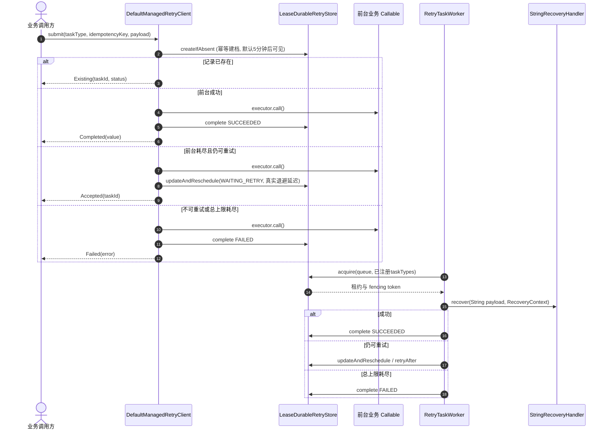

# 托管持久化重试 (MANAGED)

`MANAGED` 模式将任务状态持久化到 Lease 队列，实现 **前台即时尝试 + 后台租约接管补偿**。底层存储由 `com.team4u.framework.lease.spi.LeaseBackend` 提供，官方实现包括 `InMemoryLeaseBackend` 与 `JdbcLeaseBackend`。

## 核心生命周期



## 尝试次数语义

- `maxRetries` 表示首次执行之后的最大重试次数，不包含首次执行；总尝试上限是 `maxRetries + 1`。`maxRetries = -1` 表示无限重试。
- `foregroundMaxRetries` 表示前台在首次执行之后还能重试几次，同样不包含首次执行；MANAGED 必须显式配置，且必须小于等于 `maxRetries`。
- 前台 handoff 时会把已失败次数写入持久化 `RetryRecord.state.attempts`；后台恢复每次执行前先加 1，因此前后台尝试是连续计数。
- 例：`maxRetries = 2`、`foregroundMaxRetries = 1` 时，前台最多执行 2 次；若都失败，后台最多再执行第 3 次后终态 `FAILED`。

## 前台接管窗口

`ManagedRetryRuntime.Builder.foregroundRecoveryTimeout(Duration)` 控制初始 intent 的可见时间，默认 **5 分钟**：

1. `createIfAbsent` 首次建档时，任务 payload 处于初始 intent 状态，队列可见时间设为提交时间加上该窗口。
2. 窗口内任务留给当前进程做前台执行。若前台耗尽并成功 handoff，存储会把状态改为 `WAITING_RETRY`，并把可见时间重置为真实退避时间。
3. 若进程在建档后崩溃、重启或始终没有 handoff，任务到期自动对后台 Worker 可见，不会永久隐藏。
4. 如果前台执行异常缓慢并跨越窗口，后台可能在它仍未结束时接管，导致恢复逻辑与前台逻辑重叠。这是 **at-least-once** 交付边界；业务目标操作和 `StringRecoveryHandler` 都必须幂等。

窗口必须为正且精确到毫秒。不要用它表达业务退避时间；真实退避由 `RetryPolicy.backoff` 计算。

## 运行时配置

```java
import com.team4u.framework.lease.memory.InMemoryLeaseBackend;
import com.team4u.framework.lease.spi.LeaseBackend;
import com.team4u.framework.retry.api.RetryPolicy;
import com.team4u.framework.retry.common.backoff.Backoffs;
import com.team4u.framework.retry.managed.recovery.RecoveryHandlerRegistry;
import com.team4u.framework.retry.managed.recovery.StringRecoveryHandler;
import com.team4u.framework.retry.managed.store.serialize.RetryRecordSerializer;
import com.team4u.framework.retry.runtime.lease.LeaseRetryRecordSerializer;
import com.team4u.framework.retry.runtime.lease.ManagedRetryRuntime;

import java.time.Duration;

LeaseBackend backend = new InMemoryLeaseBackend();
RecoveryHandlerRegistry registry = new RecoveryHandlerRegistry();
registry.register(new MerchantNotifyRecoveryHandler());

ManagedRetryRuntime runtime = ManagedRetryRuntime.lease(backend)
        .queueName("retry-recovery")           // 默认 retry-recovery
        .registry(registry)                    // 本地实例；不传则新建本地 registry
        .autoScanRecoveryHandlers(false)       // 默认 true，只扫描进本地 registry
        .defaultPolicy(RetryPolicy.builder()
                .maxRetries(5)
                .foregroundMaxRetries(1)
                .backoff(Backoffs.exponentialJitter(1000, 2.0, 60_000L))
                .build())
        .serializer(LeaseRetryRecordSerializer.INSTANCE)
        .foregroundRecoveryTimeout(Duration.ofMinutes(5))
        .workerId("retry-worker-1")            // 缺省自动生成
        .lease(Duration.ofSeconds(30))
        .pollInterval(Duration.ofMillis(250))
        .heartbeatEnabled(true)
        .heartbeatInterval(Duration.ofSeconds(10)) // 缺省 lease / 3
        .threadName("managed-retry-worker")
        .build();

runtime.start();
```

`heartbeatInterval` 必须为正且小于 `lease`。同一 runtime 中的 store、worker 和后台 adapter 会使用同一个 serializer 实例；自定义 `RetryRecordSerializer` 时必须通过 builder 传入，避免读写格式分叉。

生产环境使用 JDBC：

```java
import com.team4u.framework.lease.jdbc.JdbcLeaseBackend;
import com.team4u.framework.lease.jdbc.dialect.MySqlLeaseDbDialect;
import com.team4u.framework.lease.spi.LeaseBackend;

import javax.sql.DataSource;

LeaseBackend backend = new JdbcLeaseBackend(dataSource, new MySqlLeaseDbDialect());
```

## 后台 Worker 与恢复处理器

后台 Worker 名为 `RetryTaskWorker`，由 `ManagedRetryRuntime` 内部创建并包装 Lease 的 `TaskWorker`。

```java
import com.team4u.framework.retry.managed.recovery.RecoveryContext;
import com.team4u.framework.retry.managed.recovery.StringRecoveryHandler;

public final class MerchantNotifyRecoveryHandler implements StringRecoveryHandler {

    private final MerchantNotifyService notifyService;

    public MerchantNotifyRecoveryHandler(MerchantNotifyService notifyService) {
        this.notifyService = notifyService;
    }

    @Override
    public String taskName() {
        return "merchant-webhook-notify";
    }

    @Override
    public void recover(String payload, RecoveryContext context) throws Exception {
        notifyService.notify(payload);
    }
}
```

注册规则：

- `RecoveryHandlerRegistry` 建议作为本地实例创建并显式注册 handler。
- `RetryTaskWorker.start()` 会快照 registry 当前 handler，之后修改该 registry 不影响已启动 Worker。
- 也可以在 `ManagedRetryRuntime.build()` 后、`start()` 前调用 `runtime.worker().register(handler)`。该注册只属于这个 Worker，不影响共享 registry，且启动后不允许再注册。
- Worker 按每个 handler 的 `taskName()` 生成精确 task type 订阅，只会抢占自己能处理的类型。
- Worker 启动前必须至少有一个 handler，否则 `start()` 抛出 `IllegalStateException`。
- 停止时可调用 `runtime.close()`、`worker.shutdown()`、`worker.shutdownGracefully(timeout)` 或 `worker.shutdownNow()`；Worker 关闭后不能重启。

## 提交结果状态

| 结果状态类 | 判定方法 | 含义 |
| :--- | :--- | :--- |
| `Completed<T>` | `isCompleted()` | 前台执行成功，且 `SUCCEEDED` 终态已持久化；`getValue()` 返回业务值 |
| `Accepted<T>` | `isAccepted()` | 前台预算耗尽但策略允许继续重试，已持久化并交由后台；包含 `taskId`、`status`、`nextAttemptAt` |
| `Existing<T>` | `isExisting()` | 命中已存在的幂等任务，不重复执行；返回当前持久化状态快照 |
| `Failed<T>` | `isFailed()` | 命中不可重试异常或总尝试上限耗尽；`getError()` 返回异常 |
| `Rejected<T>` | `isRejected()` | 持久化创建或 handoff 被基础设施拒绝；`getReason()` 返回原因 |

幂等唯一范围是 `queueName + taskType + idempotencyKey`。使用不同 task type 时，相同业务字符串不会互相冲突；仍建议把业务维度写入 key，保证可追踪。

## 持久化格式

`LeaseRetryRecordSerializer` 使用显式 JSON 格式，当前 `version = 1`：

- 顶层包含 `version`、`taskId`、`request`、`state`。
- `request` 持久化 `taskType`、`idempotencyKey`、`recovery.payload`、策略与 `createdAt`。
- `state` 持久化 `attempts`、`RetryStatus`、`nextRunAt`、错误信息与终态时间。
- 内置 Backoff 以 `type + params` 保存：
  - `fixed`: `delay`
  - `increment`: `initialDelay`, `stepMillis`
  - `exponential` / `exponentialJitter`: `initialDelay`, `multiplier`, `maxDelay`
- 格式不写入 `RetryRecord`、Backoff 或业务 payload 的 Java 实现类名，也不做任意对象图反射还原。
- 旧 Lease payload 没有 `version=1`，不做兼容迁移；反序列化遇到其他版本会拒绝。

自定义 Backoff 必须实现稳定的 `Backoff.toConfig()`，并在同一个 `BackoffRegistry` 中注册可从 `type + params` 重建对象的 `BackoffFactory`。无法表达为配置的自定义 Backoff 会在序列化时快速失败，应改用自定义 `RetryRecordSerializer`。

### 异常 allowlist

序列化默认只接受 `java.*` Throwable 类名；自定义异常类名会被拒绝，避免持久化 payload 触发任意类加载。需要持久化自定义异常类型时，构造显式 allowlist，并把同一个 serializer 实例贯穿 store、worker 和 runtime：

```java
import com.team4u.framework.retry.common.backoff.BackoffRegistry;
import com.team4u.framework.retry.runtime.lease.LeaseRetryRecordSerializer;

import java.util.Collections;
import java.util.LinkedHashSet;
import java.util.Set;

Set<Class<? extends Throwable>> allowlist =
        new LinkedHashSet<Class<? extends Throwable>>();
allowlist.add(MerchantNotifyException.class);

LeaseRetryRecordSerializer serializer = new LeaseRetryRecordSerializer(
        BackoffRegistry.global(), Collections.unmodifiableSet(allowlist));

ManagedRetryRuntime runtime = ManagedRetryRuntime.lease(backend)
        .serializer(serializer)
        // registry / policy / worker 配置见上文
        .build();
```

allowlist 只控制 `RetryPolicy.retryOnExceptions` 与 `abortOnExceptions` 中的异常类名。业务 payload 本身应是字符串，例如 JSON，由 handler 自己反序列化。

## 基础设施异常与租约接管

`RecoveryHandlerTaskHandlerAdapter` 会区分业务失败和基础设施失败：

- handler 抛出的业务异常按 `RetryPolicy` 判定，返回成功、延迟重试或终态失败。
- payload 反序列化失败、成功/失败结果序列化失败、恢复执行被 interrupt 等情况抛出 `RetryInfrastructureException`。
- 这类异常不会把任务写成业务 `FAILED`。Worker 放弃本次租约写回，任务保持 `RUNNING`；租约到期后，其他 Worker 可凭 fencing 语义接管并重试。
- 因此恢复逻辑必须幂等。上一次业务动作可能已经完成，只是结果写回失败或线程被中断。

## 管理面状态视图

Lease 队列对外呈现五态 `PENDING / RUNNING / SUCCEEDED / FAILED / CANCELLED`。`RetryRecord.state.status` 保留重试领域状态，例如 `ACCEPTED`、`WAITING_RETRY`、`PROCESSING` 与三个终态。查询队列任务时，`RUNNING` 会映射为重试领域的 `PROCESSING`，持久化 payload 中仍保留最近一次可安全写回的状态。
