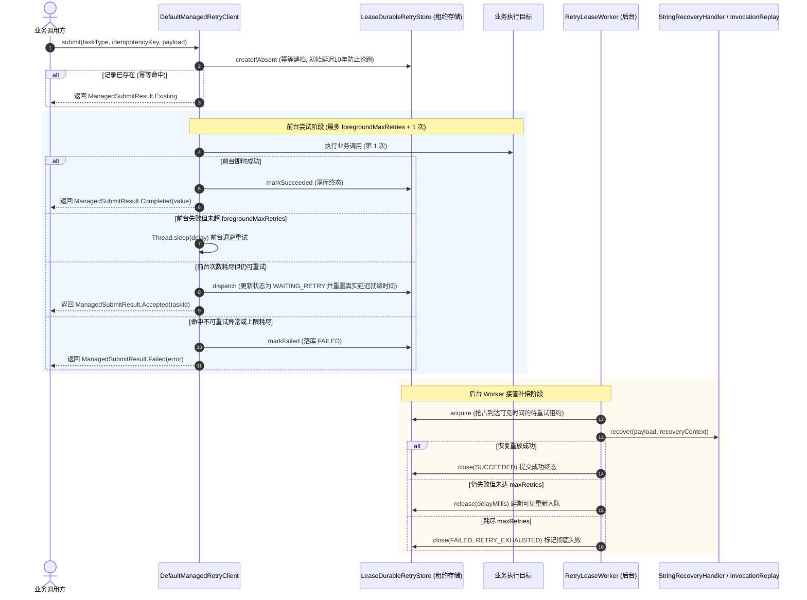

# 托管持久化重试 (MANAGED)

`MANAGED` 模式将任务状态持久化到底层存储（依托 `team4u-lease`），实现 **前台即时尝试 + 后台接管补偿** 的高可用可靠重试架构。

---

## 核心生命周期流程



---

## 前台尝试与后台持久化交接机制

1. **初始意图防抢跑保护 (Prepared Intent)**：
   - 当调用 `createIfAbsent` 首次建档时，`LeaseDurableRetryStore` 会将任务的初始就绪时间设定为 **10 年后**（`PREPARED_INTENT_DELAY_MILLIS`）。
   - 这样可以确保在调用方前台尝试执行期间，后台 Worker 绝不会提前拉取该任务，彻底避免前后台并发竞态。
2. **前台成功与持久化一致性保障 (`DurableSuccessWriteException`)**：
   - 前台执行成功后，客户端必须将 `SUCCEEDED` 终态持久化写入 `RetryStore`。
   - 若持久化写库发生异常，客户端会抛出 `DurableSuccessWriteException`，保证调用方感知持久化失败风险，维护系统一致性契约。
3. **前台预算耗尽与后台无缝交接 (Durable Handoff)**：
   - 当调用方在前台尝试了 `foregroundMaxRetries + 1` 次后依然失败，但策略判定允许继续重试时，客户端通过 `RetryDispatcher` 将任务状态变更为 `WAITING_RETRY`，并将 `visible_at` 重置为当前退避算法计算出的真实延迟时间（例如 5 秒后）。
   - 客户端立即向调用方返回 `ManagedSubmitResult.Accepted`，**前台线程瞬间释放，不再阻塞业务主流程**。

---

## 提交结果状态 (`ManagedSubmitResult`)

| 结果状态类 | 判定方法 | 含义与获取数据 |
| :--- | :--- | :--- |
| **`ManagedSubmitResult.Completed<T>`** | `result.isCompleted()` | 前台尝试阶段已经执行成功，且终态已持久化落库。通过 `completed.getValue()` 获取返回值。 |
| **`ManagedSubmitResult.Accepted<T>`** | `result.isAccepted()` | 前台尝试次数耗尽但未成功，任务已安全持久化并交由后台 Worker 接管。包含 `taskId`、`status`、`nextAttemptAt`。 |
| **`ManagedSubmitResult.Existing<T>`** | `result.isExisting()` | 命中已存在的业务幂等键记录，不重复执行，返回当前持久化状态快照。 |
| **`ManagedSubmitResult.Failed<T>`** | `result.isFailed()` | 命中不可重试异常或已达重试上限直接失败。通过 `failed.getError()` 获取异常。 |
| **`ManagedSubmitResult.Rejected<T>`** | `result.isRejected()` | 运行期持久化创建或任务分发被底层存储拒绝。通过 `rejected.getReason()` 查看原因。 |

---

## 编写后台恢复处理器 (`StringRecoveryHandler`)

当任务转入后台 Worker 异步补偿时，Worker 依赖 `StringRecoveryHandler` 定位执行逻辑：

```java
import com.team4u.framework.retry.runtime.lease.StringRecoveryHandler;
import com.team4u.framework.retry.managed.recovery.RecoveryContext;
import com.team4u.framework.serializer.json.JsonUtil;
import org.springframework.beans.factory.annotation.Autowired;
import org.springframework.stereotype.Component;

@Component
public class PaymentNotifyRecoveryHandler implements StringRecoveryHandler {

    @Autowired
    private PaymentNotifyService notifyService;

    @Override
    public String taskName() {
        return "pay-notify"; // 与提交任务时的 taskType 严格匹配
    }

    @Override
    public void recover(String payload, RecoveryContext context) throws Exception {
        // 反序列化 payload 并执行远程通知重试
        PaymentNotifyDto dto = JsonUtil.toBean(payload, PaymentNotifyDto.class);
        
        System.out.printf("后台 Worker 正在重试通知: taskId=%s, 当前重试序号=%d%n",
                context.getTaskId(),
                context.getAttemptCount());

        boolean success = notifyService.notify(dto.getOrderId());
        if (!success) {
            throw new RuntimeException("商户返回通知失败");
        }
    }
}
```

> [!NOTE]
> 在 Spring 环境中，只要标注 `@EnableRetry`，Spring 容器启动时会自动发现并注册所有 `StringRecoveryHandler` 实现类。

