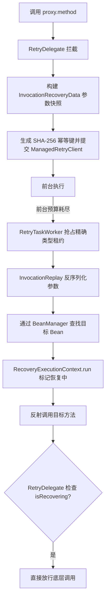

# 注解与代理模式

`team4u-retry-proxy` 提供基于 `@Retryable`、方法调用快照与反射回放的声明式重试能力。

## 核心注解

### `@Retryable`

标注在接口、类或具体方法上：

```java
import com.team4u.framework.retry.proxy.RetryMode;
import com.team4u.framework.retry.proxy.Retryable;

public interface PaymentService {

    @Retryable(policy = "pay-notify-policy", mode = RetryMode.MANAGED)
    void notifyMerchant(String orderId, String payload);
}
```

- `policy`: 策略名称，关联静态或动态配置中的 `RetryPolicy`。
- `mode`: `RetryMode.INLINE`（默认）或 `RetryMode.MANAGED`。
- `recovery`: 代理拦截默认使用 `InvocationReplay`，通常无需配置。

MANAGED 策略必须显式配置 `foregroundMaxRetries`。`maxRetries` 与 `foregroundMaxRetries` 都不包含首次执行，且 `foregroundMaxRetries` 不能超过 `maxRetries`。

### `@RetryIgnore`

标记在方法参数上，生成持久化调用快照时忽略该参数。后台回放时该位置注入 `null`：

```java
import com.team4u.framework.retry.proxy.serialize.RetryIgnore;

import javax.servlet.http.HttpServletRequest;

public void notifyMerchant(
        String orderId,
        String payload,
        @RetryIgnore HttpServletRequest request
) {
    // 业务逻辑
}
```

约束：

- `@RetryIgnore` 不能标注基本类型参数，否则初始化或回放阶段失败。
- 幂等键按目标类型、方法与参数快照计算；被忽略参数的序列化值固定为 `null`，不同 request 实例不会改变幂等键。
- 回放时上下文参数为 `null`，恢复逻辑不能依赖它。

## 方法解析

`RetryMethodResolver` 负责解析注解和实际执行方法：

1. 遍历类与接口，查找最具体的方法；
2. 处理泛型擦除生成的 bridge method；
3. 注解优先级为具体方法、接口方法、具体类、接口或父类。

## 编程式代理

非 Spring 项目可以使用 `RetryProxyFactory`：

```java
import com.team4u.framework.lease.memory.InMemoryLeaseBackend;
import com.team4u.framework.lease.spi.LeaseBackend;
import com.team4u.framework.retry.api.RetryPolicy;
import com.team4u.framework.retry.common.backoff.Backoffs;
import com.team4u.framework.retry.inline.DefaultInlineRetryClient;
import com.team4u.framework.retry.managed.recovery.RecoveryHandlerRegistry;
import com.team4u.framework.retry.proxy.InvocationReplay;
import com.team4u.framework.retry.proxy.RetryProxyFactory;
import com.team4u.framework.retry.runtime.lease.ManagedRetryRuntime;

PaymentService rawService = new PaymentServiceImpl();
LeaseBackend backend = new InMemoryLeaseBackend();
RecoveryHandlerRegistry registry = new RecoveryHandlerRegistry();
registry.register(new InvocationReplay());

ManagedRetryRuntime runtime = ManagedRetryRuntime.lease(backend)
        .registry(registry)
        .autoScanRecoveryHandlers(false)
        .defaultPolicy(RetryPolicy.builder()
                .maxRetries(3)
                .foregroundMaxRetries(0)
                .backoff(Backoffs.fixed(1000))
                .build())
        .build();
runtime.start();

PaymentService proxy = RetryProxyFactory.createProxy(
        rawService,
        PaymentService.class,
        DefaultInlineRetryClient.getInstance(),
        runtime.client());

proxy.notifyMerchant("ORDER_1001", "{\"amount\":100}");
```

这个例子显式注册了 `InvocationReplay`。如果不传入本地 registry 并保持 `autoScanRecoveryHandlers(true)`，runtime 的本地 registry 也会通过 ServiceLoader 加载 classpath 上注册的 `InvocationReplay`；显式注册更适合控制 Worker 只订阅需要的类型。

## 后台回放流程



`RecoveryExecutionContext.isRecovering()` 防止后台回放再次进入代理重试链路，避免递归重试。托管代理模式只支持 `void` 返回方法；需要同步业务返回值时使用 `Retries.managed(...)`。

后台回放使用 `ProxyInvocationReplay` task type。运行 `ManagedRetryRuntime` 的进程必须能通过 `BeanManager` 找到目标 Bean，并且目标类与方法不能是 `final`。
