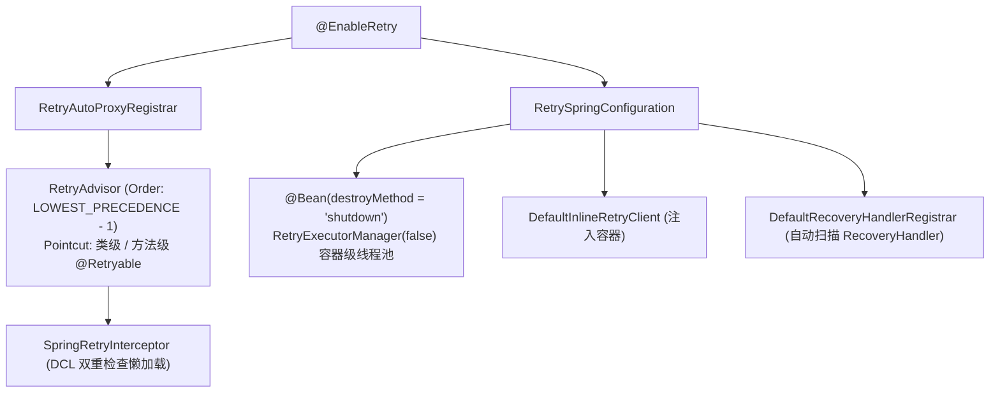

# Spring 整合与生命周期

`team4u-retry-spring` 模块为 Spring / Spring Boot 应用提供了开箱即用的声明式重试支持、AOP 自动切面与容器级生命周期隔离。

---

## 开启 Spring 重试支持 (`@EnableRetry`)

在任意 Spring `@Configuration` 配置类上添加 `@EnableRetry`：

```java
import com.team4u.framework.retry.spring.EnableRetry;
import org.springframework.context.annotation.Configuration;

@Configuration
@EnableRetry
public class RetrySpringConfig {
}
```

### `@EnableRetry` 内部装配架构：



1. **AOP 代理注册 (`RetryAutoProxyRegistrar`)**：
   - 自动扫描所有类级或方法级带有 `@Retryable` 的 Spring Bean；
   - 注册切面优先级为 `Ordered.LOWEST_PRECEDENCE - 1`，保证重试逻辑包裹在业务最内层。
2. **DCL 懒加载拦截器 (`SpringRetryInterceptor`)**：
   - 拦截器内部采用双重检查锁定（Double-Checked Locking, DCL）按需从 Spring `BeanFactory` 中懒加载解析 `InlineRetryClient` 与 `ManagedRetryClient`，避免 Spring 容器启动期循环依赖。
3. **`RecoveryHandler` 自动发现与注册**：
   - `DefaultRecoveryHandlerRegistrar` 启动时自动扫描 Spring 容器中所有实现了 `RecoveryHandler` 或 `StringRecoveryHandler` 的 Bean，并自动完成注册。
4. **容器级线程池生命周期隔离 (`RetryExecutorManager`)**：
   - 显式声明 `@Bean(destroyMethod = "shutdown") public RetryExecutorManager retryExecutorManager() { return new RetryExecutorManager(false); }`。
   - 将 `registerShutdownHook` 设置为 `false`，由 Spring 容器自身的销毁回调（`destroyMethod`）精准管理线程池生命周期，**彻底避免与 JVM ShutdownHook 发生并发关闭冲突，也不会误关其他 Spring Context 正在使用的线程池**。

---

## Spring 业务 Bean 声明式使用

```java
import com.team4u.framework.retry.proxy.Retryable;
import com.team4u.framework.retry.proxy.RetryMode;
import org.springframework.stereotype.Service;

@Service
public class OrderRpcService {

    // 进程内即时重试
    @Retryable(policy = "order-rpc-policy", mode = RetryMode.INLINE)
    public String queryRemoteOrder(String orderId) {
        return externalFeignClient.query(orderId);
    }

    // 托管持久化重试（要求返回类型为 void）
    @Retryable(policy = "pay-notify-policy", mode = RetryMode.MANAGED)
    public void notifyMerchantAsync(String orderId, String payload) {
        externalWebhookClient.post(orderId, payload);
    }
}
```

---

## Spring 中接入 MANAGED 托管运行时

当项目需要开启托管持久化重试时，只需额外向 Spring 容器提供 `ManagedRetryRuntime` 与 `ManagedRetryClient` 的 Bean 定义：

```java
import com.team4u.framework.lease.api.LeaseBackend;
import com.team4u.framework.retry.api.RetryPolicy;
import com.team4u.framework.retry.common.backoff.Backoffs;
import com.team4u.framework.retry.managed.client.ManagedRetryClient;
import com.team4u.framework.retry.runtime.lease.ManagedRetryRuntime;
import com.team4u.framework.retry.spring.EnableRetry;
import org.springframework.context.annotation.Bean;
import org.springframework.context.annotation.Configuration;

@Configuration
@EnableRetry
public class ManagedRetrySpringConfig {

    @Bean(initMethod = "start", destroyMethod = "shutdown")
    public ManagedRetryRuntime managedRetryRuntime(LeaseBackend backend) {
        return ManagedRetryRuntime.lease(backend)
                .defaultPolicy(RetryPolicy.builder()
                        .maxRetries(5)
                        .foregroundMaxRetries(1) // 前台尝试 2 次后交由后台
                        .backoff(Backoffs.exponentialJitter(1000, 2.0, 60_000L))
                        .build())
                .build();
    }

    @Bean
    public ManagedRetryClient managedRetryClient(ManagedRetryRuntime runtime) {
        return runtime.client();
    }
}
```

