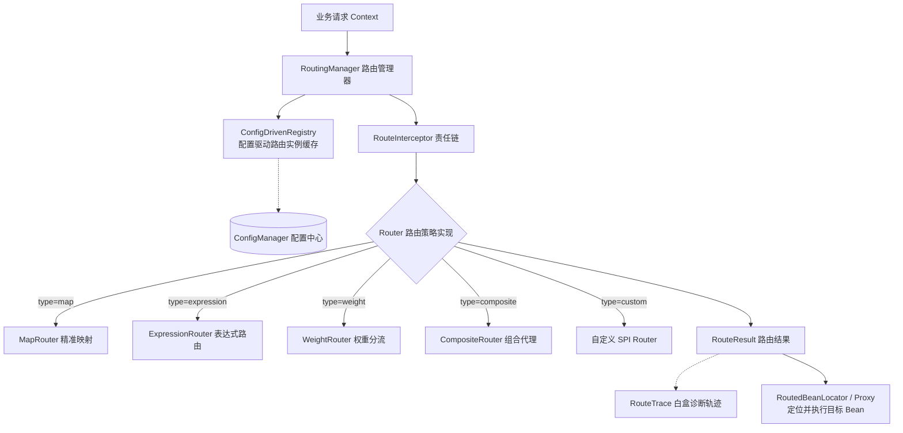

# 路由管理组件 (team4u-router)

# 背景

在企业级中大型系统架构中，业务分流与逻辑决策无处不在，例如：

- **支付与渠道分流**：根据商户号、交易金额、币种、支付方式路由到不同的渠道通道。
- **动态业务灰度与 A/B 测试**：根据用户标签、地域、版本号或特定百分比权重分流到新旧版本服务。
- **多租户与定制化路由**：针对特定大客户（如 VIP 租户）执行定制业务逻辑，普通租户走基准逻辑。
- **异常契约与响应码翻译**：将上游服务的多样化错误码映射并翻译为统一的对外契约。

传统的分流实现方式通常存在明显痛点：

- **代码硬编码 `if-else / switch`**：规则变更必须修改代码重新上线，灵活性差、维护成本高。
- **规则与执行强耦合**：缺乏统一的规则下发与配置热更新机制，无法在不停机的情况下动态切换流量。
- **缺乏白盒诊断能力**：当复杂规则未命中预期分支时，排查过程犹如黑盒，难以还原计算轨迹。
- **侵入性过高**：业务调用方必须显式编写路由查询逻辑，破坏了代码整洁度与业务内聚性。

`team4u-router` 是一个轻量级、插件化、配置驱动的 Java 业务路由框架。它将复杂的业务决策逻辑从核心业务流程中彻底解耦，通过声明式的规则配置（支持 JSON）实现动态分流，并提供纳秒级规则计算与白盒 Trace 诊断能力。`@Routed`、`RoutedProxyFactory` 与 Bean 定位能力位于 `team4u-router-proxy` 适配模块。

---

# 设计

## 设计理念

`team4u-router` 的核心哲学是“**配置即路由规则，路由驱动业务执行**”。框架将路由生命周期分为：**规则解析与缓存 -> 拦截器链推进 -> 策略路由计算 -> 目标 Bean 定位与执行**。其中目标 Bean 定位与声明式代理由 `team4u-router-proxy` 提供。



## 核心概念

| 概念 | 说明 |
| :--- | :--- |
| `RoutingManager` | 路由统一门面，提供 `route`、`routeByConfig`、`routeByPolicy` 与 `trace` 等核心方法，支持泛型转换（`TypeReference` / `Class` / `Type`），线程安全且单例复用 |
| `RouterBootstrap` | 全局引导配置入口，支持注册自定义工厂、拦截器、配置前缀设定，具备运行时锁定（`lock`）与冻结（`freeze`）安全机制 |
| `Router` | 路由器核心接口，定义 `route(request)`、`route(request, Type)` 与 `trace(request)` 方法 |
| `RoutePolicy` | 路由策略元数据模型，包含 `id`、`type`、`rules`、`fallbackValue` 与 `ext` 扩展属性 |
| `RouteRule` | 单条规则定义模型，包含 `condition` 匹配条件与 `value` 路由目标值 |
| `RouteResult<T>` | 路由执行结果（不可变值对象），包含 `value`、`outcome` (命中状态) 及命中的条件明细列表 `matchedConditions` |
| `RouteOutcome` | 结果来源枚举：`RULE_MATCH` (规则命中)、`FALLBACK_MATCH` (兜底命中)、`NO_MATCH` (未命中)、`SHORT_CIRCUITED` (拦截器短路) |
| `RouteTrace<T>` | 路由诊断轨迹，记录执行耗时、路由器类型、规则评估步骤 (`RuleTrace`) 与拦截器观察事件 (`RouteTraceEvent`) |
| `RouteInterceptor` | 路由拦截器接口，基于责任链模式支持上下文注入、监控打点、熔断降级与提前短路 |
| `TraceableRouteInterceptor` | 观察型拦截器扩展接口，提供 `beforeTrace` / `afterTrace` 回调向 Trace 补充诊断事件 |
| `@Routed` / `@RouteContext` | 声明式路由注解，配合 `RoutedProxyFactory` 实现接口方法级的透明动态路由，支持 `${property}` 动态占位符模板 |
| `RoutedBeanLocator` | 路由 Bean 定位器，将路由计算结果（目标 Bean 名称）从容器（`BeanManager` / `BeanResolver`）中提取物理 Bean 实例 |
| `RouterFactory` | 路由器 SPI 工厂接口，支持基于 `key()` 扩展自定义路由器类型 |
| `RoutePolicyParser` | 路由策略解析器 SPI 接口，默认基于 JSON 反序列化（`DefaultRoutePolicyParser`），支持自定义替换（如 YAML） |

使用默认 JSON 路由配置的应用必须显式提供 JSON 引擎：添加 `team4u-serializer-jackson` 或注册自定义 `JsonSerializerPolicy`。

## 设计目标

- **配置驱动与热更新**：无缝对接 `team4u-config`，配置修改后路由实例秒级热重载，无需重启应用。
- **多模式开箱即用**：内置精准映射、表达式运算、权重比例与组合级联四大路由器。
- **零侵入透明代理**：通过 `@Routed` 动态代理将接口调用自动路由到不同的实现 Bean。
- **多重匹配与条件收集**：`ExpressionRouter` 支持 `multiMatch: true` 模式，可一次性收集所有命中的规则结果集合与条件列表。
- **白盒可观测**：提供 `trace()` 接口，深度集成 `team4u-criterion`，完整还原规则计算细节、AST 树计算与短路原因。
- **轻量可扩展**：支持自定义 SPI 路由器工厂与责任链拦截器，核心无重量级外部依赖。

---

# 核心特性总览

| 特性 | 说明 | 适用场景 |
| :--- | :--- | :--- |
| **精准映射 (MapRouter)** | 基于字符串 Key 进行 $O(1)$ 查找，初始化重复 Key 严格校验 | 简单枚举分发、支付渠道直连 |
| **规则引擎 (ExpressionRouter)** | 集成 `team4u-criterion` 纳秒级 DSL，支持多条件短路与 `multiMatch` 多重匹配 | 复杂人群圈选、多维定价、风控拦截 |
| **权重分流 (WeightRouter)** | 基于 MurmurHash32 与 `TreeMap.ceilingEntry` 快速定位区间，支持确定性粘性路由 | 流量灰度、A/B 测试、多通道比例负载 |
| **组合级联 (CompositeRouter)** | 瀑布流串联多个子路由，支持私有规则优先、短路截断与公共规则兜底收口 | 业务线定制规则覆盖系统全局基准 |
| **声明式代理 (@Routed)** | 动态代理接口方法，支持 `${property}` 动态模板拼接与 `@RouteContext` 参数绑定 | 业务门面解耦、多租户多策略透明执行 |
| **类型安全与泛型转换** | 支持 `TypeReference<T>`、`Class<T>`、`Type` 自动类型反序列化与强制转换 | 复杂对象、泛型集合路由结果安全消费 |
| **责任链拦截器 (RouteInterceptor)** | 统一横切拦截，支持请求改写、耗时监控、熔断短路与无拦截器快速路径优化 | 全局租约注入、统一指标上报、异常防御 |
| **白盒诊断 (RouteTrace)** | 捕获规则评估轨迹、表达式计算细节、Weight Hash 区间与路由耗时 | 线上排障、规则未命中原因定位 |

---

# 组件位置与包结构

```text
com.team4u.framework.router
├── api                              # 核心 API 接口与模型
│   ├── builder                      # 编程式路由策略构建器 (RoutePolicyBuilder, RuleRoutePolicyBuilder, CompositeRoutePolicyBuilder)
│   ├── exception                    # 路由异常定义 (RouteException, RouteConfigException, RouteNotFoundException)
│   ├── interceptor                  # 拦截器与执行上下文 (RouteInterceptor, RouteInvocation, DefaultRouteInvocation, TraceableRouteInterceptor)
│   ├── model                        # 路由策略与结果模型 (RoutePolicy, RouteRule, RouteResult, RouteOutcome)
│   ├── trace                        # 诊断轨迹模型 (RouteTrace, RuleTrace, RouteTraceEvent)
│   ├── Router.java                  # 路由器核心接口
│   └── RouterType.java              # 路由器内置类型常量定义
├── core                             # 路由器内置实现 (AbstractRouter, MapRouter, ExpressionRouter, WeightRouter, CompositeRouter)
├── factory                          # 路由器工厂与注册表 (RouterFactoryRegistry, MapRouterFactory, ExpressionRouterFactory, WeightRouterFactory, CompositeRouterFactory)
├── parser                           # 路由配置解析器 (DefaultRoutePolicyParser)
├── proxy                            # team4u-router-proxy 模块：声明式路由与代理支持 (@Routed, @RouteContext, RoutedProxyFactory, RoutedBeanLocator, BeanResolver, RoutedMethodInterceptor)
├── spi                              # SPI 扩展接口 (RouterFactory, RoutePolicyParser)
├── RouterBootstrap.java             # 全局引导与配置锁 (Locked / Frozen 状态机)
└── RoutingManager.java              # 路由管理器统一门面 (Facade)
```

---

# 与其他组件联动

- **[Criterion 表达式组件](../criterion/README.md)**：`ExpressionRouter` 原生集成 Criterion，提供纳秒级 DSL 条件判定与表达式执行诊断。
- **[配置组件](../config/README.md)**：`RoutingManager` 内部基于 `ConfigDrivenRegistry` 自动监听 `router.*` 配置变更，实现规则热重载。
- **[对象容器组件](../bean/README.md)**：声明式路由在解析出目标路由值后，通过 `BeanManager` 或自定义 `BeanResolver` 动态定位目标 Bean。
- **[契约翻译组件](../translator/README.md)**：`team4u-translator` 基于 `RoutingManager` 实现错误码路由与定制化翻译。

---

# 文档导航

- [快速开始](quick-start.md)：3 分钟上手依赖引入、基础配置、泛型路由与编程式策略
- [路由器类型](router-types.md)：Map、Expression (单匹配/多重匹配)、Weight (MurmurHash32) 与 Composite 核心路由器详解
- [声明式路由](router-declarative.md)：`@Routed` 注解、`${property}` 占位符模板、`@RouteContext` 校验规则与动态代理机制
- [路由拦截器](router-interceptor.md)：基于责任链的上下文注入、监控打点、短路机制与 Traceable 观察器
- [路由诊断与 Trace](router-trace.md)：白盒轨迹分析、AST 计算树渲染与线上规则排障
- [SPI 扩展与高级配置](router-spi.md)：自定义 RouterFactory、自定义 RoutePolicyParser、生命周期锁与配置隔离
- [实战案例](router-sample.md)：动态业务开关、灰度分流、复杂定价与多级策略叠加实战
