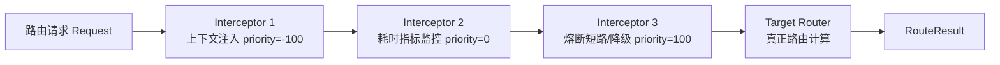

# 路由拦截器

为了支持全局上下文注入、监控打点、熔断降级、权限校验与链路染色等横切关注点，`team4u-router` 提供了基于 **责任链模式 (Chain of Responsibility)** 的通用拦截器体系。

---

## 拦截器核心体系



### 核心接口

- **`RouteInterceptor`**：拦截器核心接口，继承自 `OrderedPolicy`。
  - `<T> RouteResult<T> intercept(RouteInvocation<T> invocation)`：执行拦截逻辑，调用 `invocation.proceed()` 驱动链条流转。
  - `int priority()`：拦截器执行顺序（数值越小越优先执行，默认 `NORMAL = 0`）。
- **`TraceableRouteInterceptor`**：诊断观察型拦截器扩展接口，提供 `beforeTrace` / `afterTrace` 回调，仅用于向 `RouteTrace` 补充观察事件（`RouteTraceEvent`），不修改入参和结果。
- **`RouteInvocation<T>`**：路由执行调用上下文，提供以下方法：
  - `Router getRouter()`：获取底层路由器实例。
  - `String getRouterId()`：获取当前执行的路由策略 ID。
  - `Object getRequest()`：获取当前请求对象。
  - `void setRequest(Object request)`：修改或包装请求对象并传递给后续节点。
  - `Class<T> getTargetType()`：获取目标返回类型的 Class（若为泛型则可能为 null）。
  - `Type getTargetGenericType()`：获取目标返回类型的完整泛型 `Type`。
  - `RouteResult<T> proceed()`：推进调用链。

---

## 快速路径优化 (Fast Path)

在高并发场景下，若当前 `RoutingManager` 内部没有注册任何拦截器，框架将自动启用**零开销快速路径**：直接穿透调用 `router.route()`，完全跳过 `DefaultRouteInvocation` 对象的创建与责任链迭代，将调用栈深度压减至最低。

---

## 典型拦截器场景与示例

### 全局上下文注入与动态改写 (Context Enricher)

自动从 `ThreadLocal` 或全局会话中提取租户 ID、环境标识并注入路由请求中，避免业务方层层透传：

```java
import com.team4u.framework.criterion.MatchContext;
import com.team4u.framework.router.api.interceptor.RouteInterceptor;
import com.team4u.framework.router.api.interceptor.RouteInvocation;
import com.team4u.framework.router.api.model.RouteResult;

public class TenantEnrichInterceptor implements RouteInterceptor {

    @Override
    public int priority() {
        return -100; // 高优先级，最先执行
    }

    @Override
    public <T> RouteResult<T> intercept(RouteInvocation<T> invocation) {
        Object rawRequest = invocation.getRequest();
        
        // 包装为 Criterion 的 MatchContext 并注入全局变量
        MatchContext context = (rawRequest instanceof MatchContext)
                ? (MatchContext) rawRequest
                : MatchContext.of(rawRequest);
                
        context.setAttribute("tenantId", TenantHolder.getTenantId());
        context.setAttribute("env", System.getProperty("env", "prod"));

        // 更新请求并继续向下推进
        invocation.setRequest(context);
        return invocation.proceed();
    }
}
```

### 路由性能监控与打点 (Metrics Collector)

统计所有路由器的执行耗时、规则命中状态以及异常指标：

```java
public class MetricsInterceptor implements RouteInterceptor {

    @Override
    public int priority() {
        return 0; // 正常优先级
    }

    @Override
    public <T> RouteResult<T> intercept(RouteInvocation<T> invocation) {
        long startTime = System.currentTimeMillis();
        try {
            RouteResult<T> result = invocation.proceed();
            long cost = System.currentTimeMillis() - startTime;
            
            // 埋点监控
            Metrics.timer("router.execution.cost", cost, "routerId", invocation.getRouterId());
            Metrics.counter("router.match.outcome", "outcome", result.getOutcome().name());
            
            return result;
        } catch (Exception e) {
            Metrics.counter("router.error.count", "routerId", invocation.getRouterId());
            throw e;
        }
    }
}
```

### 主动短路与熔断降级 (Short Circuit)

在熔断、灰度引流或黑白名单场景中，拦截器可以直接返回结果，阻断后续路由规则计算：

```java
public class BlacklistBypassInterceptor implements RouteInterceptor {

    @Override
    public <T> RouteResult<T> intercept(RouteInvocation<T> invocation) {
        Object request = invocation.getRequest();
        
        if (isBlacklisted(request)) {
            // 直接短路返回特定结果，outcome 为 SHORT_CIRCUITED，附带匹配依据
            return RouteResult.shortCircuited((T) "blacklist-reject-handler", "matched-blacklist");
        }
        
        return invocation.proceed();
    }
}
```

---

## 诊断观察型拦截器 (`TraceableRouteInterceptor`)

当系统需要记录诊断轨迹（调用 `manager.trace(...)`）时，普通拦截器不改变 Trace 过程，而实现 `TraceableRouteInterceptor` 的拦截器会在 Trace 轨迹前后捕获观察事件并记录到 `RouteTrace.events`：

```java
import com.team4u.framework.router.api.interceptor.RouteTraceObservation;
import com.team4u.framework.router.api.interceptor.TraceableRouteInterceptor;
import com.team4u.framework.router.api.interceptor.RouteInvocation;
import com.team4u.framework.router.api.model.RouteResult;

public class SecurityAuditTraceInterceptor implements TraceableRouteInterceptor {

    @Override
    public <T> RouteResult<T> intercept(RouteInvocation<T> invocation) {
        return invocation.proceed();
    }

    @Override
    public <T> Object beforeTrace(RouteTraceObservation<T> observation) {
        return "CallerIP=" + RpcContext.getRemoteIp() + ", Router=" + observation.getRouterId();
    }

    @Override
    public <T> Object afterTrace(RouteTraceObservation<T> observation) {
        return "MatchedOutcome=" + observation.getTrace().getResult().getOutcome();
    }
}
```

> [!NOTE]
> `beforeTrace` / `afterTrace` 执行时若发生未捕获异常，框架会自动记录 `before-error` / `after-error` 事件并将异常信息存入 Trace 中，确保诊断流程整体不中断。

---

## 注册与生效方式

### 方式 A：通过全局引导注册（推荐）
```java
import com.team4u.framework.router.RouterBootstrap;

RouterBootstrap.global()
        .addInterceptor(new TenantEnrichInterceptor())
        .addInterceptor(new MetricsInterceptor())
        .lock(); // 启动完成后锁定，防止运行时被篡改
```

### 方式 B：通过 `RoutingManager.Builder` 独立构建
```java
RoutingManager customManager = RoutingManager.builder()
        .addInterceptor(new TenantEnrichInterceptor())
        .useGlobalInterceptors(false) // 隔离全局拦截器
        .build();
```

### 方式 C：Java SPI 自动发现
在 `META-INF/services/com.team4u.framework.router.api.interceptor.RouteInterceptor` 文件中添加实现类的全限定类名，`RoutingManager` 启动时会自动扫描并按 `priority()` 排序注册。
